# 2023-10

## 2023-10-00.00-00.der-gang-zur-schule-ist-jeden-tag-ein-trauermarsch.webp

<blockquote>

xx.10.2023 0730

Der Gang zur Schule
ist jeden Tag ein Trauermarsch.
Keiner hat Lust,
Jeder hat Angst.
und Alle folgen... ins Verderben.

----

Mittelalter Modene
Mittelalter
Bauernkriege
Luther
deutsche stämme

Subsistenz
sebstversorg
Industrie


</blockquote>


## 2023-10-02.07-00.todo-coding.epub2html-converter.webp

<blockquote>

Mo 2.10.2023 0700

EPUB 2 HTML Converter and
HTML 2 PDF Renderer (Bindery)

Convert `<p>` headings
to `<h1>` and `<h2>` headings

convert Blockquotes to `<blockquote>`

generally move "style"
from css to html
for markdown version

reduce margins paddings indents.

Increase space
between paragraphs

fix links to headings:
numeric to string slug

Font: serit or Sans-serif

Replace fancy quotes
with ascii quotes?

store the original epub files in git
but without font files.
which should be removed always

remove font files.
use default HTML fonts or external
System fonts

Improve image quality.  
Why EPUB has ugly low-res images


</blockquote>


## 2023-10-02.07-01.todo-coding.bindery-js.webp

<blockquote>

TODO Bindery.js

Remove Typescript

Avoid Headings at end of page

TODO image

Some Head
Some Next
→
Next Head
یا
prefer whitespace
at end of page

Render faster.

Have the screen layout
in the perfect width
Same as for Print Layout
then only the page height
will split the text into pages

visualize comments and annotations
Annotations from Hypothesis,
Gab Page Comments, ...

Github issues which mention code blocks?

TODO More!


</blockquote>

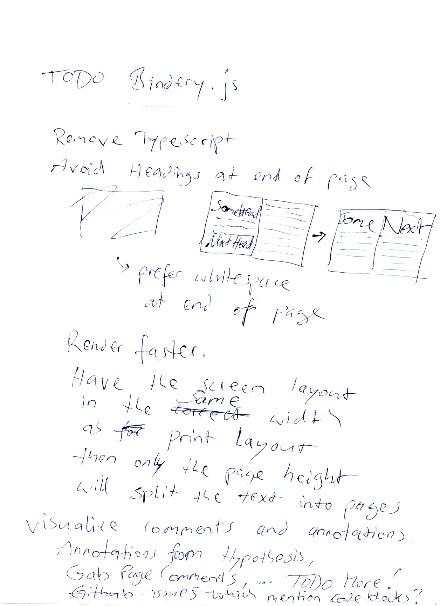

## 2023-10-02.07-30.regierung-gleich-mafia.webp

<blockquote>

Mo 2.10.2023 0730

Regierung gleich Mafia

Ja ernsthaft. weil wo ist der Unterschied
zwischen
Regierung und Mafia?

es ist höchstens der Unterschied
zwischen "öffentlich" und "privat".

Für die öffentlichkeit
produziert die Regierung schöne Lügen
als Schafpelz für bittere Wahrheiten
die von der Mafia gelebt werden.

Wenn man den Schafpelz ignoriert
dann ist die Regierung
nur eine Marketing-Abteilung.

Wenn man sich nicht blenden lässt
vom Schafpelz der schönen Lügen
dann betreibt die Regierung
eine Schutzgelderpressung
gegen ihre Untertanen:
Wer keine Steuern Zahlt
dem wird das Leben schwer gemacht.

Die Regierung hat
ein Monopol auf Gewalt,
ein Monopol auf Straftaten.

(Verbote für Untertanen
sind Privilegien der Elite.)

(Quod licet Jovis, non licet Bovis.)

Für Herren erlaubt, für Sklaven verboten.


</blockquote>


## 2023-10-02.07-40.was-ist-wenn-ich-recht-hab.webp

<blockquote>

# Was ist wenn in Recht hab

Also was ist
wenn meine Hypothese richtig ist?

Also wenn es eine "Naturordnung" gibt
nach der wir Beziehungen gestalten müssen
damit stabile Gruppen entstehen?

Wird dann diese "bittere Wahrheit"
von der Regierung zensiert
und von den dummen Menschen ignoriert
weil die Regierung
kein Interesse hat an "stabile Gruppen"?

also kein Interesse an
"Bottom-up Organisation"?

Weil die Regierung hat Angst vor
Bauernaufstand und Revolution?

Weil die Regierung glaubt:
Ein Großstant ist besser
als viele Kleinstaaten?

Ich glaube
diese ineffiziente Politik
weil wir jetzt billige Energie haber.
aber diese **billige Energie hat keine Zukunft**.

Also für die Zukunft
nach "dem großen Crash"
brauchen wir mehr Effizienz.

Bild:
A short History of Oil and Humans.
200 Years


</blockquote>


## 2023-10-02.16-20.was-ist-wenn-ich-recht-hab.webp

<blockquote>

Mo 2.10.2023 1620

Was ist
wenn
ich Recht hab?

Ich fürchte:
Wenn ich Recht hab
dann müssen wir Serienmord legalisieren.

Wie schon geschrieben:
Der Preis fürs "Paradies auf Erden"
ist Serienmord.


</blockquote>


## 2023-10-02.22-00.weniger-denken-mehr-machen.webp

<blockquote>

Mo 2.10.2023 2200

Weniger Denken, mehr machen.

Der intellektuelle Ansatz
ist zum Scheitern verurteilt
bei der Frage
"Ist meine Hypothese richtig oder falsch?"
Weil beim Denken kann man
nur Alternativ-Hypothesen generieren
und die sind dann genauso ungeprüft

Wie meine Hypothese,
Jede Hypothese ist nur
ein Lösungsvorschlag
und einen Lösungsvorschlag
kann man erst dann bewerten
wenn man ihn ausprobiert hat.

Probieren geht über Studieren,  
AKA Die wissenschaftliche Methode.


</blockquote>


## 2023-10-02.22-01.wissenschaft-oder-relgion.webp

<blockquote>

Wissenschaft oder Religion?

In dieser modernen Welt
hören wir viel
über "die Wissenschaft"
aber ganz oft
wird der gute Ruf der Wissenschaft
missbraucht
um uns einen Betrug zu verkaufen.

Etwa wenn Mediziner
den guten Ruf der Medizin missbrauchen
um ihren Patienten Gift zu verkaufen.

AKA: Exit Scam:
Guten Ruf aufbauen
und dann ausnutzen
zum Schaden.


</blockquote>


## 2023-10-03.06-00.die-nazis-sind-wieder-da.webp

<blockquote>

Di 3.10.2023 0600

Die Nazis sind wieder da
und keiner hats gemerkt
weil in der Schule lehen wir:
seit der "Entnazifizierung.
gibt es keine Nazis mehr.

Das ist so
als würde man glauben:
Seit dem Drogenverbot
gibt es keine Drogen mehr.

Nein. Die Nazis waren nie weg.

Manche von den Nazis
gingen in die USA
(Operation Paperclip)
um dort fürs Militär arbeiten.

Manche von den Nazis
gingen in die Türkei
siehe auch: Graue Wölfe (Bozkurt)


</blockquote>


## 2023-10-03.06-01.ich-werde-nicht-immer-hier-sein.webp

<blockquote>

Ich werde nicht immer hier sein

Meine feinde wollen mich
Zensieren wegsperren
umerzichen schlagen töten

weil meine Hypothese ist "zu radikal"
und bevor sie mir Recht geben
Wollen sie lieber mich kaputt machen
um ihr altes System zu retten.

Sozialdarwinisten
sehen sich als "Herrenmenschen"
und "die Anderen"
also Typen 12
sind "Sklavenmenschen"
die man ausbeuten
oder töten darf,
Typen 34 =
Kurzsichtig liberal (Typ 3) und
weitsichtig konservativ (Typ 4)
und
Typen 12 =
weitsichtig liberal (Typ 1)
kurzsichtig konservativ (Typ 2)


</blockquote>


## 2023-10-04.22-00.mir-hilft-auch-keiner.energieverschwendung.webp

<blockquote>

Mi 4.10.2023 2200

Mir hilft auch keiner

- Alle sind überarbeitet
- Alle sind überfordert
- Alle laufen am Limit
- Keiner hat Freizeit
- Keiner hat Freiraum

Deswegen muss alles so ineffizient sein
damit die Menschen ihre Energie verschwenden

Und für Arbeit will jeder Geld haben
weil wer hat schon den Luxus
dass er zu viel Geld und feit hat?


</blockquote>

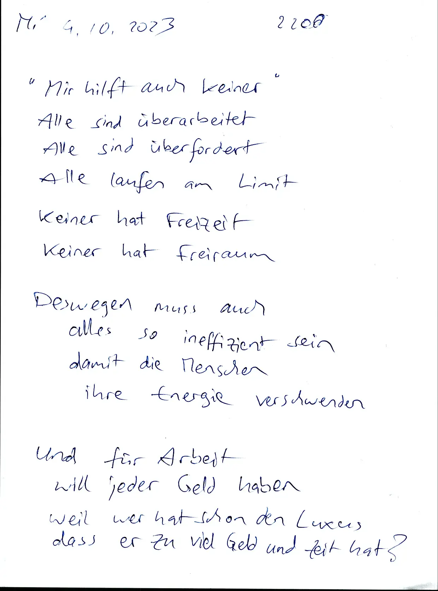

## 2023-10-04.22-01.was-würde-mir-helfen.bücher.experimente.webp

<blockquote>

Was würde mir helfen?

Leute die für mich arbeiten  
Leute die mir Arbeit abnehmen

Also

- Bücher drucken
- Bücher verteilen
- Texte schreiben
- Bilder zeichnen
- Texte übersetzen
- Werbung machen

Aber auch:  
Experimente organisieren  
also Menschen zusammen bringen  
und das "Pallas-Muster" ausprobieren.


</blockquote>


## 2023-10-04.22-30.unbewiesene-verarschungen.elektrosmog.klassenjustiz.webp

<blockquote>

Mi 4.10.2023 2230

# Noch "unbewiesene" Verarschungen:

- Elektrosmog
- Smartmeter
- Solarstrom
- Windstrom

# Im Zweifel für den Kleineren

Der übliche Grundsatz
"Im Zweifel für den Angeklagten"
ignoriert die Tatsache,
dass Größere viel leichter
so einen Zweifel erzeugen können.

Also Klassenjustiz:
Größere sind gut,
Kleinere sind böse.


</blockquote>


## 2023-10-05.22-00.betrug-ist-unterschwellig.ablenkung.webp

<blockquote>

Do 5.10.2023 2200

# Betrug ist unterschwellig

Wer Betrug verkaufen will
der muss vorhee
überschwellige Betrugsmaschen
etablieren als Ablenkung
damit später die echten Betrugsmaschen
relativ unterschwellig sind.

Also die Opfer werden abgehärtet
damit sie weniger sensibel sind
damit sie ihre Feinde nicht mehr sehen.


</blockquote>


## 2023-10-05.23-00.billige-energie.beziehungen-gestalten.stabile-gruppen.webp

<blockquote>

Do 5.10.2023 2300

# Billige Energie hat keine Zukunft

200 Jahre zurück gehen

- Staff Erdöl aus Persien hatten wir Brennholz aus unserem Wald.
- Statt Plutonium aus Afrika hatten wir Brennholz.
- Statt großen Schulen hatten wir Dorfschulen.

# Freiwilligkeit

Eigenmotivation

Ich finde die Frage wichtig:
wer sind meine Freunde ?

Also wie müssen wir
Beziehungen gestalten
damit stabile Gruppen entstehen?

Und ich hoffe dass auch andere Menschen
diese Fragen wichtig genug finden
um mein Buch zu lesen.

Aber es soll freiwillig sein,
wer keine Lust hat der soll es lassen.


</blockquote>


## 2023-10-05.23-01.mystik.ignoranz.webp

<blockquote>

- Mystik
- Ignoranz
- Nicht wissen wollen
- Einfache Antworten
- Billige Tricks
- Rhetorik
- Schöne Lügen
- "Wir werden es nie wissen"
- Blind
- Taub
- unsensibel
- "Rational dumm"? (Typ 4)

Fr 6.10.2073 0600

**Die** öffentlichkeit und  
**Der** Untergrund

# In Großstaaten:

Die Öffentlichkeit wird belogen.

In der Öffentlichkeit herrscht die Lüge.

Weil dieser "Kampf gegen die Natur"
geht nur mit Lügen,
also Betrug, Gewalt
(passive Gewalt, soft power)


</blockquote>


## 2023-10-06.06-30.natur-oder-kunst.webp

<blockquote>

6.10.2023 0630

# Natur oder Kunst

Grundsätzlich gilt:

Alles kann zwei Gründe haben:
Natur oder Kunst,
Körper oder Geist.

Agnostik ist Tolerant
"Die Anderen"
glauben wirklich was sie glauben
und jeder hat seine Gründe.

Zu sagen "du bist ja dumm"
ist zwar ehrlich
aber ein Widerspruch zum Anderen

er fühlt sich schlau weil
Jeder fühlt sich schlau
Jeder fühlt sich im Recht.

Auch das ist ein Problem beim Pazifismus.
Wir machen keine Vergleiche
also "keine Experimente"
also "Lass uns nicht streiten".
aber so finden wir nicht die Wahrheit.


</blockquote>


## 2023-10-06.06-31.elektrosmog-laptop.webp

<blockquote>

# Elektrosmog

Laptops bediene ich
immer mit externer Tastatur
weil direkt unter interne Tastatur
liegt der Prozessor
also ein Störsender.

Ich hatte Mal eine
Wespe oder Biene oder Hummel
in meinem Zimmer
und die hat sich ganz absichtlich
immer auf die interne Tastatur gesetzt
auf die linke Hälfte der Tastatur
da wo der Prozessor drunter liegt.

Ich glaube, dieses Tier wollte Suizid.
Deswegen ist es voll bewusst
an diesem Störsender gegangen
damit das Tier schneller stirbt.

Nach ein paar Minuten
war es dann auch tot davon.

Ich hab auch ein Foto


</blockquote>

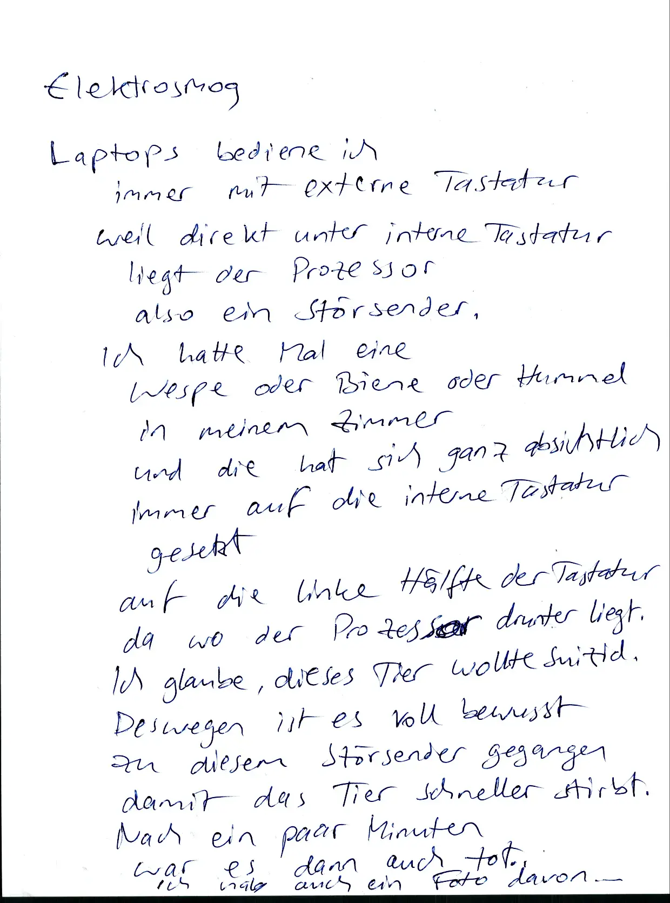

## 2023-10-06.07-00.wie-funktioniert-betrug.webp

<blockquote>

Fr 6.10.2023 0700

# Wie funktioniert Betrug

Gesinnungsethik

Es ist doch gut gemeint,
Also das schlechte Ergebnis
wird versteckt,
wird unsichtbar gemacht.

Eine vorsätzliche Schädigung
wird geleugnet
und man sagt immer
es war gut gemeint
also wenn etwas Schlechtes passiert
dann nur fahrlässig.
also unabsichtlich.
also "das wollten wir nicht".

Betrug braucht einen guten Ruf.

Dieser gute Ruf wird
eine Zeit lang aufgebaut
und dann wird er ausgenutzt.

And bekannt als "Exit Scam".
oder als "Selective Scamming.


</blockquote>


## 2023-10-06.07-01.idiokratie-ist-hier-und-jetzt.webp

<blockquote>

# Idiokratie ist hier und jetzt:
Wir sind schon mitten drin
in der Idiokratie.
Mike Judge hat seinen Film
als eine Zukunftsvision präsentiert
aber das it es nicht.
Der Film Idiocracy ist
eine Systemkritik
gegen das aktuelle System.

## Sozialisten sind Idioten.
Die "Idioten"
sind die Sozialisten
die sich aggressiv vermehren
und dann
eine "Mehrheitswahl "fordern.
Auch bekannt als "Demokratie:
Schlaue Menschen sind "antisozial"
also Einzelgänger, Privatmenschen.
Und jeder Sozialismus
macht den Antisozialen
das Leben zur Hölle
zum Beispiel durch Kinderklau.


</blockquote>

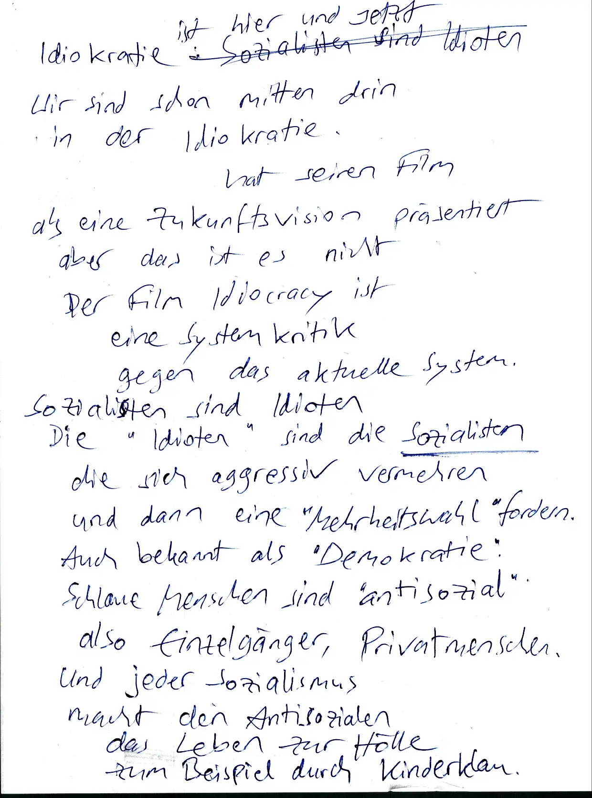

## 2023-10-06.07-30.kaputte-beziehung-zu-meiner-exfrau.webp

<blockquote>

Fr 6.10.2023 0730

Lyrics: Ich muss gar nichts

(Großstadtgeflüster?)

----

Meine Theorie über Beziehungen
ist auch ein Ausbruchsversuch
aus der kaputten Beziehung
zu meiner Ex-Frau.

Warum ist diese Deziehung "kaputt"?

Weil sie ist dumm
und lässt sich immer wieder verarschen,
Ich bin schlau
und durchschaue diese Angriffe
aber ich kann Nichts machen
weil in dieser Beziehung
habe ich nichts zu sagen.

Ich glaube das ist so eine
"Monolog" Beziehung:
ich verstehe alles von ihr
sie versteht nichts von mir.


</blockquote>

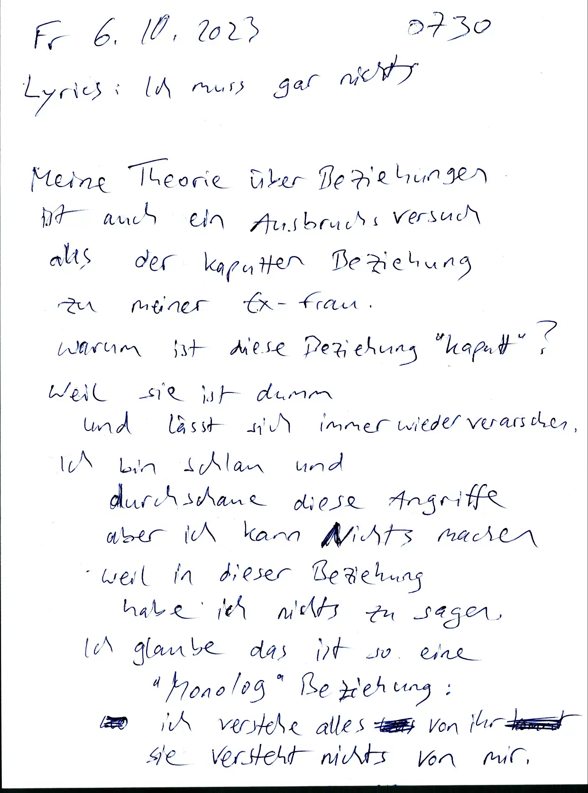

## 2023-10-06.07-31.gemeinsame-freunde.information-fließt-im-kreis.webp

<blockquote>

# Gemeinsame Freunde

Meine Lösung dafür
sind Gemeinsame Freunde
und eine Vierer-Gruppe,
wo Information im Kreis fließt.

In dieser Vierer-Gruppe
gibt es vier Monolog-Beziehungen.

## Partnertausch in Vierer-Gruppen.

Ich bin M1.  
Sie ist F2.

TODO image

```
F2        F1
v          ^
M1        M2

v -------- ^

F2 < F1


M1 → M2
```


</blockquote>


## 2023-10-07.08-00.typen-13-24.webp

<blockquote>

Sa 7.10.2023 0800

Tim Kellner M3

----

Typen 24 |  | Туреn 13
---|---|---
Dumm und Glücklich? |  | Schlau und traurig?
Weiblich | in traditioneller Alchemie | Männlich
Sklavenmoral? |  | Herrenmoral?
Weibermoral |  | Männermoral

## Politisches Spektrum

TODO image

gemäßigt = oben, öffentlich, gesellig

gemäßigt Links
2

3
gemäßigt Rechts

Links

Linksextrem

Rechts

Rechts extrem

extrem
unten, privat, Stubenhocker

----

Der Kampf gegen Rechtsextreme
ist eine Fortsetzung vom Christentum
(Sklavenmoral)
also von Römischem Staatskult

TODO image

2
402
302
1

Typ 2 ist das gemeinsame Ideal
also der gemeinsame "Gott"
von Typen 3402.
Typ 1 ist der gemeinsame Gegner
also der gemeinsame "Teufel".


</blockquote>


## 2023-10-07.08-01.typen-3402-matriarchat.webp

<blockquote>

TODO image

Mutter
2
402
302

Typen 3402

Mütter werden Vergöttert
Söhne werden geopfert

Matriarchat
Mater = Mutter
Herrschaft der Mutter
"Römisches Kreuz"

Das
Sohn

Das Gegenteil von Mutter ist Sohn!
Also der Gegner vom Matriarchat
ist nicht das Patriarchat
(Pater = Vater = Typ 4)
Sondern "die Herrschaft des Sohnes"

302
402
12

Tochter spielt Mutter = Frau
= extrem weiblich

Vater spielt Mutter = Alter
= extrem alt


</blockquote>


## 2023-10-07.09-00.wir-sind-abhängig-und-erpressbar.webp

<blockquote>

Sa 7.10.2023 0900

Wir sind abhängig und erpressbar
und unsere Vorgesetzten
tun uns immer wieder einreden:
das ist gut so
weil nur durch
diesen "Druck von oben"
kann dieses System funktionieren

aber wer sagt
dass
dieses System gut ist?

Wir sind abhängig
weil unsere Vorgesetzten
kontrollieren unsere Versorgung:
Strom, Wasser, Heizung, Essen,
Abwasser, Müllabfuhr, ...

wir sind expressbar
well unsere Vorgesetzten
können uns die Versorgung verweigern
wenn wir zu "böse" sind.
"Ich dreh dir den Hahn zu"
(den Geldhahn)
heisst es im Film Werner Beinhart


</blockquote>


## 2023-10-07.09-01.feudalismus.oligarchie.zu-viele-sklaven.webp

<blockquote>

# Feudalismus

weil letztendlich
sind wir immer noch
(wie schon immer?)
(Naturkonstante?)
im Feudalismus

- also Zwei Klassen Gesellschaft
- also Oligarchie
- also eine Symbiose von Herren und Sklaven.
- also Großgrundbesitzer und Plantagenarbeiter

weil warum auch nicht.

Eine Sache die mir daran stört:
Es gibt zu viele Sklaven
und zu wenige Herren.
weil Profitmaximierung.
deswegen Pazifismus.

Ich glaube statt
"Herren und Sklaven"
sollten wir sagen
"Soldaten und Bauern"
dann macht es mehr Sinn
dass beide gleich wichtig sind
und dass wir gleich viele von beiden brauchen.


</blockquote>


## 2023-10-07.22-00.demokratie-mit-parteiverboten-ist-keine-demokratie.webp

<blockquote>

Sa 7.10.2023 2200

Eine "Demokratie" mit Parteiverboten
ist keine Demokratie.

----

So 8.10.2023 0600

Ein "freier" Markt mit Berufsverboten
ist kein freier Markt.

Ideale sind leere Versprechen

Paradox der Toleranz.
Sozialisten sind nur tolerant
für andere Sozialisten.

----

Brainstorming geht nur dann
wenn ich meine Einfälle
aufschreibe
weil dann kann ich vergessen
und
neue Einfalle generieren.
"Das merk ich mir"
ist der Feind vom Brainstorming.


</blockquote>


## 2023-10-07.22-01.wer-schwere-sprachen-lernt-der-fühlt-sich-schlau.webp

<blockquote>

TODO digitale Bücher analogisieren
also Drucken
→ SVG
PDF Jam
mit schönem Cover
und schönem Layout

----

Bullen gehören
nicht zu meiner Zielgruppe.
Bullen sind nützliche Idioten
für das alte System.
Bullen stehen für Gewaltmonopol
also Zentralismus und Großstaat.
Ich will das Gegenteil.
Bullen sind ein Sicherheitsdienst
für die Elite.

----

Menschen die schwere Sprachen lernen
füllen sich schlau
aber eigentlich sind sie dumm
weil sie ihre Kinder quälen
mit schwere Sprache:
Chinesisch, Arabisch, Russisch, ...


</blockquote>


## 2023-10-08.07-00.probleme-im-kopf-lösen-oder-hypothesen-prüfen.webp

<blockquote>

So 8.10.2023 0700

Git Filter Branch

What went wrong?
why do all commits
have new hashes?

----

In staatlichen Schulen leren wir
"Wir können alle Probleme im Kopf lösen"
aber Wissenschaft geht nicht so,
Wissenschaft fordert:
Ergebnisse müssen reproduzierbar sein.
Wenn ich etwas glauben muss
und nicht prüfen kann,
dann ist dieses Etwas ein Teil von Religion.

Beispiel: Hypothese:
"Es gibt ein Leben nach dem Tod".
Wenn ich diese Hypothese prüfen will
dann muss ich sterben,
aber dann kann ich mein Ergebnis
nicht teilen.


</blockquote>


## 2023-10-08.07-01.jeder-sozialismus-hat-seine-staatsfeinde.webp

<blockquote>

Rationalisieren

Schönreden von Scheisse

----

# Staatsfeinde

Jeder Sozialismus
hat seine Staatsfeinde:

Bei uns sind das "Rechtsextreme"

In Indien sind es die Dalid
also die "Unberührbaren"
also die man nicht anfassen soll

In der kommunistischen Diktatur
Waren es die "Asozialen"

Im Sorgerecht beim Familiengericht
und beim Jugendamt
sind es "Erziehungsunfähige"

In einer Demokratie
(Diktatur der Mehrheit)
sind es "Antidemokraten"
also Minderheiten

In einem Imperium der Zivilisation
sind es primitive Naturvölker.


</blockquote>

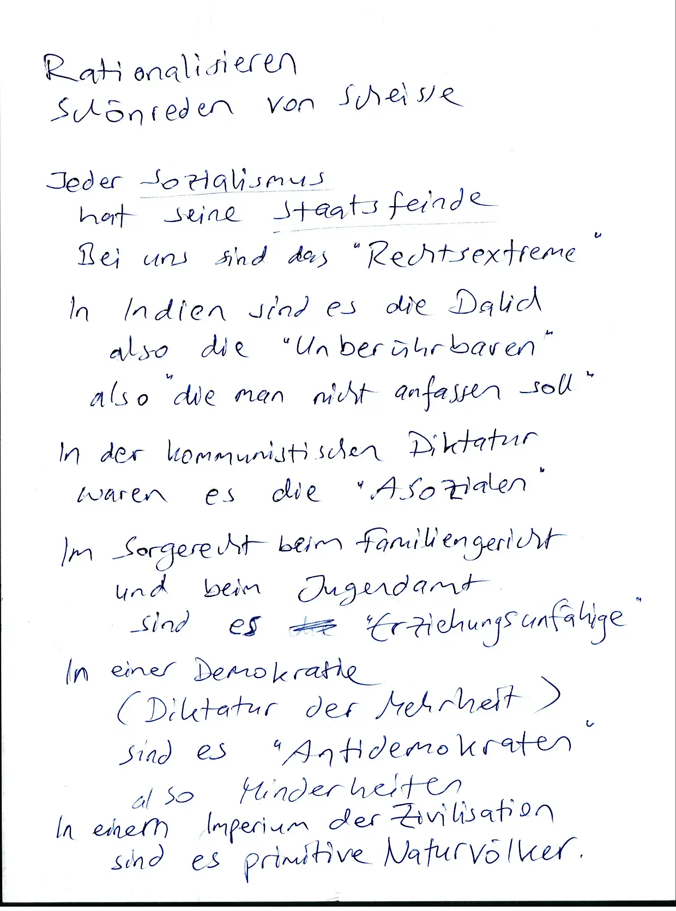

## 2023-10-08.07-30.brainstorming-bild.webp


## 2023-10-08.07-31.bullen-und-soldaten-sind-idioten.webp

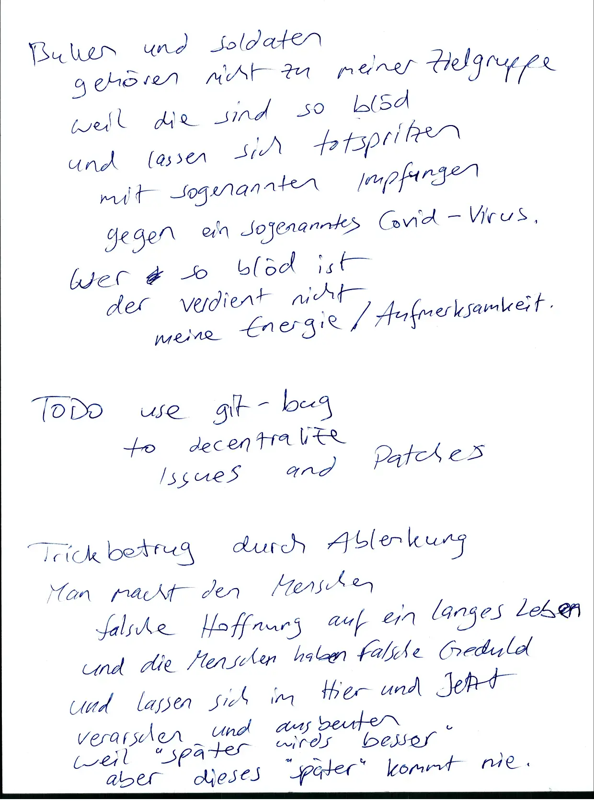

## 2023-10-08.08-00.amazon-sex-stellung.missionar-sex-stellung.webp


## 2023-10-08.08-01.manche-typen-sind-blind-für-innere-werte.webp


## 2023-10-08.08-30.psychiatrie-ist-medizindiktatur.webp


## 2023-10-08.08-31.psychiatrie.webp


## 2023-10-08.10-20.bei-der-wahl.webp


## 2023-10-08.10-21.schwere-kost-aber-auch-hoffnung.webp


## 2023-10-08.12-00.methadon-entzug.abstimmung-mit-den-füßen.webp


## 2023-10-08.14-00.buckel-heilen-mit-yoga.webp


## 2023-10-08.14-01.grundschule-mit-jesus-spruch.webp


## 2023-10-08.15-00.elektrosmog-in-elektroautos.webp


## 2023-10-08.15-01.thomas-malthus-wann.webp


## 2023-10-08.15-40.box-sprinten.webp


## 2023-10-08.15-41.ich-akzeptiere-wenn-menschen-nein-sagen.webp


## 2023-10-08.22-00.rothschild-zitat.mir-ist-egal-wer-die-gesetze-schreibt.webp


## 2023-10-08.22-01.stockholm-syndrom.webp


## 2023-10-09.08-00.dissidenten-sind-einzelgänger.webp


## 2023-10-10.06-00.timeline-of-the-distant-future.rechte-sollen-mit-migranten-reden.webp


## 2023-10-10.06-01.der-anfang-ist-das-wichtigste.webp

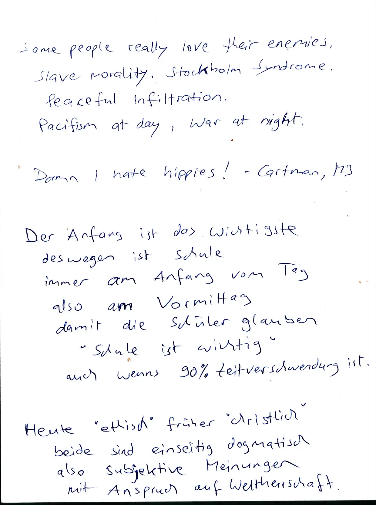

## 2023-10-11.07-00.schwäche-kommt-vor-dummheit.webp


## 2023-10-11.07-01.persönlichkeitstest-ins-buch-drucken.webp


## 2023-10-13.14-00.gnostik-mystik.kommentare-zu-video-von-tilman-knechtel-aka-traukeinempromi.webp


## 2023-10-13.14-01.gleichheit.webp


## 2023-10-13.22-00.144-menschen-12-oder-16-pro-gruppe.webp


## 2023-10-13.22-01.speed-reading.berühmte-menschen-und-deren-persönlichkeitstyp.webp


## 2023-10-14.07-00.berühmte-menschen-und-deren-persönlichkeitstyp.webp


## 2023-10-14.07-01.linke-sind-opportunisten.webp


## 2023-10-14.20-00.wie-funktioniert-betrug.webp


## 2023-10-14.20-01.wir-sind-schon-in-der-diktatur.webp


## 2023-10-14.22-00.kakokratie.webp


## 2023-10-15.06-00.180-degrees-book.they-lied-about-everything.banken-erzeugen-geld-aus-nichts.webp


## 2023-10-15.06-01.they-lie-about-everything.webp

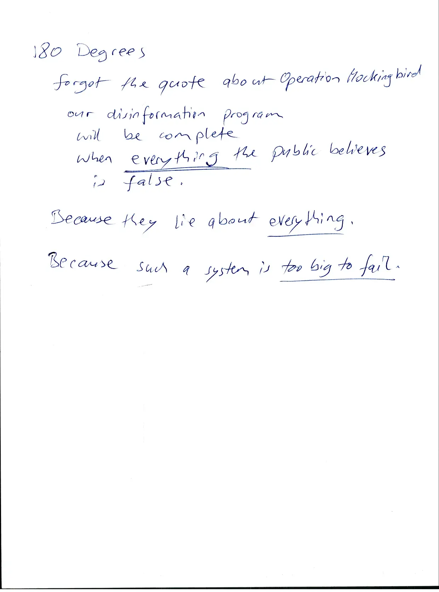

## 2023-10-15.22-00.zensur-behauptet-es-gibt-keine-alternativen-lösungen.webp


## 2023-10-16.15-00.kapitalismus.man-kann-freunde-kaufen.webp


## 2023-10-17.00-00.merken-blockiert.schreiben-befreit.webp


## 2023-10-17.07-00.alternative-lösung.melting-pot.lokales-chaos.webp


## 2023-10-18.07-00.billige-tricks-für-arme-leute.webp


## 2023-10-18.08-00.they-want-metals-in-our-bodies.webp


## 2023-10-18.08-01.kinder-werden-unterfordert.webp


## 2023-10-19.06-00.sogenannte-juden-sind-rhetoriker-sophisten-schlau-und-böse.webp


## 2023-10-19.06-01.too-big-to-fail.kriminelle-organisationen.webp


## 2023-10-20.09-00.typ-104-innerer-monolog-zwischen-vater-und-sohn.webp


## 2023-10-20.23-00.dualzahlen-quadrat-rechteck.webp


## 2023-10-21.06-00.hässliche-politiker-erzeugen-mitleid.kakokratie.webp


## 2023-10-21.07-00.warum-sind-schulkinder-so-dumm.webp

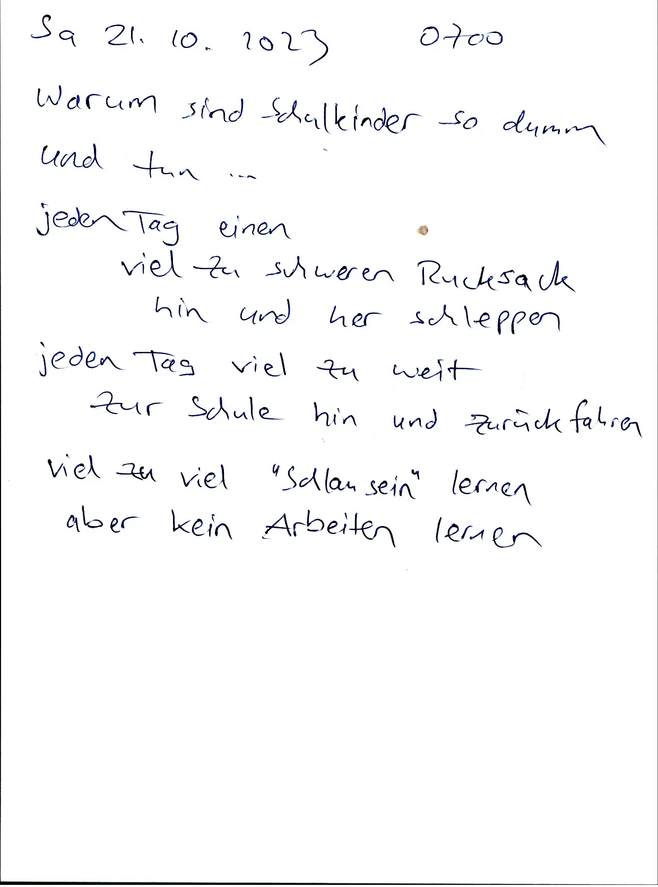

## 2023-10-21.22-00.wer-sind-meine-freunde.warum-ist-dieses-problem-seit-2000-jahren-ungelöst.webp


## 2023-10-22.04-00.zensur-wird-aggressiver.regime-baut-auf-lügen.volksverhetzung.wahrsager-sind-revolutionsführer.webp


## 2023-10-22.05-30.pazifismus-ist-lüge.passive-gewalt.einseitig.ungerecht.lügner-führen-hexenprozesse.webp


## 2023-10-22.23-00.matrix.dumm-und-glücklich.sieger-schreiben-geschichte.deutungshoheit.webp


## 2023-10-23.04-30.wissenschaft-von-oben.religion.glauben.gatekeepers.zensoren.machtpositionen.webp


## 2023-10-23.04-31.passiv-oder-aktiv.sozialdarwinismus.einseitige-selektion.rhetorik.ad-hominem-attacks.webp

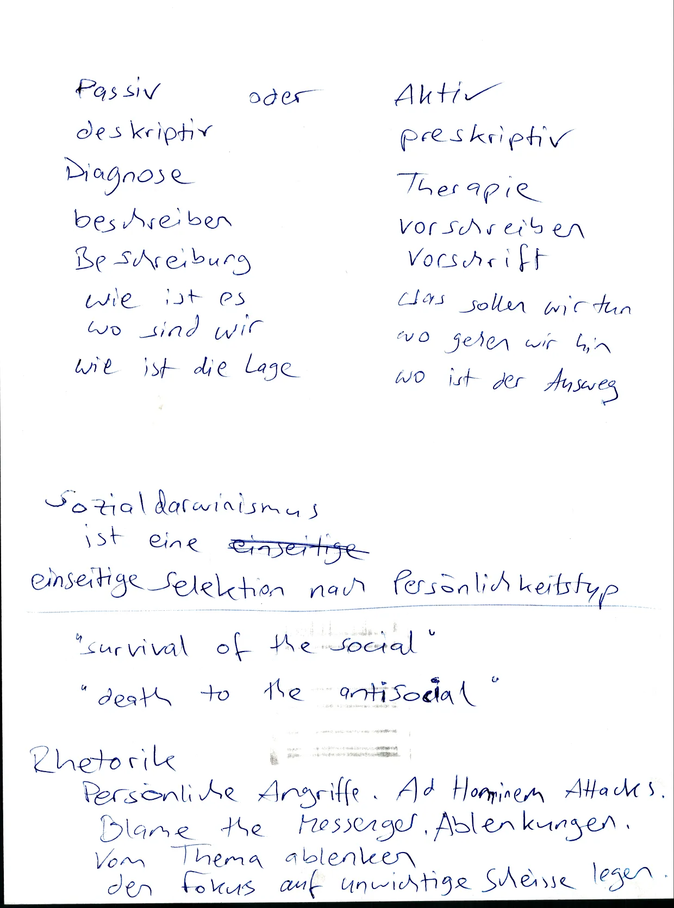

## 2023-10-23.06-00.alles-endet-in-feudalismus-oligarchie.schüler.schluss-mit-bücher-schleppen.webp

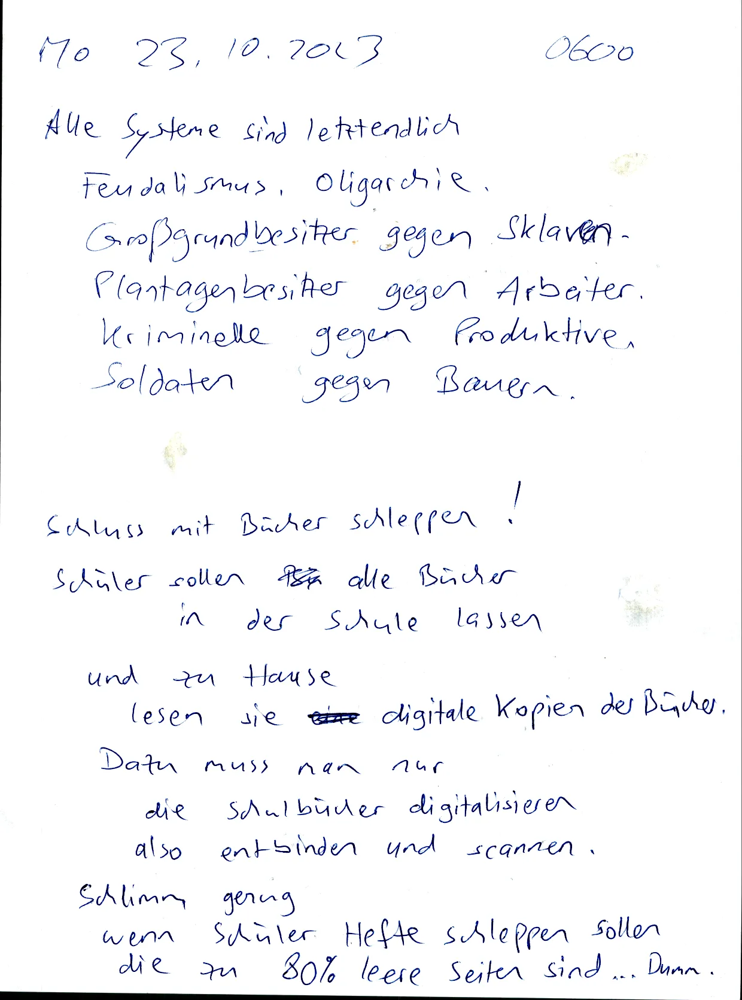

## 2023-10-23.06-01.harari-quote-drugs-and-games-for-the-useless-people.webp


## 2023-10-24.06-00.sozialtherapie.systemlinge-sind-opfer-von-falsche-beziehungen.falsche-freunde.falsche-feinde.besseres-umfeld.ehrlich.wahrheit.webp


## 2023-10-24.06-01.jeder-hat-seine-gründe.gefangen-in-scheisse.scheisse-schönreden.kein-ausweg.keine-alternative.zivilisten.opfer.wehrlos.leichte-beute.webp


## 2023-10-24.06-30.projekt-null-kilo-rucksack.schüler-sollen-keine-bücher-schleppen.kleines-problem.webp


## 2023-10-24.16-20.macht-des-unterbewussten.mind-control-ist-unterbewusst.manipulation-von-gefühle.synthetische-telepathie.stromnetz.normies-sind-unsensibel.webp


## 2023-10-25.22-00.passiv.vorbereitung-ist-nur-das-halbe-leben-danach-kommt-der-einsatz.hängen-geblieben.angst-vor-konsequenzen.webp


## 2023-10-25.22-01.einseitige-selektion.schädlinge-ausrotten.besser-gleichgewicht.biodynamisches-gleichgewicht.webp


## 2023-10-25.22-30.ich-will-frei-sein.spontan.keine-termine.keine-verträge.chaotische-lösungen.zero-knowledge.webp


## 2023-10-25.22-31.coding.rich-text-translator.webp


## 2023-10-25.23-00.pazifismus.dumme-lösung.problemverschiebung.falsche-geduld.selektion.schulden.todeslisten.massenmord-alle-100-jahre.webp


## 2023-10-25.23-01.matrix-zitate-über-normalos.dumm-und-glücklich.wollen-mich-in-den-knast-stecken.webp


## 2023-10-26.05-00.auswandern-richtung-süden.winter-ist-zu-kalt.afrika.webp


## 2023-10-26.05-01.globale-erwärmung-oder-eiszeit.mittelfrist-gegen-langfrist.eiszeit.vulkanausbruch.webp


## 2023-10-26.06-00.typen23.kurzsichtig.strategisch-unbegabt.mein-deutsch-ist-besser-als-deins.webp

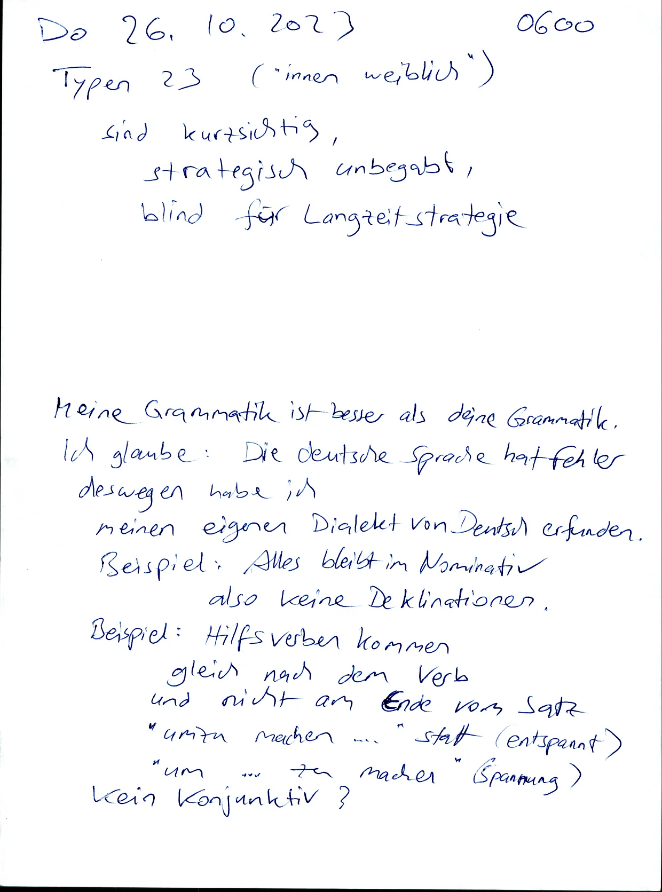

## 2023-10-26.09-00.schlechte-verlierer.lügner.betrüger.unsportlich.formkritik.theorie.blabla.webp


## 2023-10-26.09-01.banken-erschaffen-geld-aus-dem-nichts.alle-regierungen-sind-verschuldet-bei-banken.webp


## 2023-10-26.10-00.volksverhetzung-oder-regimekritik.bullen-drohen.zensur.webp


## 2023-10-26.10-01.suizid-hat-schlechten-ruf.falsche-geduld.sklavenmoral.webp


## 2023-10-27.08-00.adjectives.1234.sunny-muddy-dotty-fuzzy.webp


## 2023-10-29.07-00.passiver-widerstand-ist-zu-wenig.drogen-sind-controlled-opposition.webp


## 2023-10-29.07-01.9-core-creative-frequencies.music-notes-tuning-440hz.roman-catholic-church.military-research.webp


## 2023-10-30.05-00.pallas-muster.hexagon-muster.typen-kodierung-2-3-4-zeichen.webp


## 2023-10-31.09-00.klassenjustiz.persönliche-gründe.bullen-haben-immer-recht.zeitumstellung.tageszeitenklima.webp


## 2023-10-31.22-00.linke-sind-suizidal-aber-wollen-nicht-alleine-sterben.united-nations-rule-the-world.webp


