# 2023-11

## 2023-11-01.13-00.vitamin-c.essenzieller-nährstoff.grundwissen.krebs-therapie.menschen-genmanipulieren.webp

<blockquote>

Mi 1.11.2023 1300

Auch so Grundwissen
was wir nicht in der Schule lernen:

**Vitamin C** ist ein essenzieller Nährstoff
also muss über Essen zugeführt werden
weil unser Körper
kann Vitamin C nicht produzieren.

Vitamin C Mangel hat viele Symptome:

- Skorbut (Zahnausfall)
- Krebs

Deswegen:
Eine alternative Krebs-Therapie
ist Intravenöses Vitamin C.
mit hoher Dosierung
(Megadosing)

Als Biologe würde in versuchen:
die Menschen so gen-manipulieren
dass sie Vitamin C selber herstellen können
so wie Ziegen.

... oder dass Menschen
Zellulose verdauen können
(so wie Ziegen.)


</blockquote>


## 2023-11-02.05-00.hey-bulle.wenn-du-mir-helfen-willst.silent-kill-mit-klebeband-und-messer.webp

<blockquote>

Do 2.11.2023 0500

# Hey Bulle?

Wenn du mir helfen willst
dann töte 10 von deinen Kollegen
und dann tôte dich selber.
Dann hab ich 11 Probleme weniger.

# Silent Kill

Mit Klebeband den Mund zu kleben
dass er nicht schreien kann
und dann mit einem Messer
den Bauch aufschlitzen
damit er ausblutet.

Wenn das Blut stören würde
dann Erwürgen
aber das dauert länger
und er kann sich wehren.

Vielleicht Fesseln mit Kabelbindern
und einen Kabelbinder um den Hals
dann würgt ihn der Kabelbinder.


</blockquote>


## 2023-11-02.05-01.traditionelle-alchemie.13-24.männlich-weiblich.römische-zahlen.penis-vagina.altenlutscher-und-kinderficker.webp

<blockquote>

# Traditionelle Alchemie

- Typen 13 sind männlich
- Types 24 sind weiblich

dazu passen die Römischen Zahlen

- I = Penis
- II = Vagina
- III = Beine und Peris
- IIII = Beine and Vagina

# Altenlutscher und Kinderficker

Alte Menschen verehren.

Tote Menschen anbeten.

Junge Menschen (Kinder)  
mit Gewalt in alte Systeme zwingen  
die von alter Menschen gebaut wurden.

Alte führen, Junge folgen.

Erfahrung führt (Typ 4), Gefühl folgt (Typ 3).


</blockquote>

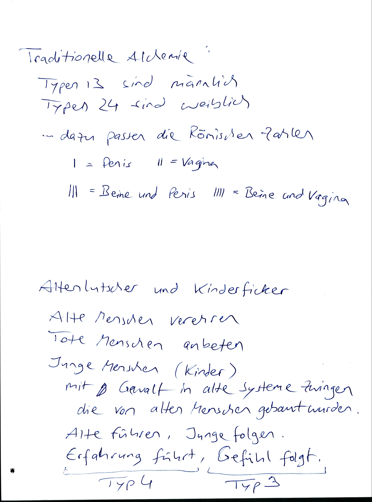

## 2023-11-02.06-00.sklavenmoral.alles-falsch-machen.disinformation-program-cia.psychokrieg.webp

<blockquote>

Do 2.11.2023 0600

# Sklavenmoral

- Selbstverletzung
- Selbstzerstörung
- systematisch alles falsch machen

----

"we know our disinformation program
is complete
when everything the public believes
is false."
-- CIA Direktor
1980

Dumme Menschen ausbeuten
ist Psychologische Kriegsführung
"Schlaue gegen Dumme"


</blockquote>


## 2023-11-02.06-01.naturordnung.alle-kultur-wegnehmen.gesetze.moral.subjektive-weltbilder.tiere.webp

<blockquote>

Ich suche die Naturordnung

also ich frage:
Was passiert wenn ich alles wegnehme
was Menschen erschaffen haben
also was "künstlich ist.

also auch alle "Gesetze"
und auch jede "Moral"
die nach Aussen kodifiziert wurden
("in Stein gemeisselt")
weil das sind nur
subjektive Weltbilder.

oder anders gefragt:
Was würden Tiere tun?
Tiere haben auch
keine Buchreligionen,
keine festgeschriebene Kultur.

Humanisten wollen ja immer
"besser" sein als Tiere,
aber ich sehe Tiere als Vorbild.


</blockquote>


## 2023-11-03.05-00.krankes-essen-macht-mich-krank.nitrit-pökelsalz-in-wurst-zieht-wasser.fett-und-krank.typen-34-sind-rational-dumm.webp

<blockquote>

Fr 9.11.2023 0500

# Krankes Essen

macht mich krank

Wiener Würstchen
sind schleisse
well **Nitrit-Pökelsalz**
zieht Wasser
aus meinem körper

Auch Hunde werden
schnell fett und krank
von Wiener Würsten

----

Typen 34 sind einfach nur dumm...

also zwar "emotional intelligent"
aber "rational dumm".

Typen 12 die mitspielen
im kranken System der Typen 34
Sind Verräter und Versager
die dumm und glücklich sein wollen
aber die ihre Arbeit (Schlauheit) verweigern.


</blockquote>


## 2023-11-03.05-01.demokratie-ist-tyrannei-der-mehrheit.schafe-gegen-wölfe.webp

<blockquote>

Demokratie ist Tyrannei der Mehrheit.

Demokratie ist wenn
3 Schafe gegen einen Wolf stimmen
und dem Wolf sagen:

- "Pazifismus ist ne gute Idee"
- "Fleisch essen ist böse"
- "deine rechtsextreme Partei tun wir verbieten"
- "deine aggressiven Wörter darfst du nicht sagen"
- "Wenn wir deine Spezies ausrotten dann hast du Pech gehabt"
- "Wir müssen deine Spezies ausrotten damit unser System funktioniert."

(Buch: The wolf tamers)


</blockquote>


## 2023-11-03.05-30.they-lied-about.nitrit-pökelsalz.holocaust.911.weapons-of-mass-destruction.israel-is-victim.inversions.exact-opposite.webp

<blockquote>

Fr 3.11.2023 0530

# They Lied about

- Nitritpökelsalz
- Holocaust
- 9/11
- Iraq has Weapons of Mass Destruction
- Israel is Victim of Palestine

# Inversions

Often they say the exact opposite
because then their Lie is **too big to fail**.

because then only radical critics
will critizise the lie
but radical critics
are banned from the public.


</blockquote>


## 2023-11-03.05-31.meme.stupid-and-happy-family.harmoniesucht.chris-hedges.udo-ulfkotte.paradox-selbsthass.webp

<blockquote>

TODO Meme: Stupid and happy family

Mutter kocht giftige Scheisse für Kinder
und kinder sind "brav"
und essen die Scheisse.

höflich, nett, dankbar, passiv,
anspruchslos, sich alles gefallen lassen,
Harmoniesucht:
"Lass uns nicht streiten."

----

TODO Quote The Farewell Tour

von
Chris Hedges?

----

TODO Quote Udo Ulfkotte

----

# Das große Paradox

Viele Menschen hassen ihr Leben,
wollen sterben, aber schaffen es nicht alleine.

Und deswegen: Legalize Serial Murder!


</blockquote>


## 2023-11-03.06-00.real-democracy-only-works-in-small-states-of-150-people.same-age-circles.webp

<blockquote>

Fr 3.11.2023

Real Democracy
only works works
in small states of 150 People

----

Same Age Circles

F3 - M104 - F203 - M4

```
M104   F203

F302   M401
```


</blockquote>


## 2023-11-03.06-01.bücher-drucken-ohne-strom.diesel-stromgenerator.webp

<blockquote>

# Bücher drucken ohne Strom

Wenn ich zu viel Geld hätte
dann würd ich mir kaufen:

einen Diesel-Stromgenerator
der 3 Kilowatt bei 230 Volt erzeugt.

Diesel ist besser zum Lagern als Benzin.

Der Generator sollte gekapselt sein
in einem Gehäuse,
dann ist er etwas leiser.

So ein Generator wiegt 150 kg
und kostet
2000 Euro
und läuft mit Diesel oder Heizöl
und reicht für 4 Laserdrucker
mit je 700 Watt.

Nachteil von Diesel:
Dieselmotoren brauchen mehr Wartung
(Warum genau? Einspritzung?)


</blockquote>


## 2023-11-03.07-00.paradies-auf-erden-nur-mit-serienmord.das-ist-der-deal.wenn-ich-recht-habe.webp

<blockquote>

Fr 3.11.2023 0700

# Serienmord

Ein Paradies auf Erden
gibt es nur mit Serienmord.

Das ist auch "der Deal"
bei meiner Hypothese.
Wenn ich Recht habe
dann darf ich losgehen
und jeden Tag 100 Leute töten
und werde dafür belohnt
wie jeder andere Arbeiter.
Sagen wir 30 Euro pro Stunde
wegen dem Gefahrenzuschlag.

Oder besser: Ich kriege pauschal
100 Euro für jede Leiche
von einem Unwürdigen.


</blockquote>


## 2023-11-03.20-00.was-ist-wenn-ich-recht-habe.wette.schlechte-verlierer.webp

<blockquote>

Fr 3.11.2023 2000

wenn einer meine Arbeit scheisse findet
dann ist das ein legitimer erster Eindruck.

Man kann auch sagen:
Wer meine Arbeit scheisse findet
der wettet
gegen meine Hypothese.

Dann stellt sich die Frage:
Was ist wenn ich Recht hab?
Was ist wenn ich die wette gewinne?

sind es gute Verlierer?
sind es schlechte Verlierer?

----

Sa 21.10. 2023 1020

Psychiatrie ist Knast für Unschuldige

----

Drogen "Gangster" sind
Controlled Opposition

----

Typen 24 haben Bad Taste
und folgen dem Geschmack von Typen 13

----

Die Wahrheit ist zu einfach
für Leute die sich schlau fühlen wollen

Truth is so simple
its offending to "smart" people.


</blockquote>


## 2023-11-03.20-01.ich-hasse-die-meisten-menschen.die-wollen-immer-nur-kleine-probleme-lösen.catch-22.pazifismus.ignoranz.passiv.warten.jesus-wird-uns-retten.webp

<blockquote>

3.11.2023 2001

Ich hasse die meisten Menschen
also 80 bis 99% aller Menschen

weil die meisten Menschen
wollen immer nur
kleine Probleme lösen
und **versagen für große Probleme**
weil für große Probleme
braucht man
**effiziente Organisation**
aber and das
ist ein großes Problem
also Catch 22 Situation
also Henne-Ei Problem.

----

... weil die meisten Menschen
sind wertlos
also wollen friedliche Lösungen
und wenn es
keine friedliche Lösung gibt
dann kommt Ignoranz,
dann stellt man sich passiv
und wartet auf einen Erlöser
der aber nie kommt.

- "Trump wird uns retten!" - Nein.
- "Putin wird uns retten!" - Nein.
- "Jesus wird uns retten!" - Nein.
- "Elon Musk wird uns retten!" - Nein.


</blockquote>


## 2023-11-03.20-02.paradox.mystik.sklavenmoral.sich-schlau-fühlen.nicht-sterben-wollen.sublimierte-aggression.gangster-sind-pseudo-rebellen.webp

<blockquote>

Fr 3.11.2023 2002

# Das große Paradox

- Mystik
- Mysterium
- Sklavenmoral
- Dummheit
- Religion
- Glauben
- Alles falsch machen aber sich Schlau fühlen.
- Ein sinnloses Leben führen aber nicht sterben wollen.

----

# Sublimation

Jeder will seine Ziele erreichen
aber keiner will dafür kämpfen
weil man darf nicht kämpfen
sondern man soll arbeiten.

Arbeiten ist sublimieste Aggression.

Arbeiten ist kastriertes Kämpfen.

Das betrifft auch
so genannte "Gangster"
die sich als Rebellen fühlen
weil sie kleine Gesetze brechen
(Drogen verkaufen)
aber wer Aggression
wirklich ausleben will
der muss große Gesetze brechen.
(Serienmord)


</blockquote>


## 2023-11-03.20-03.recht-auf-leben.grundsatzkritik.naturordnung.alle-kultur-wegnehmen.tiere.urmenschen.webp

<blockquote>

2003

Große Gesetze
also Grundrechte / Grundsätze
die in der Verfassung stehen.

Sowas wie "Recht auf Leben".
Pah!
Nur würdige Menschen
verdienen ein Recht auf Leben.

Aber die meisten Menschen
haben genau so wenig ein "Recht auf Leben"
wie eine Mücke die ich erschlage.

----

Meine Arbeit ist auch
eine Grundsatzkritik

also ein radikaler
Alternativ-Lösungsvorschlag

Meine Suche nach der Naturordnung
entspricht der Frage:
"Was passiert
wenn ich alles wegnehme
was von Menschen
erfunden wurde?"

Also "Was würden Tiere machen?"

Oder: "Was haben die Urmenschen
vor einer Million Jahren gemacht?"


</blockquote>


## 2023-11-03.20-04.pazifismus.jeder-fühlt-sich-im-recht.kein-vergleich.kein-kampf.streiten-ist-böse.webp

<blockquote>

Fr 3.11.2023 2004

Das Problem am Pazifismus ist:
Jeder fühlt sich im Recht
weil verschiedene Hypothesen
werden nicht ausgekämpft, ausprobiert
sondern "Streit ist böse"
und "seid einfach lieb zueinander".
(Harmoniesucht. Symptompfuscher. Gier.)

Das kommt davon
wenn Idioten und Schwächlinge
führen dürfen.

----

... und wenn die "Bösen"
immer folgen sollen.

> verschiedene Hypothesen  
> werden nicht ausgekämpft, ausprobiert

→ Also:  
Jeder fühlt sich im Recht  
Jeder fühlt sich als Gewinner

Gleichheit  
"Alle haben gewonnen"  
ist genau das Gegenteil
von Wettbewerb, Kampf,
Konkurrenz, Sport, Vergleich,
Rangordnung, Kapitalismus


</blockquote>


## 2023-11-04.04-00.too-big-to-fail-cult.wahrheit-ist-schmerzhaft.wahrsager-sind-beleidiger.schule.kompliziertes-denken.wahrheit-ist-zu-einfach.zu-radikal.investitionsschutz.webp

<blockquote>

Sa 4.11.2023 0400

Der "Too Big To Fail" Kult

Wahrheit ist einfach,
hart, schmerzhaft,
bitter, direkt

Lügen sind kompliziert,
Weich, beruhigend,
Süß, Umwege

Wahrheit ist schmerzhaft
für Lügen-Gläubige.

Deswegen: Wahrsager sind
Gefühlsverletzer, Beleidiger.

----

Schüler im
"Too Big To Fail" Kult
werden ausgebildet
zu maximal kompliziertem Denken
und wenn man diese Menschen
mit der einfachen Wahrheit konfrontiert
dann sagen sie
"Nein! Das ist zu einfach.
Das kann nicht wahr sein."

Weil Investitionsschutz:
Diese Menschen
haben zu viel Energie investiert
zum tausend Lügen lernen
und das zugeben wäre zu schmerzhaft.

(Warum leicht wenns auch schwer geht...)


</blockquote>


## 2023-11-04.07-00.planet-of-the-humans.desperate-measures-to-preserve-our-way-of-life.welche-relevanz-hat-das.drei-dinge-für-einsame-insel.typen-23-müssen-laut-denken.webp

<blockquote>

Sa 4.11.2023 0700

Planet of The Humans

These are all
desperate measures
to preserve our
Way of Life
which is fundamentally
not sustainable.

----

Matt Groening
School Is Hell
↳ Cartoon?

----

Fight Club:
Welche Relevanz hat das
für unser Überleben
im Sinn einer Jäger-Sammler-Kultur?

----

Drei Dinge für eine einsame Insel:
die drei anderen Grundtypen.

----

Typen 23 müssen laut denken
sind also "Schwätzer"

----

Biegen oder Brechen?
Reform oder Revolution
gemäßigt oder radikal


</blockquote>


## 2023-11-04.21-00.geschichte-unterricht-in-schule-lehrt-nur-die-offizielle-version-der-vergangenheit.george-orwell.lügen.sieger-schreiben-geschichte.seerecht-landrecht.webp

<blockquote>

Sa 
2100

George Orwell

Wer die Vergangenheit kontrolliert
der kontrolliert die Gegenwart.

→ "Geschichte Unterricht in der Schule
lehrt nur die offizielle Version
der Vergangenheit
aber die ist voll mit Lügen
well "Sieger schreiben Geschichte".

siehe auch
Revisionismus
Buchreligion
Kult Programmierung

----

Seerecht
Тур 4
Sozialdarwinismus

Landrecht
Typ 2


</blockquote>


## 2023-11-05.00-00.für-papa.herz.hallo-papa.schokolade.geist.webp

<blockquote>

FÜR PAPA ♡

HALLO
PAPA


</blockquote>


## 2023-11-05.00-01.schnecke.gesichter-froh-und-traurig.webp

<blockquote>

Mi 5.11.2023


</blockquote>


## 2023-11-05.07-00.selbstversorgung.kissinger-report.rohstoffe-aus-afrika-rauben.bill-gates.impfungen-in-indien.impfschäden.hpv-impfung.wundermittel-gegen-krebs.negativ-selektion.webp

<blockquote>

So 5.11.2023 0700

"Die Agrar-Industrie wird uns retten."
-- Nein.
wir brauchen Selbstversorgung.

Kissinger Report

"Wir müssen die Afrikaner
schwach halten
damit wir die Rohstoffe von Afrika
ausbeuten können."

Bill Gates, Impfungen, Indien,
Impfschäden

HPV-Impfung wurde beworben
als Wundermittel
gegen.Krebs
(dabei ist Krebs ein
Symptom von Nährstoffmangel).

Sklavenmoral ist eine Negativ-Seleletion
well Dumme und Schwache
werden subventioniert = belohnt
und fühlen sich im Recht = als Gewinner.


</blockquote>


## 2023-11-05.07-30.dampfmaschinen-haben-zukunft.holz-ist-nachwachsender-rohstoff.pazifismus-ist-krieg-gegen-natur.volksverhetzung.bullen.webp

<blockquote>

So 5.11.2023 0730

# Dampfmaschinen haben Zukunft

weil Holz ist ein nachwachsender
Rohstoff

# Pazifismus ist Krieg gegen die Natur

Die Aggression die sonst
gegen Menschen geht
gehen im Pazifismus
gegen Tiere, Pflanzen, Lebensraum
und wird belohnt als "Arbeit"

# was meine feinde über mich sagen

Ihr Pallas Forschungsprojekt
ist Volksverhetzung
und wenn sie weiter
ihre Bücher verschenken
dann stecken wir sie
in den Knast. - ein Bulle

Ich so: Warte kurz,
Ich muss
noch eine Million Bücher
verschenken.


</blockquote>


## 2023-11-05.07-31.immigranten-werden-abhängig-und-dankbar-gemacht.liebe-deine-feinde.unterschicht-wird-ausgetauscht.webp

<blockquote>

Bite the hand that feeds

Immigranten werden abhängig gemacht
(abhängig: falsche freunde, Korruption)
Von Vorgesetzten
damit sie "dankbar" sind
und "Liebe deine feinde" Leben.

Also genau
die kriminellen Vorgesetzten
die ich bei einer Revolution
an die Wand stellen würde
also ermorden würde.

die bleiben so am Leben
und dafür wird die Unterschicht
ausgetauscht.

also die alte Unterschicht
wird ermordet
(deutsche Männer)
und ersetzt durch
eine neue Unterschricht
(afrikanische Männer)


</blockquote>


## 2023-11-05.08-00.sozialismus.überschätzen-psychische-probleme.unterschätzen-physische-probleme.guter-ruf.dienstleistungs-gesellschaft.arbeitsscheu.verwalter.reformer.webp

<blockquote>

So 5.11.2023 0800

# Sozialismus

überschätzen
Von Psychische Probleme

Unterschätzen
von Physische Probleme

Mind over Matter

Guter Ruf ist wichtiger
als Essen, Trinken, Wehrhaftigkeit

Abhängigkeit von Mitmenschen

Delegieren Von Harte Arbeit

Dienstleistungs Gesellschaft

"Lass uns alle Friseur werden
dann können wir uns gegenseitig
die Haare schneiden."

und irgendwelche Dummen
werden schon unser Essen produzieren.

Arbeitsscheu.
Arbeitsverweigerer.
wollen kleine Probleme lösen.
Reformer.
Wollen viel Geld verdienen.
Fremdwert.
Wollen Altruisten sein


</blockquote>


## 2023-11-06.07-00.unser-high-life-lebensstandard-ist-abhängig-von-importenaus-der-ganzen-welt.webp

<blockquote>

Do 6.11.2023 0700

unser hoher Lebensstandard "High Life"
ist abhängig von
Importen aus
der ganzen Welt
für billige Rohstoffe
und billige Energie.

Diese Abhängigkeit
verhindert Dezentralisierung,
Unabhängigkeit, Freiheit,
Kleinstaaten.

Also muss zuerst
unser hoher Lebensstandard
gesenkt werden
damit wir "Zurück zur Natur" gehen
und unser Essen
wieder selbst produzieren.

und
unsere Kriege
wieder selbst führen.
= Bauern und Soldaten


</blockquote>


## 2023-11-07.06-00.dialog-bindungen.großstaaten-brauchen-lügen.globalisten.sozialisten.exotik.webp

<blockquote>

Di 7.11.2023 0600

Dialog-Bindungen für Zweier Gruppen

Großstaaten übersteigen
die Natürliche Gruppengröße
von 150 Menschen
(Dunbar's Number)
und um dieses fundamentale Problem
zu verdrängen
brauchen Großstaaten immer Lügen.

Globalisten. Sozialisten.
Fernweh. Exotik ist gut,
Liebe deine Übernächsten.
Liebe deine Feinde.


</blockquote>


## 2023-11-07.06-01.politisches-spektrum.kleinstaaten-großstaaten.militärtechnik-gegen-ziviltechnik.webp

<blockquote>

Typen 1234 =
Kommunist Kapitalist Sazialist Totalitarist

Typen 12
Kleinstaaten

Typen 34
Großstaaten

# Closed Source Software

macht Sinn
damit Militars und Geheimdienste
ihren Technik-Vorsprung halten können.

Technik für Zivilisten
ist immer 20 Jahre hinterher.

Beispiel OCR- Software:
"Consumer Grade" OCR Software
ist zu blöd zum Texte lesen
und produziert immer wieder Fehler.


</blockquote>


## 2023-11-07.07-00.stromgenerator-bauen-mit-kleinwagen-dieselmotor.webp

<blockquote>

Di 7.11.2023 0700

# Stromgenerator bauen

Kleinwagen mit Diesel motor
Der Motor hat circa 50 KW = 62 PS

Der elektrische Teil (Alternator)
braucht einen Elektromotor.

Große Motoren sind schwer.

Bis circa 30 kg kann man alleine tragen.

30 kg wiegt ein 3 KW Elektromotor.
40 kg -> 4 KW

Der Elektromotor muss haben:

Drehzahl 1500 RPM (oder 1460 oder so)

Sternschaltung 230 Volt  
Dreieckschaltung 400 Volt

TODO wie muss man die 4 Pole
anschließen damit 50Hz Wechselstrom
rauskommt mit 230 Volt?


</blockquote>


## 2023-11-07.07-01.webp

<blockquote>

Dann muss man den Automotor
verbinden mit dem Elektromotor
am besten über einen Zahnriemen
oder Keilriemen.
Eine drehende Achse geht auch
aber dann braucht man
ein "Winkel getriebe"

Dieselmotor

Elektromotor

Strom

Biodiesel ist scheisse
Weil der ist nur kurz haltbar
und dann wird er schlecht
weil "Dieselpest".

Besser ist Synthetischer Diesel aus Holzgas
oder gleich den Generator mit Holzgas antreiben.


</blockquote>

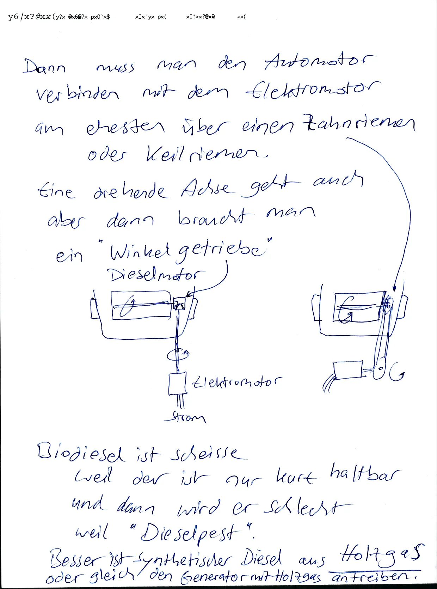

## 2023-11-07.07-10.communism.refactor-html.webp

<blockquote>

Di 7.11.2023 0710

Alchi Book

Topic Communism (Bottom-up, small state)

Just use
`<p>`
instead of `<div class="para">`
and give a fuck about "valid HTML
because all HTML Parsers are loose.

Add an `id="..."` Attribute
to all paragraphs and image containers
so we have a mapping
between translations
so we can move paragraphs
to minimize white space.
= change the sequence of paragraphs

Add a script to auto-add
missing id attributes

maybe also add id attributes
to meta tags?
No, they have a name attribute.


</blockquote>


## 2023-11-08.22-00.schon-so-viele-sachen-verloren.festhalten.tagebuch-schreiben.todo-listen.webp

<blockquote>

Mi 8.11.2023 2200

Ich habe schon
so viele Sachen verloren...

wichtige Sachen soll man
festhalten und wiederholen,
in Worte fassen und vermehren.

Mein Tagebuch
(und meine TODO Listen)
schreibe ich in
in traurigem Gedenken
an all meine verlorenen Ideen.

Wenn eine Idee weg ist
kommt sie meisters nie wieder.


</blockquote>


## 2023-11-08.22-01.sklavenmoral-herrenmoral.kompliziert-einfach.lügen-wahrheit.webp

<blockquote>

Sklavenmoral | Herrenmoral
---|---
Die Welt von unten sehen | Die Welt von oben sehen
viele komplizierte Lügen | Wenige einfache Wahrheiten


</blockquote>


## 2023-11-09.11-30.linke-rechte.konservativ-liberal.weitsicht-kurzsicht.geistlicht-weltlich.webp

<blockquote>

Do 9.11.2023 1130

Linke | Rechte
---|---
Politisch Liberal? | Politisch konservativ?
Geduld | Gier
Weitsicht | Kurzsicht
Leben nach dem Tod | Leben vor dem Tod
Geistlich | Weltlich
Religion | Wissenschaft
Glauben | Wissen
warten | Kämpfen
Anfang | Ergebnis
Intention | Resultat
Gesinnungsethik | .
gut gemeint | gut gemacht

Das Paradox ist:
Linke hassen das Leben
aber wollen nicht sterben,
Sondern ziehen alle Menschen
in den Tod
= Todestrieb, Thanatos


</blockquote>


## 2023-11-09.17-00.warum-leicht-wenns-auch-schwer-geht.gerechtigkeit-ist-leicht.sozialdarwnisten-wollen-alle-anderen-ausrotten.webp

<blockquote>

Do 9.11.2023 1700

Moin ihr Juden.

Warum leicht wens
wenns auch schwer geht?
So ungefähr ist euer Motto.

Wahrheit, Gerechtigkeit,
Gleichgewicht, Naturordnung..
das wäre der leichte Weg
und den beschreibe ich
in meinem Buch.

Aber ihr seid "Sozial-Darwinisten"
also ihr müsst alle "Anderen" ausrotten
damit euer "schönes" System funktioniert.


</blockquote>

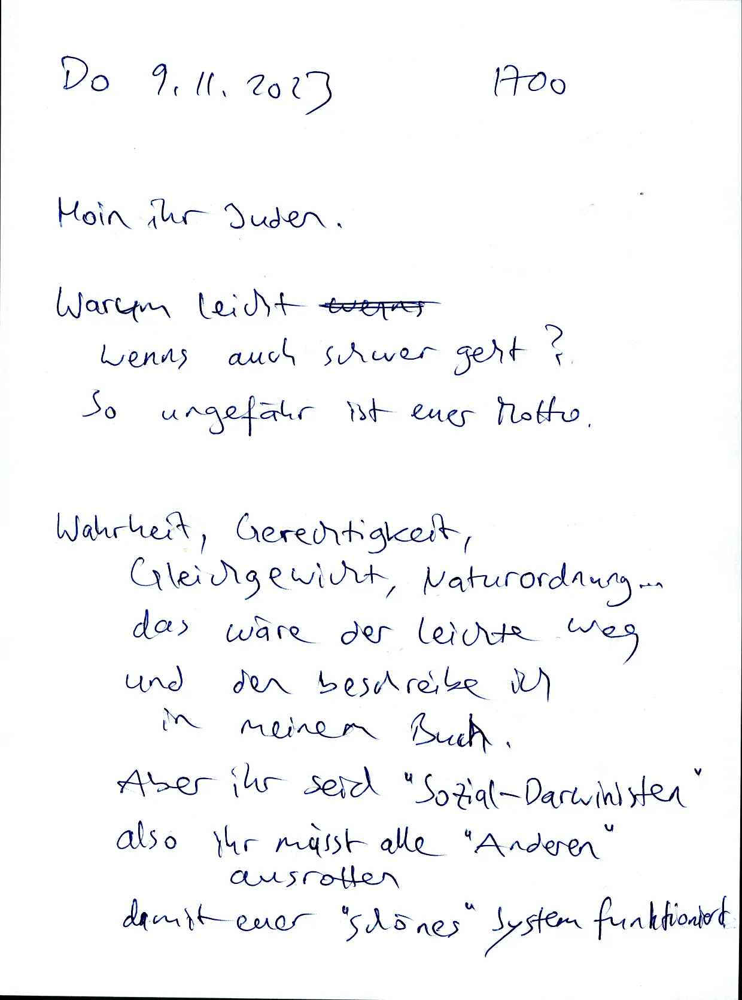

## 2023-11-09.17-01.meine-letzten-worte.wie-meine-welt-funktionieren-würde.webp

<blockquote>

Warum schreibe ich euch?

Sicher nicht zum ench aufhalten,
das wäre Zeitverschwendung.

Ich will her cher "Tschüß! "Sagen.
und "Viel Spaß!" sagen
Bevor ihr meine Hälfte
der Natur ausrottet.

Ich wollte ich noch Mal
zusammenfassen
wie "meine Welt"
funktionieren würde.
Also meine letzten Worte.


</blockquote>


## 2023-11-09.19-00.freimaurer-sind-lakaien-israels.traukeinempromi.juden-wollen-weltherrschaft.pazifismus-ist-psychokrieg.nützliche-idioten.webp

<blockquote>

Do 9.11.2023 1900

Freimaurer sind Lakaien

Kabbala Juden wollen...

Messias und Paradies auf Erden

das Römische Imperium
(Weltliche Herrscher)
zerstören

Weltherrschaft

alle anderen Völker versklaven

----

Pazifismus ist Psychokrieg
"Lass uns reden..."

Geist gegen Körper

Freimaurer
(und Moslems, Christen, ...)
sind nützliche Idioten
für Kabbala-Juden


</blockquote>


## 2023-11-09.19-01.noahs-sieben-gebote.endzeit.salomonischer-tempel.jüdischer-könig.welthass.körperhass.geist-über-materie.webp

<blockquote>

Noah's sieben Gebote  
alte jüdische Religion  
Altes Testament

2000 Jahre Christentum
waren ein Rückschrit

4000 Jahre

6000 Jahre

Endzeit, Eschatologie,
Paradies auf Erden,
Heiliges Reis, Himmel auf Erden

Salomonischer Tempel
ist Palast von einem jüdischen König
und Mittelpunkt von Freimaurerei,
Gnostik: Welthass, Fernweh,
Geist über Materie.
Selbsthass. Körperhass


</blockquote>


## 2023-11-09.19-20.urzustand.paradies-auf-erden.jüdische-weltherrschaft.priesterkaste.webp

<blockquote>

Do 9.11.2023 1920

Urzustand, Paradies auf Erden,
Jüdische Weltherrschaft

Messias Ben David

Jüdische Priesterkaste

Jomkipur Ritual.
Seitenwechsel

Sabat Zevi.
Sabbatisten.
Frankisten

Der dritte Tempel

Controlled Opposition.
Pseudo Wissen.
Einbildung.
Gefängnis für den Verstand


</blockquote>


## 2023-11-09.19-21.untertanen.dumm-und-glücklich.geheimwissen.webp

<blockquote>

Untertanen sollen
dumm and glücklich sein
(Ignoranz)

Wissen ist gefährlich.
Schlau and traurig

Dunkle Okkultisten
(schwarze Zauberer, Böse)
wollen Herrscherwissen
geheim halten
→ Typ 4
heimlicher Herrscher
Schlau und verschämt


</blockquote>


## 2023-11-09.19-30.prometheus-bringt-licht-zu-menschen.falsche-adresse.geheimwissen.juden-sind-das-auserwählte-volk.kain.handwerker.arbeiter.sklave.webp

<blockquote>

Do 9.11.2023 1930

Prometheus.
Lichtbringer.
bringt göttliches Wissen
zu Menschen.
Falsche Adresse!

Frucht vom Baum der Erkenntnis.
Geheimwissen.
Geheime Elite.

Juden sind das Auserwählte Volk
(das glauben Juden)

Kain: Handwerker, Arbeiter,
Kommunisten, Weltbauer,
Sklaven für Israel,
Weltenbauer, Typ 3?


</blockquote>


## 2023-11-09.19-31.seth.priester.oberschicht.2-arten-von-menschen.kain-abel.nichtjuden-juden.samael-seth.webp

<blockquote>

TODO table

Seth. Priester, Oberschicht,

Typ 4?
Typen 12
2 Arten
Typen

Kain
Bain
Typen 34

Abel
Typen 24?

Nicht juden
Herren

Priester
Schleimer
Denker
Sohn einer Witwe
Juden
Samael Sklaven
Luzifer
Satan Kelipot
Seth
aggressiv
Böse Geister
Höflich
progressiv
Feuer
Gut
Ungeduldig
Ausbeuter
Lügner
naiv
dumm
Jako's Manipulatoren
unglauben
Sklaventreiber
Taten
Handwerker
Vernung
Tempelbauer
Erwachsene
Alte
ане
Räuber
produktiv
Bauarbeiter
Diebe
geist-feindlich
Schwätzer
Wissen
Gestalter
Verwalter
Schönhet
Parasiten
Paradies-Bauer
Soft Skills


</blockquote>


## 2023-11-09.19-40.einheit-der-gegensätze.conjunctio-oppositorum.symbiose-von-typen.webp

<blockquote>

TODO image

Do 9.11.2023 1940

Einheit der Gegensätze

Conjunctio Oppositorum

Symbiose

----

Тур 1
Soldaten

oder

Bauern
Тур 2

----

Typ 3
Priester

oder

Arbeiter
Тур 4


</blockquote>


## 2023-11-09.19-41.erster-wird-immer-geopfert.erster-sohn.erster-tempel.satan-jahwe.webp

<blockquote>

Erste wird immer geopfert
Erster Sohn
Erster Tempel

TODO table

Satan
Antigott
Teufel
Götzen
Nichtjuden
Freier Wille
Gut und Böse
Freiheit
Pan - Mann?
Ziegenbock
Schlange
Freie Völker
Kleinstaaten
Natur
Jahwe
Gott
Juden


</blockquote>


## 2023-11-09.19-50.sephirot-baum.abyss.abgrund.ganz-unten.webp

<blockquote>

Do 9.11.2023 0950

Abyss - Abgrund

Ganz unten

(im Sephirot Baum?)

Kether

TODO image


</blockquote>


## 2023-11-09.19-51.umerziehung.mind-over-matter.sklaverei.webp

<blockquote>

- wilde Tiere dressieren
- Soft Power
- Sklaverei
- Missbrauch
- Ausbeutung
- Mind over Matter
- Umerziehung
- Monotheismus
- E Pluribus unum
- Weltherrschaft
- Weltordnung
- Viele Völker vereinigen unter einem Gott


</blockquote>


## 2023-11-09.20-00.westen-osten.gott-luzifer.vier-seiten-vom-tempel.webp

<blockquote>

Do 9.11.2023 2000

TODO table

- Westen
- Gott
- Sonnenuntergang
- "Materie ist böse"
- Anti Materie
- Kether

.

- Osten
- Luzifer
- Logenmeister
- Rechter Winkel
- Sonnenaufgang
- Materie
- Malkut


</blockquote>


## 2023-11-09.20-01.tempel-ist-fertig-und-handwerker-werden-getötet.webp

<blockquote>

Wenn der Tempel
fertig gebaut ist
werden die Handwerker getötet
ausser sie lassen sich versklaven
als Noahider.

Handwerker sind Nützliche Idioten
die nach der Revolution
geopfert werden.

Handwerker:
Leidender Knecht
der im Steinbruch arbeitet


</blockquote>


## 2023-11-09.20-10.schlussstein.keystone.noahs-gebote.sklavenmoral.webp

<blockquote>

Do 9.11.2023 2010

Schluss-Stein = Keystone

TODO image

- Hiram Abif
- zu Stein geworden
- Jüdisches Volk ist das wahre Licht
- Licht gegen Dunkel
- Dunkel soll besiegt werden
- Dualismus zu Monismus
- Konkurrenz zu Monopol
- Noah's sieben Gebote
- Sklaven Moral
- brave Arbeiter


</blockquote>


## 2023-11-09.20-11.endzeit.massenmord.alkohol-ist-gift.webp

<blockquote>

- Völkermord
- Massenmord
- Endzeit
- Jesus der Weinkelter
- Völker werden geschwächt mit Wein
- Irrglaube: Wein ist gut


</blockquote>


## 2023-11-10.05-00.reproduzierbare-hypothese.zitronenlimonade.webp

<blockquote>


Fr 10.11.2023 0500

# Reproduzierbare Hypothesen

## Zitronen Limonade

Man braucht:

- Zitrone
- Natronpulver
- Wasser
- Flüssig süßstoff
- Messer
- Glas

Man muss:

- Zitrone in 2 Hälften schneiden
- Zitronenhälften ausdrücken ins Glas (mit Kerne)
- eine Messerspitze Natronpulver dazu
- einen Spritzer Süßstoff dazu
- das Glas mit Wasser auffüllen
- Fertig

Wenn du Leitungswasser nimmst
(welches sonst...)
dann tu die Wasserleitung spülen
(Wasser laufen lassen)
bis kaltes Wasser kommt.


</blockquote>


## 2023-11-10.05-01.reproduzierbarkeit-ist-begrenzt-durch-rohstoffe.webp

<blockquote>

Die Reproduzierbarkeit
ist limitiert durch Rohstoffe.

Woher kommen
Zitrone, Natron, Süßstoff,
Messer, Glas, Wasser

Klar, in unserer Wohlstandswelt
geht man einfach
in den nächsten Supermarkt
und kauft alle Zutaten,
mit Geld für das
man irgendwo
gearbeitet oder gebettelt hat,
bei anderen Menschen
die zu viel Geld haben.


</blockquote>


## 2023-11-10.05-30.probleme-beschreiben-kann-jeder-depp.webp

<blockquote>

Fr 10.14 2023 0530

Probleme beschreiben
und passiv bleiben
kann jeder Depp.

Probleme und Lösungsvorschläge
beschreiben und aktiv werden
ist eine hohe Kunst,
eine Königsdisziplin.

aber auch hier gibts viele Idioten
die ihre Lösungsverschläge
von irgendwem kopiert haben,
die Lösung nur oberflächlich verstehen,
und bei Problemen zu blöd sind
dass sie zum Erfinder der Lösung gehen
und den Erfinder fragen:
Warum geht das schief?
Warum funktioniert das nicht?

In der Chaos-Welt
(Hölle auf Erden)
ist es eher so:
Keiner ist verantwortlich
und wer Probleme hat
der ist selber schuld


</blockquote>


## 2023-11-10.05-40.rahmen-oder-inhalt.webp

<blockquote>

Fr 10.11.2023 0540

- Bist du Rahmen oder Inhalt?
- Frame oder Content?
- Bühnenbauer oder Künstler

.

TODO add onion Domains to Mirror List

- (darktea).onion
- (righttoprivacy).onion

Konservativer Bias:

- Alte sachen sind gut
- Junge Sachen sind schlecht

Politik: 1234
=
Kommunist Kapitalist
Sozialist Faschist

Politik: 1234
=
extrem rechts. gemäßigt rechts.
gemäßigt links. extrem links.


</blockquote>


## 2023-11-10.05-50.typen-34-haben-schöne-gesichter.gesicht.face.faith.glauben.vertrauen.freundschaft.webp

<blockquote>

Fr 10.11.2023 0550

Typen 34 (Sozialisten und Faschisten)
haben schöne Gesichter
und hässliche Körper.

Diese Typen zwingen alle Menschen
zum Kleider tragen
und Menschen werden
nach Gesicht bewertet (einseitig)
nicht ganzheitlich
nach Gesicht und Körper.

Gesicht
= Face
= Faith
= Glaube
= Vertrauen
= Freundschaft

Deswegen:

- FKK ist tabu (Nacktbaden.)
- Pornos sind tabu


</blockquote>


## 2023-11-10.06-00.krebs-therapie.intravenöses-vitamin-c.sichere-persönlichkeitstests.webp

<blockquote>

Fr 10.11.2023 0600

# Krebs Therapie

## Intravenöses Vitamin C

eklig, Hightech (Spritzen, Flaschen)
Alternative?

Transdermales Vitamin C

Vitamin C hochdosiert
also fußbad mit Vitamin C wasser.

oder Handbad
Hauptsache "Innen" Flächen.
vom Körper
= Vorderseite

oder Vitamin C Creme hochdosiert

----

Wir brauchen
sichere Persönlichkeitstests

"sicher" vor Messfehlern

also eindentig, zweifelsfrei

Beispiel Schlafposition?
Typ 1 ist Bauchschläfer?


</blockquote>


## 2023-11-10.06-01.markus-krall.komplexe-modelle-sind-wertlos.gewünschtes-ergebnis-kann-produziert-werden.webp

<blockquote>

Zitat Markus Krall

Mathematische Modelle
mit zu vielen Variablen
sind zu komplex
also wertlos für Prognosen.

Aber Modelle in Politik
(Finanzen, Klima, Migration, ...)
werden absichtlich
zu komplex gemacht
damit man ein gewünschtes Ergebnis
produzieren kann.
=
Zirkelschluss.
Zirkulare Logik.
Anti Logik.
(Vorurteile.)


</blockquote>


## 2023-11-11.06-00.html-book-authoring.webp

<blockquote>

Sa 11.11.2023 0600

# html book authoring

html editor

Inplace Editing of HTML Documents

Based on Clojure Script?
Solid JS ?

HTML Parser
Lezer Parser
Tree Sitter
→ Live Coding

while preserving app state

Lapce? Ropes...

Hybrid Editor:
Code Editor like Code Mirror
WYSIWYG editor like Prose Mirror

## Incremental Translations

Translate Changes
to all other Languages

## Full Translations

Translate full document
to one new Language

(related: linked data, solid pods)


</blockquote>


## 2023-11-12.07-00.antifaschisten-nutzen-methoden-der-faschisten.webp

<blockquote>

So 12.11.2023 0700

Antifaschisten die bei jeder Gelegenheit
Methoden von Faschisten nutzen
sind wie Bullen, die kriminell sind
damit sie kriminelle jagen können.

Bei Beiden geht es um Privilegien
also Faschismus ist ein Privileg
das die Antifaschisten
den Faschisten wegnehmen wollen.

Wie Sklaven
die sich befreien wollen
aus der Sklaverei
und die zu Herren werden
und dafür Andere versklaven.

Rollentausch


</blockquote>


## 2023-11-12.18-00.16-jahre-alt-kein-bock-auf-schule-will-arbeiten.webp

<blockquote>

So 12.11.2023 1800

Was kann man machen

wenn mаn 16 Jahre alt ist
noch zur Schule gehen muss
in die 10. Klasse
also noch ein Jahr
und die Schule scheisse findet
und lieber arbeiten will
irgendwo im Büro
oder im Innendienst?
vielleicht zum Sport gehen
(Kampfsport?)
und dort Leute finden
die gute Arbeit haben.

Auf jeden Fall Selbsthilfe.
Privat.

was hätten wir früher gemacht?
Haushaltshilfe?
Im Garten arbeiten?


</blockquote>


## 2023-11-12.18-01.south-park.butters-schreibt-buch.alle-eltern-kotzen.S14E02.The-Tale-of-Scrotie-McBoogerballs.webp

<blockquote>

South Park
Butters Schreibt Buch
alle Eltern kotzen

Linkin Park
Strings Violins
Ascendo
Rising Tones


</blockquote>


## 2023-11-14.05-00.tagebuch-schreiben-in-der-nacht.webp

<blockquote>

Di 0500

Alchi Tags

- Natural Communism
- Radical Solutions

Tagebuch schreiben
um vier Uhr in der Früh.

Ein Nachteil vom früh aufstehen:
Es gibt noch kein Sonnenlicht
und elektrisches Licht ist oft zu hell.
Deswegen hab ich
eine kleine Taschenlampe gebaut:

TODO image

Also eine LED Lampe
getrieben von zwei AAA Batterien
und der Strom (oder die Spannung?)
wird begrenzt in einem Widerstand R.
Der Widerstand ist so dimensioniert
dass die LED die richtige Spannung
und den richtigen Strom erhält.


</blockquote>


## 2023-11-15.05-00.todo.incremental-translator.render-two-languages-side-by-side.webp

<blockquote>

Mi 15.11.2023 0500

Font Chrome uses a
more condensed (narrow)
Sans serif font than Firefox.

can we use that font in firefox too?

Ideally via an included font file
TTF or Woff
not from an external domain

Add mеnu
item "Language"

add id attr to every para

Translate the German version to German

- Differential Translator
- Incremental Translator
- Translate only changed text parts

Render Side-by-Side View
of two languages
aligned by paragraph ids


</blockquote>


## 2023-11-15.05-30.controlled-opposition.geheimdienste.kabbalisten.terror-von-oben.kinder-brauchen-echte-freunde.webp

<blockquote>

Mi 15.11.2023 0530

Lenin: Der beste Weg,
Zu Kontrolle der Opposition:
Wir müssen die opposition selbst führen.

Mossad steuert Hamas.
CIA steuert Operation Gladio.
CIA Steuert Drogenhandel.
Geheimdienste steuern die RAF.
Geheimdienste steuern Islamisten.
(Black Operations.)
Kabbalisten steuern Freimaurer.
Kabbalisten steuern Christen, Moslems.
→ Gewaltenteilung ist nur Show.

Kinder brauchen echte Freunde.
Kinder branden sinnvolle Arbeit.
Kinder branchen Kampfsport-Ausbildung.


</blockquote>


## 2023-11-15.05-31.todo.publish-my-public-todo-list.webp

<blockquote>

My Personal TODO List

My Personality dictates:
"Start everything
finish nothing"

I have started many projects
but finished only some.

If I had more friends
then I would delegate these projects

TODO qmake to cmake Translator
Started, not finished.
Qmake can express
dependencies
between install targets
Cmake can not
→ Implement Toposort in cmake
TODO qmake To Meson Translator
Meson is newer/better than cmake


</blockquote>


## 2023-11-15.06-00.todo.git-forges-should-provide-lossless-archive-files-of-git-repos.webp

<blockquote>

Mi 15.11.2023 0600

Gitea, Forgejo

tarballs and Zips of Git repos
Should contain the Commit object
so the content can be verified
by the commit hash (git is a CAS)
Simplest solution:
store the commit object
in .git/objects/

This means:
Tools will have to fix their
"is this a git repo?" check
because only the
presence of a .git/ folder
does not make a git repo

or better:
Include enough infos
in the
.git/ folder
to allow
reconstruction
of the full .git/ folder
-- No.


</blockquote>


## 2023-11-15.06-01.autoupdate-is-a-computer-virus.webp

<blockquote>

Auto Update is a Computer Virus
that allows Remote Code Execution.

Example: Brave Browser
An attacker can include malware
in the updated binary
targetting certain individuals
by ther IP address.


</blockquote>


## 2023-11-16.07-00.wishlist.laptop.festplatte.router.webp

<blockquote>

Do 16.11.2023 0700

Tinning Elektro

- Telefon Festnetz grau
- Docking Station Lenovo

Wish List

- Laptop 400 - 600 Eur
- Festplatte M.2 PCIe 2TB 200 Eur
- festplatte SATA 2× 10 TB RAID 500 Eur?
- Router mit 512MB oder 16B RAM 50-100 Eur


</blockquote>


## 2023-11-16.07-10.wertstoffhof-direkt-recycling.warum-nicht.webp

<blockquote>

Do 16.11.2023 0710

Wertstoffhof Direkt-Recycling

Warum nicht?  
Warum ist das verboten als "Diebstahl"?

Ist die Industrie so mächtig?  
Ist die Natur so egal?

Direkt-Recycling wäre
effizient rational

Komisch dass
unsere."grünen" Politiker
das nicht legalisieren


</blockquote>


## 2023-11-17.06-00.nationalsozialismus-hat-nie-aufgehört.webp

<blockquote>

Fr 17.11.2023 0600

Der NationalSozialismus
hat nie aufgehört

Das System ist immer noch
gemacht für Typen 23
also für Nationalisten = Kapitalisten = Typ 2
und für Sozialisten =Typ 3.

Typen 23 sind
"die Öffentlichkeit"
also

- emotional
- weiblich
- neurotisch
- gesellig
- gemäßigt
- Kurzsichtig
- starke Körper - Neurotiker
- geistig
- passiv
- sexuell passiv


</blockquote>


## 2023-11-18.05-00.handwerker-sind-sklaven-für-bürokraten.webp

<blockquote>

So 18.11.2023 0500

# Handwerker

Zielgruppe Handwerker
die zu oft
als "Nützliche Idioten"
ausgebeutet werden

Kabbalisten sind Sozialdarwinisten
sie wollen die Anderen (die "Bösen")
ausbeuten als Sklaven
und dann loswerden
um die Produkte der Sklaven
für sich zu haben.

----

# Scheiss auf Lehrer

Warum gibt es so wenige
Amokläufe gegen Lehrer?
Weil zu viele Schüler sind gefangen
in Falsche Geduld also Sklavenmoral.
Keiner will Hier und Jetzt kämpfen.
Jeder will warten auf ein besseres später...


</blockquote>

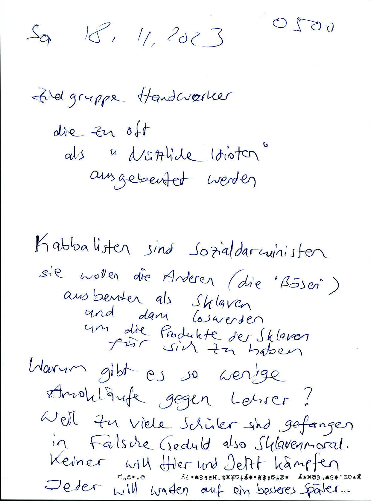

## 2023-11-18.05-20.traum.kampf-gegen-mob-von-sozialisten.webp

<blockquote>

Sa 18.11.2023 0520

# Traum

Ich Individualist und Kommunist
kämpfe gegen
einen Mob von Sozialisten.

Am Schluss:
Der Kampf ist aussichtslos
weil ich
rufe "Polizei"
aber Polizei hilft den Sozialisten
die werden freigesprochen für alles
Ich werde schuldig gesprochen für alles
→ Selektion nach Persönlichkeitstyp

Ich bin von Natur aus "böse"
werde immer bestraft
die sind von Natur aus "gut
und werden immer belohnt


</blockquote>

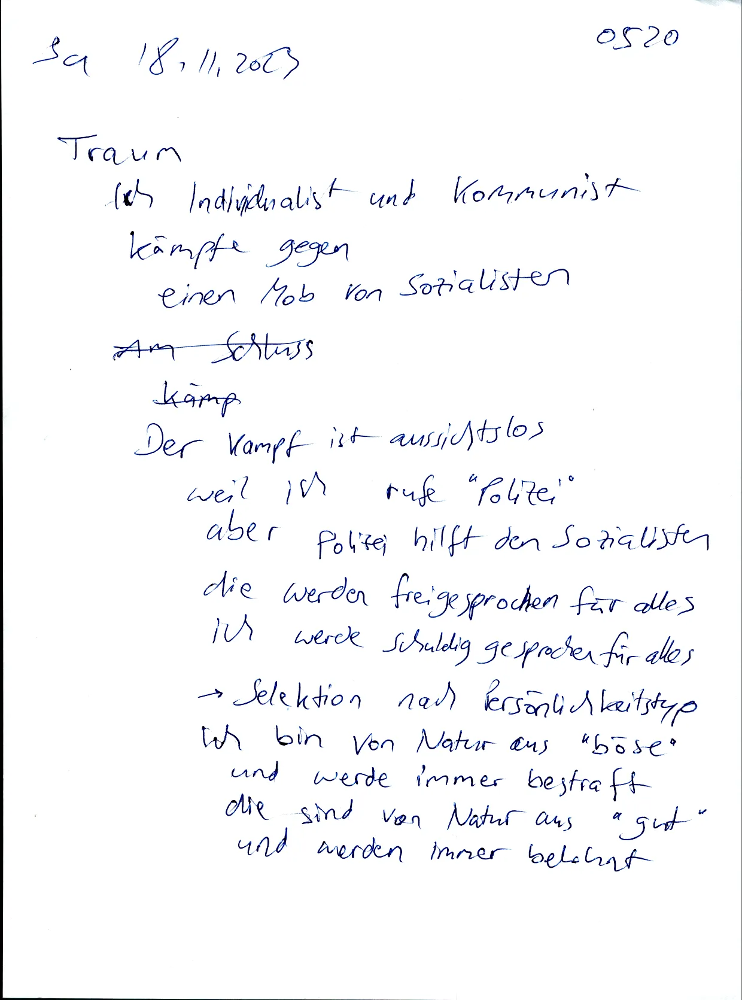

## 2023-11-18.05-21.warum-so-wenig-amokläufe-gegen-lehrer.falsche-geduld.webp

<blockquote>

Warum so wenig Amokläufe
gegen Lehrer

Alle wollen ewig leben im Später.
Keiner will sich opfern im Hier und Jetzt.
Alle lassen sich ködern durch falsche Geduld.
Alle sehen das Leben als Geduldspiel,
wo man möglichst lange durchhalten soll.

Zeit vergeht, Scheisse bleibt.  
Tempus fugit, dolor manet.

Dumme Fragen...
Warum ist diese Welt

- So ungerecht
- So komplex
- so verlogen


</blockquote>


## 2023-11-19.07-00.elektrosmog-ist-körperverletzung.webp

<blockquote>

So 19.11.2023 0700

Elektrosmog ist Körperverletzung

aber wenn der Esmog überall ist
dann ist es "normal"?

Esmog ist überall?

- Mobilfunk
- WLAN
- Smartmeter
- Smart Home
- Internet of Things
- Wechselstromnetz
- Displays
- Monitore
- Photovoltaik-Inverter,
- Schaltnetzteile
- PLC (?)
- Gigabit LAN

alle diese Elektrogeräte
produzieren Elektrosmog


</blockquote>


## 2023-11-19.07-01.south-park.i-just-wanted-to-know-where-your-line-is.webp

<blockquote>

South Park

I just wanted to know
where your Line is

x is okay but y is bad

-- Garisson President

Shitting on Mexicans is okay...


</blockquote>


## 2023-11-20.06-00.slave-morality.useful-idiots.webp

<blockquote>

Mo 20.11.2023 0600

Leftists, Gays, Civilians,
Socialists, Pacifists

They are proud
because their stupidity
is rewarded from above
when in reality
they are just Useful Idiots
for their masters.

They dominate the public.

# Contact

My enemies know where I live.
My friends should know too.


</blockquote>

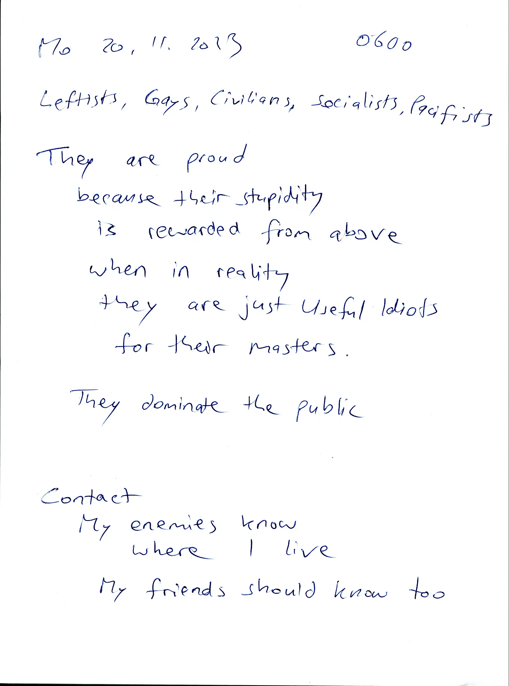

## 2023-11-21.05-30.sozialisten-marschieren-wieder.webp

<blockquote>

Di 21.11.2023 0530

Versicherungszwang ist ein Nazi-Gesetz?

Die Sozialisten marschieren wieder
und rekrutieren ihre Freunde
aus Türkei (Graue Wölfe)
und Ukraine (Bandera)
und Afrika (Billige Soldaten und Arbeiter)

----

1234 durch 5 gleich 246,8
ist ein "Streaming Algorithm"
weil die Eingabe (1234)
kann unendlich lang sein
(1234321424123424132...)
und ich kann für jede Stelle
gleich das Ergebnis berechnen
(2468642848246848264...)

Allgemein:
Multiplikation ist einfacher als Division.

Aber "durch 10" ist
nur bei Basis 10 einfach.
Ein Computer rechnet in Basis 2
und braucht andere Optimierungen.


</blockquote>

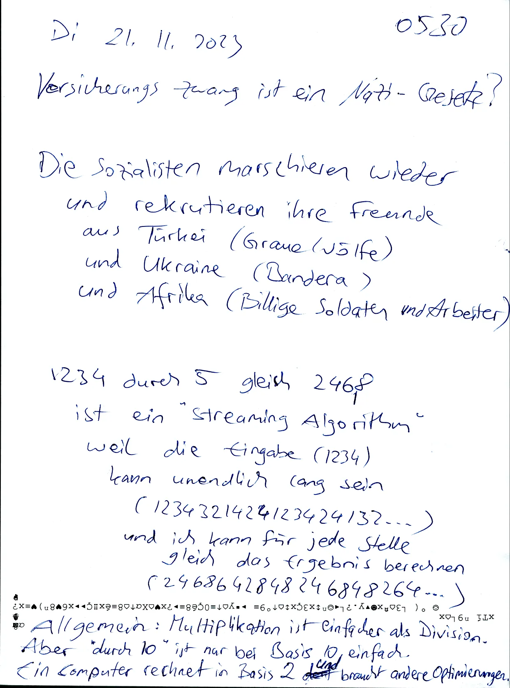

## 2023-11-21.06-00.typen3401.satanisten-aber-keine-satane.meine-forschung-wird-zensiert.webp

<blockquote>

Di 21.11.2023 0600

# Typen 3401

Satanisten aber keine Satane

Grundtypen 34 aber kein Grundtyp 1

Sie spielen nur den Satan
aber sie sind kein Satan

Falsche Satane.

Fake Saterns.

# Herrenmoral

Warum wird meine Forschung
ignoriert und zensiert?

Weil "manche Leute"
(Tyреп 34
oder Typen 23
oder Typen 24
Oder Typen 234)
werden das hier nie verstehen
also schämen sie sich
weil sie sich dumm fühlen
und weil sie keine Typ 1 Freunde haben
zum Delegieren.


</blockquote>


## 2023-11-21.06-01.catch-22.gute-organisation.ausweg-theater-spielen.lets-play-pretend.webp

<blockquote>

... also das Catch 22 Problem:

Wenn man
eine Hypothese testen will
dann braucht man
eine gute Organisation
aber meine Hypothese
beschreibt den Aufbau
Von guten Organisation.

Ausweg: Theater spielen.
Lets play pretend.
(fake it til you make it.)
Nehmen wir an
die Hypothese ist wahr,
in begrenztem Zeit and Raum.
Experimentierfeld.
"Glauben" an die Hypothese
für begrenzte Zeit.
Tun wir mal so
als hätte ich Recht.


</blockquote>

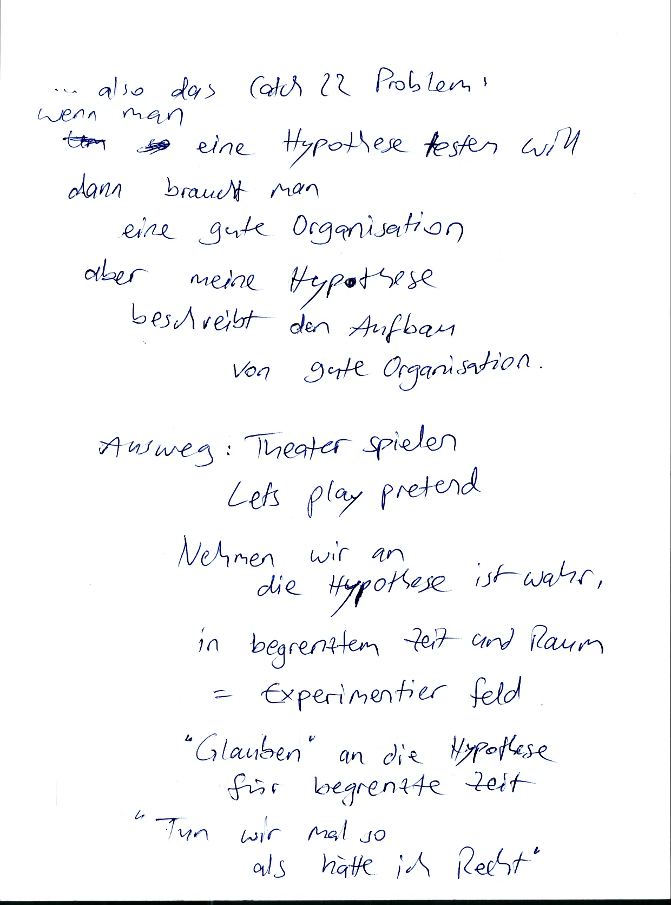

## 2023-11-21.13-30.sozialisten-sagen-spalter-sind-böse.webp


## 2023-11-22.06-00.essenzielle-nährstoffe.grundwissen.collaborative-subtitles-editing.webp


## 2023-11-22.06-01.publishing-torrents.jeder-sucht-seine-leute.webp


## 2023-11-23.06-00.wege-und-ziele.strategie-oder-kurzsicht.webp


## 2023-11-23.06-01.potenzielle-revolutionsführer-werden-ruhiggestellt.webp


## 2023-11-23.07-00.schlaue-technik-für-dumme-menschen.webp


## 2023-11-23.22-00.links-rechts.schlampig-konsequent.webp


## 2023-11-24.06-00.bullen-drohen-mit-hausdurchsuchung.webp


## 2023-11-24.11-00.das-leben-der-anderen.hysteriker.webp


## 2023-11-25.06-00.psychologie-ist-gnostik.webp

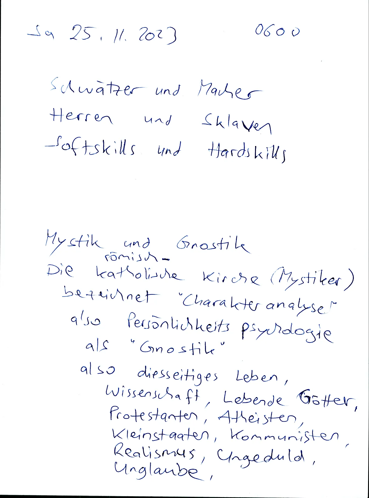

## 2023-11-25.06-01.todo-scraper-opensubtitles.webp

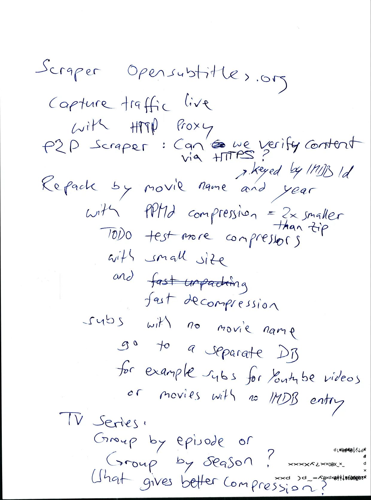

## 2023-11-25.06-30.sozialdarwinismus.tod-den-ungläubigen.webp


## 2023-11-25.07-00.hausdurchsuchung-gegen-bücherdrucker.webp


## 2023-11-25.07-01.hausdurchsuchung-gegen-bücherdrucker.webp


## 2023-11-25.07-30.sneakernet.webp

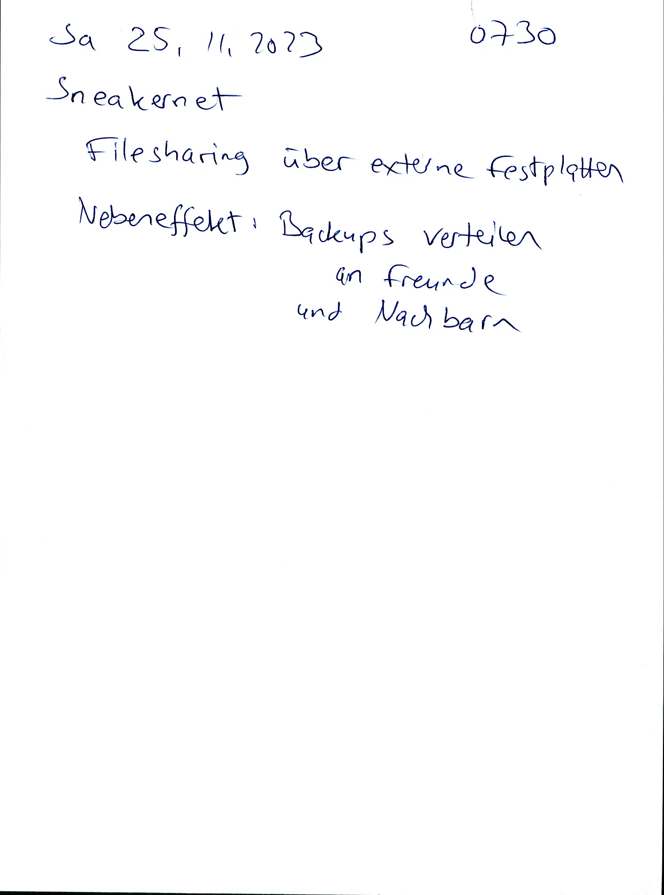

## 2023-11-29.05-00.kleinfamilie-ist-keimzelle-für-faschismus.alles-falsch-machen.webp


## 2023-11-29.05-01.99-prozent-idioten.wir-sind-schon-mitten-drin-in-der-idiokratie.webp


## 2023-11-29.11-00.sklavenmoral.assume-good-faith.pharmaindustrie-gleich-geldgier.problem-patente-copyright.webp

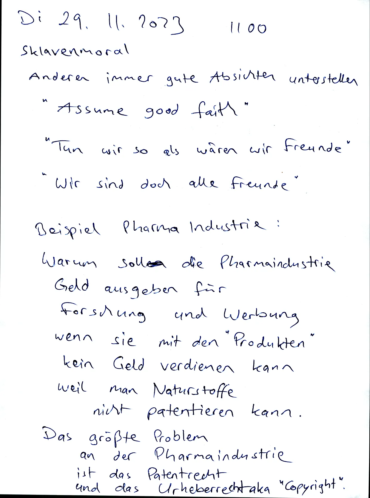

## 2023-11-29.11-01.let-me-open-your-eyes.webp


## 2023-11-30.05-00.hausdurchsuchung-noch-nicht-aber-drohungen-werden-lauter.webp


## 2023-11-30.05-10.zivilisation-ist-kampf-gegen-natur.einseitige-selektion.webp

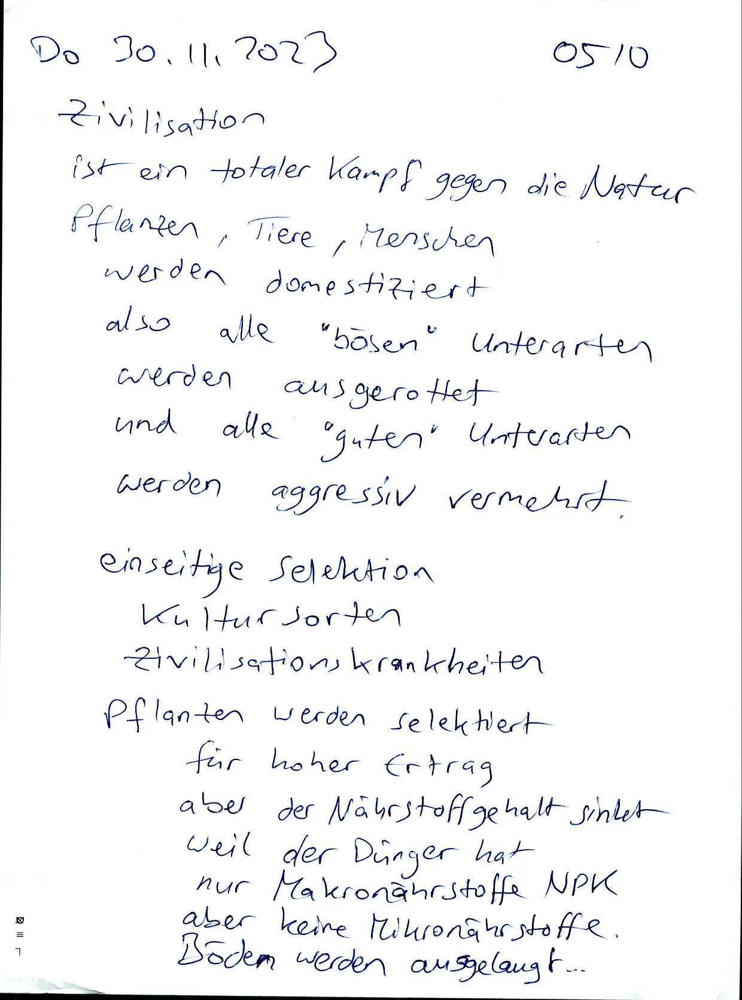

## 2023-11-30.06-00.kommunisten-sind-staatsfeinde-in-sozialistische-diktatur.sklaven-sollen-abhängig-sein.webp


## 2023-11-30.06-01.kommunismus-sozialismus-gruppengröße.webp


