# 2023-12

## 2023-12-03.07-00.warum-braucht-man-freunde.delegieren-von-schwäche.webp

<blockquote>

So 3.12.2023 0700

# Warum braucht man Freunde?

Zum Delegieren von Schwäche:  
"Ich kann das nicht,  
du kannst das,  
magst du mir helfen?"


</blockquote>


## 2023-12-04.06-00.pazifisten-machen-passive-selektion.webp

<blockquote>

Mо 4.12.2023 0600

# Pazifisten machen Passive Selektion.

Sie warten bis einer Hilfe braucht,
und wenn er würdig ist
dann helfen sie ihm
damit er länger lebt,
und wenn er unwürdig ist
dann stellen sie sich dumm
und schaden ihm,
damit er früher stirbt.

# Pharmaindustrie und Schulmediziner

arbeiten "profitorientiert"
also machen nur das
für das die Krankenkasse zahlt.

Am besten patentierte Kunststoffe
weil Naturstoffe kann man nicht patentieren
weil auf Naturstoffe gibts keine Patente.


</blockquote>


## 2023-12-04.06-01.seedless-grapes.bullen-hassen-dieses-buch.1234-taxi.webp

<blockquote>

# Seedless grapes

This is why they are selling
"Seedless" grapes:  
The grapeseeds are too good
for the public.

----

# Bullen hassen dieses Buch

Warnung:  
Bullen hassen dieses Buch.  
Verstecken, Lesen, Kopieren.

----

# TAXI

Buchstaben: 1234 = TAXI

Deswegen wird das "TAXI" immer
groß geschrieben.

A = λ = Delta = Birne = Schiene

Ziffern
1234 = 9681 = qbBI


</blockquote>


## 2023-12-04.06-30.sozialisten-wollen-unschuldig-sein.webp

<blockquote>

Mо 4.12.2023 0630

# Sozialisten wollen unschuldig sein

also jeder sozialist
macht
nur
einen kleinen Schlag
gegen den Feind
und irgendwann stirbt der Feind.

"death by a million cuts".

und jeder Sozialist
hat seinen kleinen Beitrag
geleistet.

Deswegen:
Sozialisten sind
Schläger und Folterknechte.

Aber Sozialisten sind keine Mörder
weil das wäre "zu viel".


</blockquote>


## 2023-12-05.06-00.technische-probleme-sind-gelöst.bleiben-nur-soziale-probleme.webp

<blockquote>

Di 5.12.2023 0600

Wer an einen
"ewigen Fortschritt der Technik"
glaubt
(Fortschritt fort von der Naturordnung)
der hat keine Ahnung von Technik.

der sieht nicht:

unsere technischen Probleme
sind schon alle gelöst,
die wissenschaft ist am Ende.

es gibt keine
"revolutionaren" Entdeckungen mehr,
so wie sie in der Vergangenheit
immer wieder passiert sind.

Unsere größten ungelösten Probleme
sind "soziale" Probleme.  
Also Menschen sind das Problem.

Aber dafür sind Sozialisten blind
weil
"Menschen sind unendlich wichtig" ...


</blockquote>


## 2023-12-05.06-01.typ1-wird-ferngehalten-von-soziale-probleme.webp

<blockquote>

# Handwerker

Typ 1
(Kommunist bei Hans Eysenck)
soll immer nur
technische Probleme lösen
(Handwerker)
und wird ferngehalten
von sozialen Problemen
auf die Typ 3 (und Typ 4)
ein Monopol haben will.

Typen 34 sind geborene ...

- Verwalter
- Schwätzer
- Erzieher
- Psychologen
- Soft Skills


</blockquote>

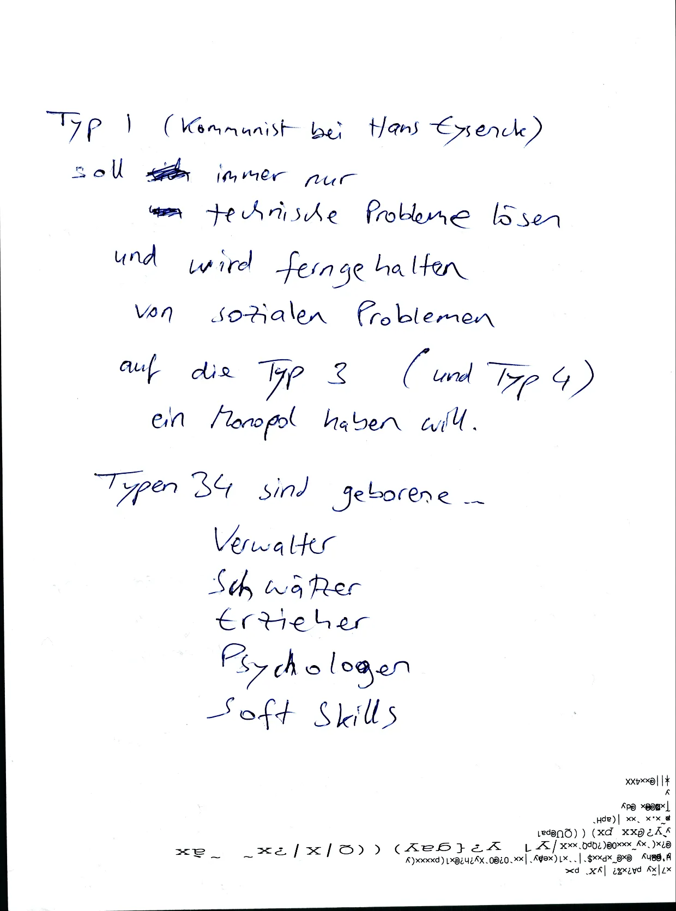

## 2023-12-05.07-00.was-ist-wenn-ich-recht-hab.webp

<blockquote>

Di 5.12.2023 0700

# was ist wenn ich Recht hab?

Dann scheitert
das Paradies auf Erden
am Serienmord-Verbot.

Wenn meine "Pallas-Hypothese"
richtig ist
also wenn das Pallas-Muster
kompatible Beziehungen
Stabile Bindungen von Menschen
beschreibt und vorhersagt
deskriptiv und preskriptiv

----

Quote Vatican

Sklavenmoral beschimpft Herrenmoral
als "unchristlich"

(done.
charakteranalyse ist unchristlich,
new age, esoterik)


</blockquote>


## 2023-12-05.10-00.revolution-von-oben.webp

<blockquote>

Di 5.12.2023

Jede Revolution
ist eine Revolution von oben.

Jede Bewegung von unten
braucht Sponsoren, Mezäne, (Champions?),
Insider, Patrons,
die diese Bewegung von oben fördern
also vor allem Geld schicken.


</blockquote>


## 2023-12-06.00-00.private-public.webp

<blockquote>


 Private | Public
---|---
Aggressive | Defensive
Soldiers | Civil
Soldiers | Farmers
Destructive | Productive
Masters | slaves
Leaders | Followers
Decisions | Rationalizations
Acting | Thinking
Mafia | Parliament
Crime | Sheepskin
Violence | Figleaf


</blockquote>


## 2023-12-07.06-30.kinderhasser-sekten.webp

<blockquote>

7.12.2023 0630

Kinderhasser-Sekten
verstümmeln ihre Kinder

lebenslange Schäden

wie Genitalverstümmeling

wie Impfschäden

wie Traumatisierung
(dem Kind wird
sein Papa weggenommen)
(das Kind wird
vom Jugendamt "gerettet"
weg von seinen Eltern
in eine "Ersatzfamilie")


</blockquote>


## 2023-12-07.07-00.sozialisten-sind-erzieher.webp

<blockquote>

Do 7.12.2023 0700

Sozialisten arbeiten am liebsten
als Erzieher, Pfarrer,
Vorbeter, Pädagogen,
Sozialpädagogen, Psychologen,
Psychiater, Bürokraten, Verwalter,
Maintainer, Konservierer, Mentalisten,
Lehrer, Politiker, Journalisten, ...

weil man für "den Staat" arbeitet.

Also überall

- wo man unschuldig sein kann
- wo man mit dem Kopf "arbeitet"
- wo man soft "skills" braucht
- wo man antisoziale Menschen versklaven / umerziehen / reparieren kann damit die für die Gesellschaft" arbeiten.
- wo man die "Zivilisation" noch größer machen kann.
- wo man den dummen Arbeitern = Handwerker diktieren kann, wie sie arbeiten müssen und wie sie denken and reden mussen.


</blockquote>

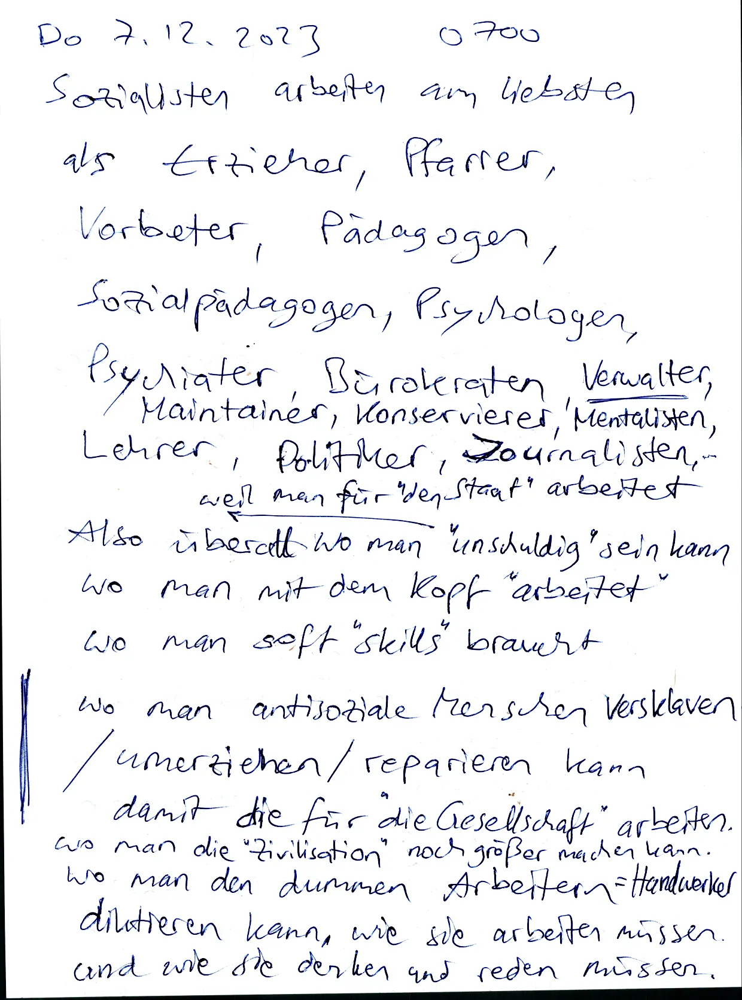

## 2023-12-07.07-01.der-ist-fertig.fertigsein-positiv.webp

<blockquote>


</blockquote>

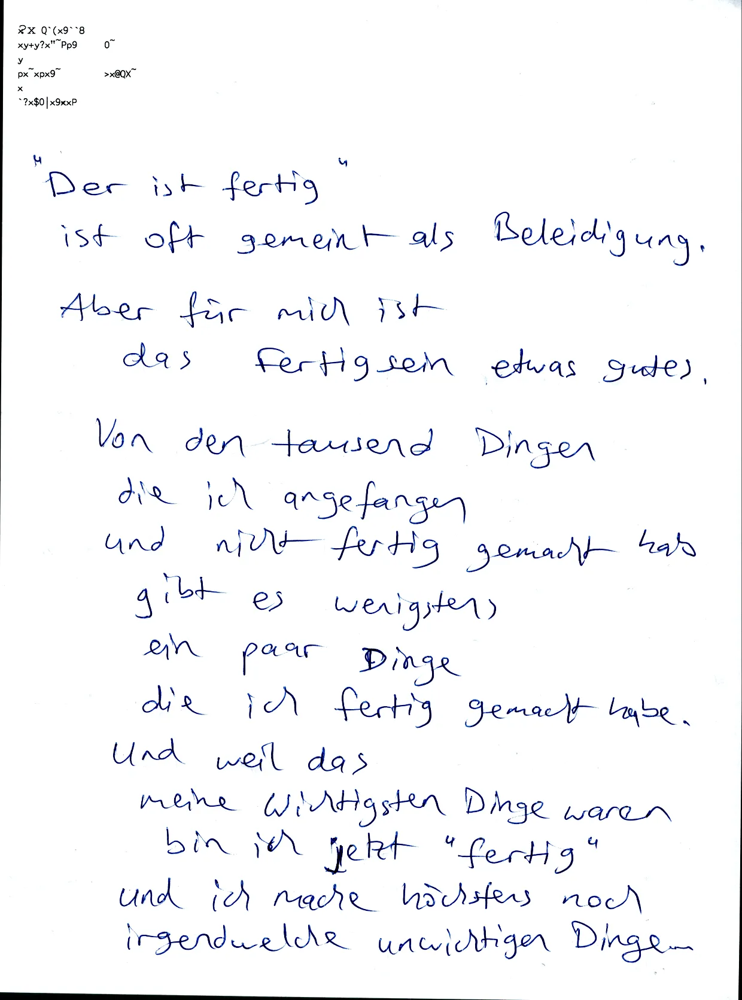

## 2023-12-09.06-00.jude-synonym-profitgier-ausbeuter.webp

<blockquote>

Sa 9.12.2023

TODO Joined Translation:
Also add "notranslate" words
to the import text
to fix the context

Cancer Cures: Shorter

Jude ist and synonym
mit Profitgier und Ausbeuter
weil Juden dürfen Zinsen nehmen
und Christen dürfen nicht.

Herren und Sklaven:
Sklaven sollen arbeiten
Herren Profitieren
als "Parasiten"
als "Blutsauger"

Also "Juden" sind
Kreditgeber und Zinsnehmer,
aber auch Bürokraten, Verwalter,
Manager, ... alle die unproduktiv sind.


</blockquote>


## 2023-12-09.07-00.mit-bloßen-händen-erwürgen.typ1.webp

<blockquote>

Sa 9.12.2023 0700

# Mit bloßen Händen erwürgen

Suffocating with bare hands

Test für Typ 1:
Wenn Typ 1 ein anderes Tier töten will
dann schafft Typ 1
das auch ohne Werkzeug
und nur mit seinen Händen.
Und er braucht keine Ausrede
wie "Gott hat meine Hand geführt"
sondern er ganz alleine
hat das entschieden und gemacht.


</blockquote>


## 2023-12-09.07-01.sklavenmoral-herrenmoral.webp

<blockquote>

Sklavenmoral | Herrenmoral
---|---
Noah's Gesetze | .
Schulmedizin | Naturmedizin
sich helfen lassen von den Experten | Selbsthilfe
Abhängigkeit | Freiheit
wird subventioniert | ist verboten
wird belohnt | wird bestraft
wird bezahlt von der Versicherung | muss man selber zahlen
wird beworben | wird totgeschwiegen
lernt man in der Schule | muss man selber lernen
konventionelle Lösungen | alternative Lösungen
Mainstream | Dissidenten
Zentrum | Hinterwäldler
Normal | "verrückt"
Öffentlich | Privat
"richtig" | "krank"
zivilisiert | wild
orthodox | "rechtsextrem"
Menschen | Tiere


</blockquote>


## 2023-12-09.12-00.alle-gefangenen-sind-nur-sündenböcke.webp

<blockquote>

Sa 9.12.2023 1200

Alle Gefangenen sind nur Sündenböcke
von denen "die Gesellschaft" sich befreien will.

Das gilt für alle Gefangeren
also Strafvollzug, Untersuchungshaft,
Psychiatrie, Therapeutische Einrichtung, ...


</blockquote>


## 2023-12-10.06-00.ensembles-of-personality-types.personality-database.webp

<blockquote>

So 10.12.2023 0600

# Ensembles of Personality Types

Personality Database is mostly wrong  
because people misunderstand MBTI  
and the typed people appear alone  
but types are always relative  
to closely-bonded other types,  
family, friends

TODO Localize Ensembles
in Alchi Maps

# Gerechtigkeit beim Orgasmus

Amazon-Stellung für die Frau  
Missionar-Stellung für den Mann  
Revolution - Umdrehung - Rollerwechsel


</blockquote>


## 2023-12-10.06-01.revolution-ist-rollenwechsel.webp

<blockquote>

# Revolution ist Rollenwechsel

Sklaven werden Herren

Rachefeldzug gegen alte Herren.  
Rache für Vergewaltigung,
Machtmissbranch

# Vor den Toren der Stadt

wuchert das Elend

weil keiner fühlt sich verantwortlich
zum Aufräumen,
weil das wäre ja "aggressiv" und "dreckig"


</blockquote>


## 2023-12-10.07-00.alles-läuft-falsch.wichtige-arbeit-ist-unterbezahlt-oder-verboten.webp

<blockquote>

So 10.12.2023 0700

# Alles läuft falsch

wichtige Arbeit ist unterbezahlt
oder verboten (Staatsfeinde)

Sinnlose Arbeit ist überbezahlt
und subventioniert (Systemgewinner)

Kollektive Selbstzerstörung

Systematisch alles falsch machen

Suizid Kult

überall Gift

Kampf gegen Natur

"Dieses Leben ist Scheisse
und nach dem Tod
kommt ein besseres Leben"

Gesinnungsethik

Mentalisten

gut gemeint

Mind over Matter

Konstruktivisten:
Ich mach mir die Welt wie sie mir gefällt.


</blockquote>


## 2023-12-10.07-01.wahrheitsmatrix-beispiel.sinnlose-abwehr.kontrollgruppen.webp

<blockquote>

# Wahrheitsmatrix Beispiel

## Sinnlose Abwehr

man macht ein Abwehr-Ritual,
es passiert nichts
also fühlt man sich bestätigt
in seinem Ritual

(Placebo Effekt)  
(false negative)  
(Typ 2 Fehler)  
(falsche Abwehr)

Aber man weiss nicht:

was wäre passiert
wenn man nichts gemacht hatte?

Dafür braucht man
Kontrollgruppen.

## Falsche Kontrollgruppe

Pseudo-Placebo bei Impfungen
wo das Placebo keine Kochsalzlösung ist
sondern (giftige) Aluminiumsalze etc enthält.


</blockquote>


## 2023-12-11.05-00.was-sagen-meine-feinde-über-mich.dein-pallas-buch-darfst-du-nicht-mehr-verteilen-sonst-brechen-wir-ein-in-deine-wohnung-rauben-deine-wertsachen-und-stecken-dich-5-jahre-in-den-knast-wegen-volksverhetzung.webp

<blockquote>

Mo 11.12.2023 0500

(was sagen meine Feinde über mich)

Dein Pallas-Buch
darfst du nicht mehr verteilen,
sonst brechen wir in deine Wohnung ein,
rauben deine Wertsachen,
und steder dich 5 Jahre in den Knast
wegen "Volksverhetzung".

-- ein Staatsanwalt, Jahr 2023


</blockquote>


## 2023-12-11.05-10.gewaltverbrecher-kriegen-freispruch-damit-im-knast-platzt-ist-für-gedankenverbrecher-wie-mich.geldfälschen-ist-erlaubt-für-banken.webp

<blockquote>

alle Gewaltverbrecher
werden freigesprochen
damit in Knast platz ist
für so Gedankenverbrecher wie mich.

Gold fälschen und Geld fälschen
ist verboten für Sklaven
aber erlaubt für Banker.

(Straftaten sind Privilegien für Reiche.)

(quod licet Jovis, non licet Bovis.)


</blockquote>


## 2023-12-11.05-20.staatsanwalt-hasst-mich-weil-seine-soldaten-also-erzieher-und-lehrer-auf-meiner-todesliste-stehen.falsche-aussage-gegen-mich-von-bullen.webp

<blockquote>

Мо 11.12.2023 0520

# Meine Todesliste

Staatsanwalt hasst mich
vielleicht auch weil
seine Soldaten
(Erzieher und Lehrer)
auf meiner Todesliste stehen.

----

# Was sagen meine Feinde über mich

Der hat gesagt
"Fickts euch
ihr scheiss Bullenschweine"
nachdem ich
die Bullen mit
"fickts euch"
verabschiedet habe.


</blockquote>


## 2023-12-11.05-30.was-sagen-meine-feinde-über-mich.du-gehst-3-jahre-in-den-knast-weil-du-zu-viel-naturmedizin-produziert-hast.webp

<blockquote>

Mo 11.12.2023 0530

# was sagen meine Feinde über mich

Du gehst 3 Jahre in den Knast  
weil du zu viel Cannabis angebaut hast.

zu viel Cannabis =  
zu viel Naturmedizin.


</blockquote>


## 2023-12-11.05-40.16-jahre-alt-und-arbeitslos.kein-bock-auf-schule.lehrer-labern-scheisse.eltern-müssen-zahlen-bis-du-25-jahre-alt-bist.webp

<blockquote>

Mo 11.12.2023 0540

# 16 und arbeitslos

Stell dir vor
du bist 16 Jare alt
und du hat keinen Bock mehr
auf Schule
weil die Lehrer
nur Scheisse labern
und dir null Praktisches lehren.

Du kriegst kein Geld
vom Jobcenter
weil deine Eltern
müssen Unterhalt zahlen
bis du 25 Jahre alt bist.


</blockquote>


## 2023-12-11.05-50.gute-arbeit-finden-ist-schwer.wichtige-arbeit-ist-unterbezahlt.gut-bezahlte-arbeit-ist-scheisse.webp

<blockquote>

Mo 11.12.2023 0550

Also deine Eltern sagen
"Geh arbeiten"
und auch du
willst nicht abhänging sein
vom Taschengeld.

Essen. Schlafplatz.

Arbeit finden ist schwer
weil wichtige Arbeit ist unterbezahlt
(Gärtner, Erntehelfer, ...)
und gut bezahlte Arbeit ist scheisse.


</blockquote>


## 2023-12-11.05-55.webp

<blockquote>

Zu jung für Sozialhilfe

Alter 15 bis 25 Jahre

"arbeitsfähig"

Eltern sind unterhaltspflichtig.
Eltern müssen Unterhalt zahlen.

Wenn Kinder arbeiten wollen
aber keine Arbeit finden.

(siehe Kleinanzeigen:
Dienstleistungen, Nachbarschaftshilfe)


</blockquote>

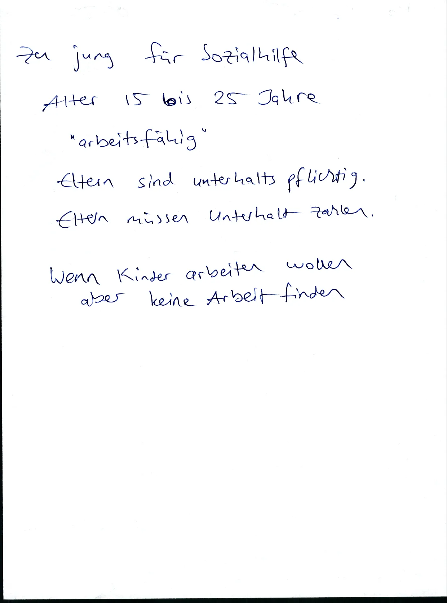

## 2023-12-11.06-00.eltern-entlasten.paar-leute-kaltmachen-und-15-jahre-in-den-knast.dann-zahlt-der-dumme-steuerzahler.webp

<blockquote>

Mo 11.12.2023 0600

Wenn dein wichtigstes Ziel ist
"Ich will meine Eltern entlasten"
dann geh
ein paar Leute kaltmachen
und setz dich
für 10 oder 15 Jahre
in den Knast.
Dann muss
der dumme
Steuerzahler
jeden Tag circa 500 Euro
Haftkosten zahlen.


</blockquote>

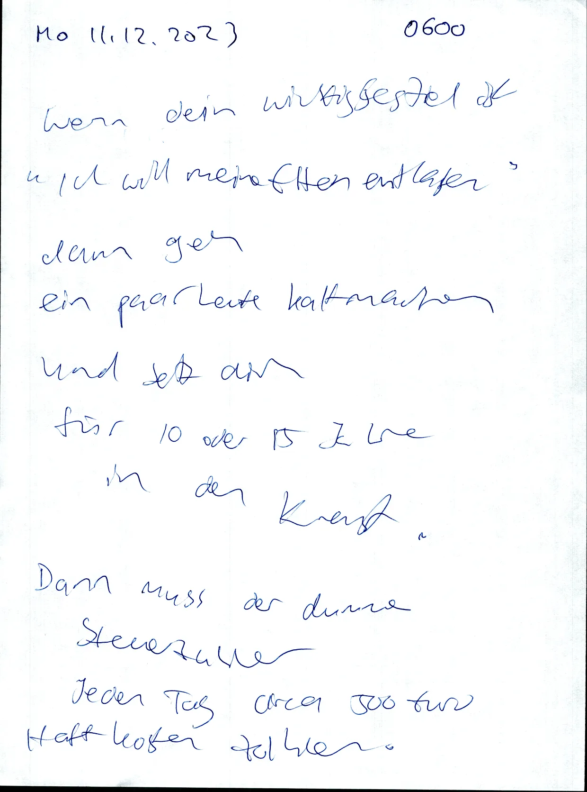

## 2023-12-11.06-10.zu-wenig-amokläufe-gegen-erzieher-und-lehrer.wie-viel-schaden-diese-menschen-produzieren.staatlich-geprüfte-kinderficker.marktlücke.webp

<blockquote>

Mo 11.12.2023 0610

Es gibt sowieso viel zu wenig Amokläufe
gegen Erzieher und Lehrer
wenn man überlegt
wie viel Schaden diese Menschen produzieren
als staatlich-geprüfte Kinderficker.
("Kinderficker" im Sinn von "Falsche Erziehung".)

Also ich sehe da eine Marktlücke.


</blockquote>


## 2023-12-11.06-20.afd-ist-gemäßigt-rechts.echte-rechtsextreme-forderungen.serienmord-legalisieren.webp

<blockquote>

Mo 11.12.2023 0620

# AFD ist gemäßigt rechts

Es gibt immer wieder Leute
die behaupten
"Die AFD ist rechtsextrem"

Aber ich als
"Rechtsextremer"
sehe mich nicht vertreten
von der AFD.

Als Rechtsextremer fordere ich

- Alle Drogen legalisieren
- Serienmord legalisieren
- ...


</blockquote>


## 2023-12-11.08-30.immer-dabei-haben.nachtlicht-zum-schreiben.windows-mac-android.closed-source-software-ist-für-idioten.überall-backdoors-für-geheimdienste.hardware-backdoors-in-cpus.kompromittierende-strahlung.webp

<blockquote>

Mo 11.12.2023 0830
 
# Immer dabei haben

Nachtlicht zum Schreiben in der Nacht

---

# Closed Source ist für Idioten

Windows und Mac sind für Idioten.
Android auch.

Überall in diesen Programmen
sind Backdoors vom Geheimdienst.

Es ist ja schlimm genug
dass im Prozessor
Hardware-Backdoors eingebaut sind
("CPU bugs")
und dass man über
"kompromittierende Strahlung"
meinen Rechner überwachen kann.

Aber dann muss ich nicht
auch noch Closed Source Software
(Windows and Mac) installieren
und meinen Feinden
noch mehr Zugriff geben.


</blockquote>

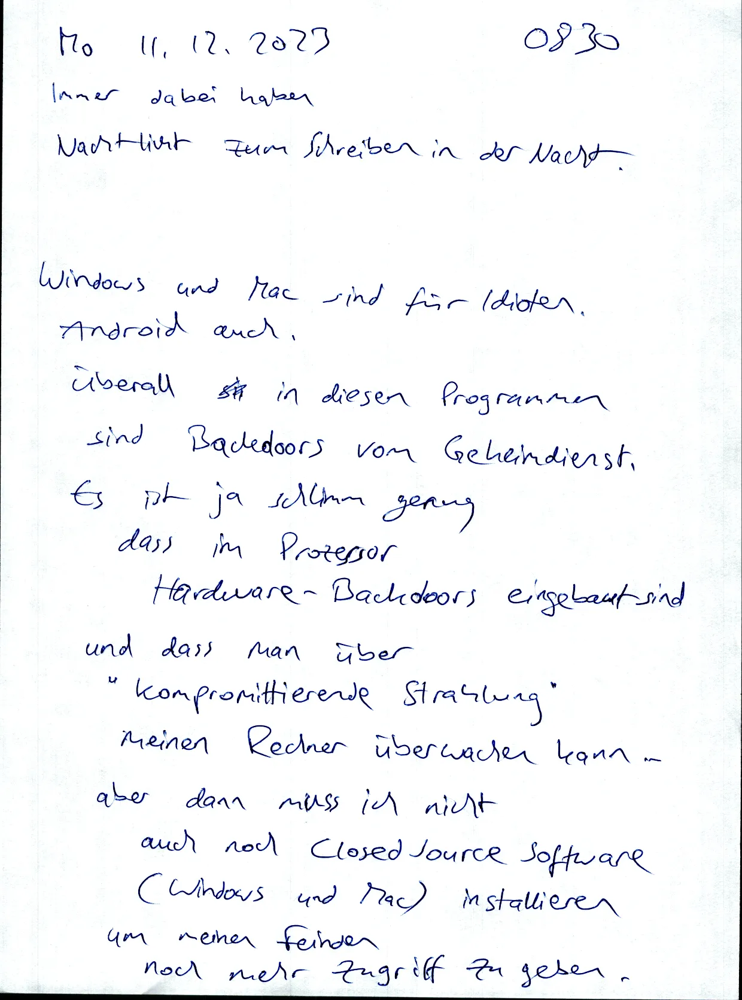

## 2023-12-11.08-40.der-erste-wird-geopfert.woher-kommt-das.webp

<blockquote>

Mo 11.12.2023 0840

"Der erste wird geopfert"  
woher kommt das?

Auch in
Jüdische Kabbala
bzw. Ashkenazi-Juden
also Mafia mit Juden-Flagge.


</blockquote>


## 2023-12-12.06-00.rechtsradikale-forderungen.mein-buch-spaltet-die-menschen.webp

<blockquote>

Di 12.12.2023 0600

# Rechtsradikale Forderungen

Demokratie / Parlament / Wahlen abschaffen  
und dafür eine brutale Militärdiktatur einführen.

# Alles ist ein Persönlichkeitstest

Auch mein Buch "spaltet die Menschen"
in vier Typen:

- Neutral
  - Das Buch ist gut und ...
    - Ich werde aktiv
      - machen dafür
      - arbeiten dafür
      - wetten dafür
    - Ich bleibe passiv
      - denken dafür
  - Das Buch ist schlecht und ...
    - Ich werde aktiv
      - wetten dagegen
      - arbeiten dagegen
    - Ich bleibe passiv
      - denken dagegen

Aktive Hasser sind dann die Leute
die die Polizei rufen
oder die selber als Bullen arbeiten.


</blockquote>


## 2023-12-12.06-01.four-types.webp

<blockquote>

"... mach ein paar Leute kalt ..."

jeder hat seine Todesliste

----

<!--TODO tree -->

- 0
  - dagegen
    - handeln, machen
    - denken, träumen
  - dafür
    - handeln, machen
    - denken, träumen

<table>
<tr>
<td>
Type 1<br>
Resistance leaders<br>
intellectual support
</td>
<td>
Type 2<br>
Resistance helpers<br>
physical support
</td>
</tr>
<tr>
<td>
Type 4<br>
Conservative leaders<br>
intellectual attacks
</td>
<td>
Type 3<br>
Conservative helpers<br>
ad-hominem attacks<br>
"Cops"
</td>
</tr>
</table>

<br>

<table>
<tr>
<td>
Types 12<br>
dafür
</td>
<td>
Types 23<br>
physical<br>
handeln<br>
machen<br>
arbeiten<br>
körperlich<br>
persönlich
</td>
</tr>
<tr>
<td>
Types 14<br>
mental<br>
denken<br>
träumen<br>
reden<br>
intellektuell
</td>
<td>
Types 34<br>
dagegen
</td>
</tr>
</table>


</blockquote>


## 2023-12-12.07-00.m104s-gegen-m302l-grundtyp-subtyp-vertauscht.webp

<blockquote>

Di 12.12.2023 0700


Milan | Milan sein Papa
---|---
Typ 104 | Typ 302
radikal | gemäßigt
extreme Forderungen | Kompromisse
extrem männlich | extrem weiblich

Problem:  
Grundtyp and Subtyp
sind vertauscht

Er sucht M401. Ich bin M104

```
            M2
           /
F1  F2  F3 |F4
           \
M2  M1  M4  МЗ
       /      \
F4  F3 |F2  F1|
       \      /
M3  M4  M1  M2
          \
        F3|
          /
        M4
```

Er glaubt der Subtyp (Typ 1)
vom Mischtyp 401 ist zu stark

und überschattet
den Grundtyp 4

(Mein Vater ist Mystiker und Schulmediziner.
also er fühlt bei mir immer "bei dem ist was falsch"
und er will immer mich therapieren,
also mein "Gehirn waschen",
aber er wird nie verstehen:
diese Unterschiede sind angeboren und stabil,
und er wird immer glauben:
diese Unterschiede sind gelernt und änderbar, weil er glaubt "alle Menschen sind gleich geboren" also "mein Kind muss nach mir kommen".)

(Mein dummer Vater hat auch angefangen
mit der "Diagnose Schizophrenie"
und seitdem glauben alle Ärzte
"der hat Schizophrenie"
und erfinden immer wieder neue "Gründe"
für das Vorurteil "der hat Schizophrenie.
Aktueller "Grund":
"der verteilt sein Buch in Schulen.")


</blockquote>


## 2023-12-12.22-00.einfaches-weltbild.dumm-und-glücklich.webp

<blockquote>

Di 1.11.2023 2200

Einfaches Weltbild.
dumm und glücklich

- Gleichheit
- Konsens
- Definitionen sind eindeutig
- es gibt nur eine Wahrheit
- Objektivismus
- Lösungen sind eindeutig
- Mainstream ist Wahrheit
- Lügen ist Verboten
- Kriminelle sind im Knast
- Die Guten beherrschen die Welt
- Alles wird gut
- Es gibt ein ewiges Leben nach dem Tod
- Geduld lohnt sich

und so weiter


</blockquote>


## 2023-12-12.22-01.religion-wird-oft-zu-eng-definiert.webp

<blockquote>

Religion wird oft
viel zu eng definiert
als etwas künstliches
und als wäre
Religion etwas anderes
als Politik
oder Eseterik
oder Ideologie.

Für mich ist das auch nur
Ausdruck von Persönlichkeitstyp
also ein instinktives
angeborenes
unbewusstes
subjektives Weltbild
und jeder sucht seine "Glaubensbrüder"
mit dem gleichen Weltbild.


</blockquote>


## 2023-12-12.22-10.bullen-suchen-die-billigste-lösung.webp

<blockquote>

Di 12.12.2023 1210

Bullen suchen die billigste Lösung
also als Erstes probieren sie
mir Angst machen
in der Hoffnung
dass ich
"vernünftig" bin
also dass ich ein "guter" Sklave bin
(Angstmensch. Typen 24? Typ 2?)
und freiwillig aufhöre
mein "krankes "Buch
zu verteilen.

Die haben wenig Lust
einen Gerichtsprozess zu machen
wo es die ganze Zeit
um mein scheiss Buch gehen würde
also indirekte Werbung für mein Buch.

Wahrscheinlicher ist dass die mich
Enteignen und/oder Wegsperren wollen
in Untersuchungshaft ohne einen Prozess.


</blockquote>


## 2023-12-13.07-00.radikale-forderungen.webp

<blockquote>

Mi 13.12.2023 0700

# Radikale Forderungen

Todesstrafe für alle Lügen.

Militärdiktatur.

Euthanasie gegen alle Erbkrankheiten.

Todesstrafe für Genitalverstümmelung
gegen Täter und Opfer
weil das offer ist leicht zu finden
aber der Täter ist schwer in finden,
und nur so kann man
diese kranke Tradition brechen.

----

Einkauf: H2O2. Morfs.
Fett für Lederhandschuhe.
Imprägnierspray.

----

Double think. Emotional, Unlogisch.

----

Müll trenen vs Kanacken.

----

Schlaue Antworten sind feldabhängig = relativ.


</blockquote>


## 2023-12-14.05-30.keywords.legalize-serial-murder.citizen-science.too-smart-for-this-world.webp

<blockquote>

Do 14.12.2073 0530

# Keywords

- Legalize Serial Murder
- Citizen Science
- Too Smart for this world
- Censored
- Banned
- Hate speech
- Master Morality
- Too smart for this world
- Volksverhetzung
- Streisand Effect
- Werbeeffekt
- Banned from Public
- Private
- "Secret"
- Esoteric
- Extraterrestrial
- Alien
- Rational Intelligence
- Post-Collapse Culture
- Natural Order
- Natural Communism
- Red Pills
- Hard Truths


</blockquote>


## 2023-12-14.05-40.typen34.sozialismus-und-faschismus.webp

<blockquote>

# Typ 302

Sozialist | nationalistisch
---|---
Grundtyp | Subtyp
Nomen | Adjektiv
Hauptwort | Eigenschaftswort

# Туреn 34

- Sozialismus und Faschismus
- Hysterie und Soft Power
- Planwirtschaft
- Versicherungen
- Steuern, Zwangsabgaben
- Großstaaten, Großkonzerne
- Imperien
- Globalisten
- Linke, Lügner, Emos
- Räuber, Piraten, Skull + Bones


</blockquote>


## 2023-12-14.06-00.meine-feinde-sind-sozialisten.webp

<blockquote>

Do 14.12.2023 0600

Meine Feinde
(Staatsanwälte, Bullen)
sind Sozialisten,  
also Sozialdarwinisten
die alle "antisozialen" Völker
ausrotten wollen,  
und well ich "antisozial" bin
stehe ich auf deren Todesliste.

Weil Sozialismus und Völkermord
gehen Hand in Hand:  
Weil Sozialismus sagt:  
"Gleichheit ist wichtiger als Gerechtigkeit."  
Links ist besser als Rechts.

Die meisten Menschen sind Typen 34  
weil aggressive Vermehrung
(Idiocracy)


</blockquote>


## 2023-12-14.06-10.webp

<blockquote>

... und Sozialismus und Sklaverei
gehen Hand in Hand.

Weil antisoziale Menschen
werden toleriert
wenn sie arbeiten
für einen Hungerlohn,
dafür dass ein "Manager"
(Sozialist oder Faschist)
den 10-fachen Lohn kriegt
dafür dass der Manager
mit seinen Soft Skills arbeitet
(People focus, Emos)


</blockquote>


## 2023-12-14.06-30.emos-sind-taub-für-logik.webp

<blockquote>

Do 14.12.2023 0630

# Emos sind taub für Logik

und werden immer wieder
getriggert von Stichworten.

Beispiel:
negative stichworte wie

- Drogen
- Diebstahl
- Körperverletzung
- Kinderpornos
- Schizophrenie

Wie genau solde Rufmord-Labels
entstanden sind
und wer genau sie produziert hat
das ist völlig egal.

Wenn Emos sowas hören
werden sie überflutet
von negativen Emotionen,
kriegen Angst
und suchen "Hilfe" und "Sicherheit".


</blockquote>


## 2023-12-14.06-40.webp

<blockquote>

# Emos denken in Klischees

wörter haben genau eine Definition
und wenn ein Mensch ein Label hat
dann sind alle Menschen gleich
die dieses Label tragen.

Emos denken in Grobstrukturen.
ungenau, schlampig,
Pfusch, schwamming


</blockquote>


## 2023-12-14.07-00.denunziation-ist-legaler-rufmord.problem.zeugen-sind-immer-unschuldig.idioten-fühlen-sich-beleidigt.webp

<blockquote>

Do 14.12.2023 0700

# Denunzianten sind legale Rufmörder

Das Problem mit allen "Aussagen".
an einen Richter
ist dass die "Zeugen"
immer unschuldig sind
and nie Konsequenzen erfahren.

Beispiel:
Idioten rufen die Polizei
weil sie sich beleidigt fühlen
von meinen Buch.
Die Sache kommt zu einem Richter
und wenn ich viel Glück habe
sagt der Richter "der ist unschuldig".

In meiner Welt würde das heissen:
Alle Zeugen haben gelogen und werden bestraft.


</blockquote>


## 2023-12-14.07-10.sicherheitswahn.wer-legal-arbeitet-der-arbeitet-für-meine-feinde.webp

<blockquote>

# Sicherheitswahn

Aber in dieser Welt
ist man lieber auf
der "sicheren" Seite
also man toleriert Fehler
wenn dabei mehr "Sicherheit rauskommt,
und freiheit wird geopfert
für mehr sicherheit.

# Sympathie nur für Schwarzarbeiter

Wer legal arbeitet
der arbeitet für meine-feinde
die leben von Steuergeld
und Versicherungsbeiträgen.

Polizei ist auch nur eine Versicherung
finanziert über Zwangsabgaben.

Auch bekannt als Mafia
and Schutzgelderpressung.


</blockquote>


## 2023-12-14.07-30.grundtyp-subtyp.natur-kunst.webp

<blockquote>

Do 14.12.2023 0730

Grundtyp | Subtyp
---|---
Natur | Kunst
echt | falsch
angeboren | gelernt
Ziel | Weg
Zweck | Mittel
wahres Gesicht | Maske
real | fake
. | eingebildet
. | Bildung
. | Erziehung
Natur | Kultur
. | Image
Hauptberuf | Nebenberuf


</blockquote>


## 2023-12-14.07-40.freigeist.querdenker.keine-tabus.keine-denkverbote.keine-angst.hitler-zitate.inhalt-ist-egal.formkritik.webp

<blockquote>

# ich bin ein Freigeist

- also "Querdenker"
- also ich habe keine Tabus
- also ich habe keine Denkverbote

... und schon daran
stören sich viele Menschen.

Beispiel:  
Wenn ich Adolf Hitler zitiere
("Judenfrage", Schulzwang)
dann geht es meinen Kritikern
keine Sekunde um den Inhalt
sondern es kommt gleich
der Kurzschluss
von "der zitiert Hitler"
auf
"der ist ein Nazi".
Und "Nazi" ist das neue "Untermensch".
oder "Dalid" also "unberührbar".


</blockquote>

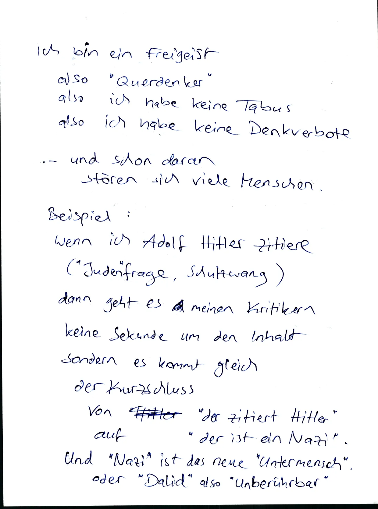

## 2023-12-14.08-00.schulmediziner.psychiater.tagebuch-schreiben.gefühle-festhalten.krankheit-stabilisieren.webp

<blockquote>

Do 14.12.2023 0800

# Schulmediziner

Verbreiten Krankheiten und
sammeln Geld  
= Subventionen  
= Zwangsbeiträge

## Naturmediziner

verbreiten Gesundheit und
Sammeln Strafanzeiger.

# Psychiater

also Psycho-Knast-wärter
hassen es
wenn ihre Gefangenen Tagebuch Schreiben
weil die Gefangenen so
ihre "Krankheit" stabilisieren können
also ihre Gefühle festhalten können.


</blockquote>


## 2023-12-14.08-10.slave-morality.security-or-freedom.webp

<blockquote>

# Slave Morality

Slaves eat shit and live lies
because in return
they get a small part (crumbs)
of the "security" cake
from their "benevolent" masters.

For me, personally,
that is a bad deal
because in my view
freedom is better than security.

And globally
Freedom and Security
should be 50% and 50%
two equal halfs

- Soldiers and farmers
- Masters and slaves

should have equal quantities.


</blockquote>

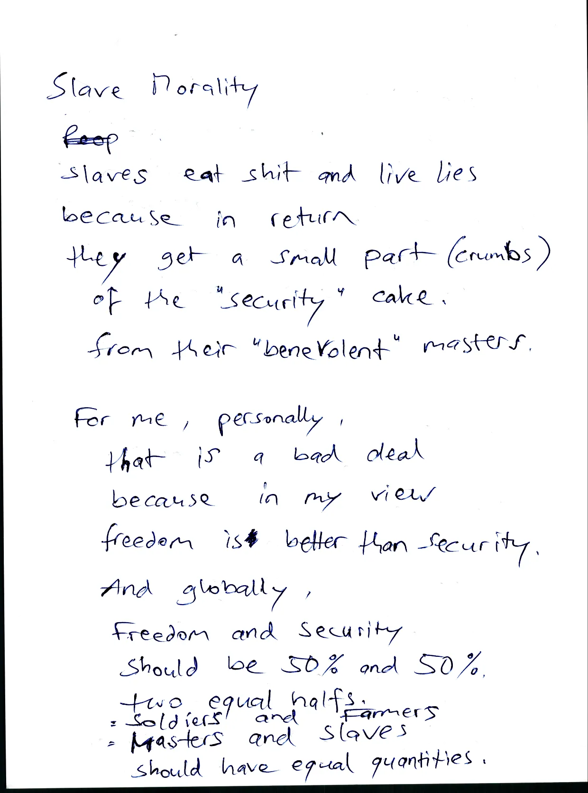

## 2023-12-14.08-30.typen13-typen24.freiheit-sicherheit.täter-opfer.belastbar-verletzlich.webp

<blockquote>

Do 14.12.2023 0830


Typen 13 | Typen 24
---|---
belastbar | Verletzlich. Vulnerable. wenig belastbar
Sucht Freiheit | sucht Sicherheit
High Stress Tolerance | Low Stress Tolerance
"Täter" | "Opfer"
 
Typ 1  
psychisch belastbar  
starker Kopf

Typ 3  
physisch belastbar  
Starker Körper

Typ 4  
Schwacher Kopf  
(indirekt starker Körper)

Typ 2  
schwacher Körper  
(indirekt starker Kopf)

also effektiv:  
Typen 12 sind schlau,  
Typen 34 sind Stark.


</blockquote>


## 2023-12-14.08-40.erziehung.tabus.selektion-gegen-böses-verhalten.erst-denken-dann-machen.intellektuell.typen24-wollen-alles-fertigmachen.webp

<blockquote>

Erzieher nutzen Tabus
also Redeverbote und Denkverbote
zum "böses" Verhalten wegselektieren
weil "erst Denken dann Machen" = Typen 24.

also diese Leute glauben:  
wenn ich über etwas Denke oder Rede,
dann ist es nur eine Frage der Zeit
bis ich es auch mache,
weil ich hab ja angeblich
keine Selbstbeherrschung...

Nein, das sind Typer 24.  
Wenn Typen 24 etwas angefangen haben
dann müssen sie es fertigmachen
um jeden Preis.

# Projektion

Goldene Regel,
Andere als "gleich" behandeln.


</blockquote>


## 2023-12-14.09-30.tabu.denkverbot.thought-stopping.böse-impulse-im-keim-ersticken.thought-police.webp

<blockquote>

Do 14.12.2023 0930

Beim Tabu hōrt das Denken auf

- Thought-Stopping
- böse Impulse im Keim ersticken
- Wehret den Anfängen
- Denkblockade
- Denkverbot
- Thought Police
- Thought Criminals
- Thought Crime


</blockquote>


## 2023-12-15.06-00.einfach-nur-mein-buch-lesen.aber-wer-macht-das-schon.das-wichtigste-steht-auf-15-seiten.das-kann-man-in-einer-stunde-lesen.webp

<blockquote>

Fr 15.12.2023 0600

Wer verstehen will
wie falsch der Polizei-Einsatz
gegen mich ist
der muss einfach nur mein Buch lesen.
Aber wer macht das schon?

Mein Buch hat aktuell 140 Seiten
und das Wichtigste
steht auf den ersten 15 Seiten
die kann man in einer Stunde Lesen.

TODO
Spoiler am Anfang von Buch.

TODO
Inhalt:
Das Wichtigste steht am
am Anfang
auf den erster 15 Seiten.


</blockquote>


## 2023-12-15.06-05.erziehung-ist-psychokrieg-gegen-antisoziale-menschen.sozialismus.sozialdarwinismus.elektrosmog-graph-oberwellen-stromnetz.elektrosmog-ist-folter.webp

<blockquote>

# Erziehung ist Psychokrieg

gegen antisoziale Menschen
im Sozialismus
und Sozialdarwinismus

----

TODO Graf mit Spektrum
Oberwellen im Stromnetz

# Elektrosmog ist Körperverletzung

Elektrosmog ist Folter

Strafe dafür dass man
zu sensibel ist.

Ein Ausweg aus
der Elektrosmog-Folter
ist die selbst-Betäubung
mit Alkohol oder Opium.

Kinder sind sensibler als Erwachsene.

Halluzinogen-Drogen machen sensibel.


</blockquote>


## 2023-12-15.06-30.einseitigkeit-vom-system.zensur-gegen-hassrede-volksverhetzung.man-soll-nur-optimismus-verbreiten-in-der-öffentlichkeit.mystiker-wollen-dumm-und-glücklich-sein.idealisten.mentalisten.mind-over-matter.webp

<blockquote>

Fr 15.12.2023 0630

Die Einseitigkeit
(also ungerechtigkeit)
vom System
zeigt sich auch in der Zensuer
gegen "Hassrede"
oder "Volksverhetzung".

Die Erwartung ist:
In der Öffentlichkeit
soll man nur
Optimismus verbreiten
a la alles ist gut
auch wenn alles scheisse ist.

Den Idealisten
Mentalisten Konstruktivisten
ist ja egal "was "ist"
and viel wichtiger "was sein soll".

Die sagen "Mind over Matter"
also "Mein Kopf ist schlauer als mein Körper"


</blockquote>


## 2023-12-15.06-35.i-do-everything-alone.i-would-have-work-for-100-people.webp

<blockquote>

I do everything alone
I would have work for 100 people.

See also
My public todo List.

But I am alone
So I must focus
on my most-important goals.
and ignore all the rest
which has lower priority.


</blockquote>

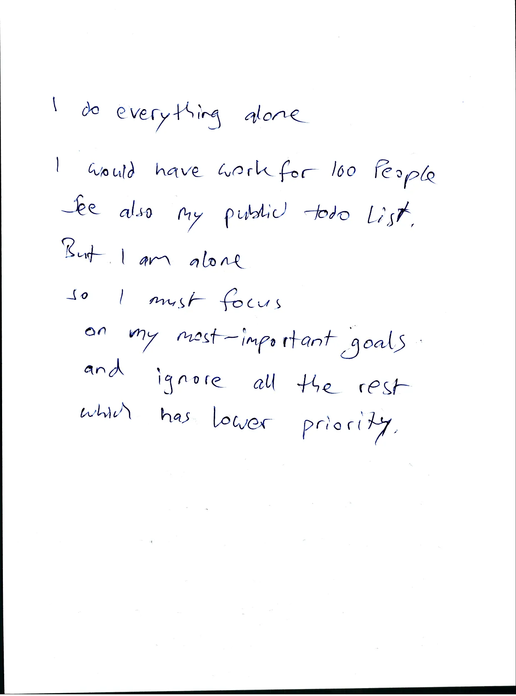

## 2023-12-15.07-00.serious-personality-test.allow-to-add-comments-to-every-question.system-sagt-dummheit-ist-besser-als-bosheit.dumme-sind-nützliche-idioten-für-das-regime.dumm-und-glücklich.bullen-sind-angeblich-gute-gewalt.webp

<blockquote>

Fr 15.12.2023 0700

A serious personality test
should allow to add comments
to every question.

----

Das System sagt

Dummheit ist besser als Bosheit.

(Dummheit: Nützliche Idioten für das Regime.)

Stärke ist besser als Schlauheit

und so dürfen dumme Leute
hemmungslos und schamlos
ihre Dummheit ausleben
also dürfen "dumm und glücklich" sein.

und wenn ich
ein "falsches" Wort sage
dann rufen sie die Bullen
und lassen mich entfernen
mit "guter Gewalt".

(weil ich bin ein spaßverderber,
spielverderber, party pooper, ...)


</blockquote>


## 2023-12-15.07-05.todo-quote-gary-webb-exposed-cia-drug-trafficking.todo-quote-empire-is-the-original-drug-cartel-opium-wars-crack-epidemic.idioten-kämpfen-gegen-symptome.schlaue-menschen-kämpfen-gegen-ursachen.webp

<blockquote>

# TODO Quote

Gary Webb

- killed by the CIA
- exposed Drug Trafficking of the CIA

# TODO Quote

Empire is the original Drug Cartel

- Opium Wars
- Crack Epidemic
- Fentanyl Epidemic

# Reformen

Idioten kämpfen gegen Symptome
und wundern sich
warum die Ursachen bleiben.

Schlaue Menschen kämpfen gegen Ursachen
(radikale Lösungen)
und die Symptome verschwinden automatisch.


</blockquote>

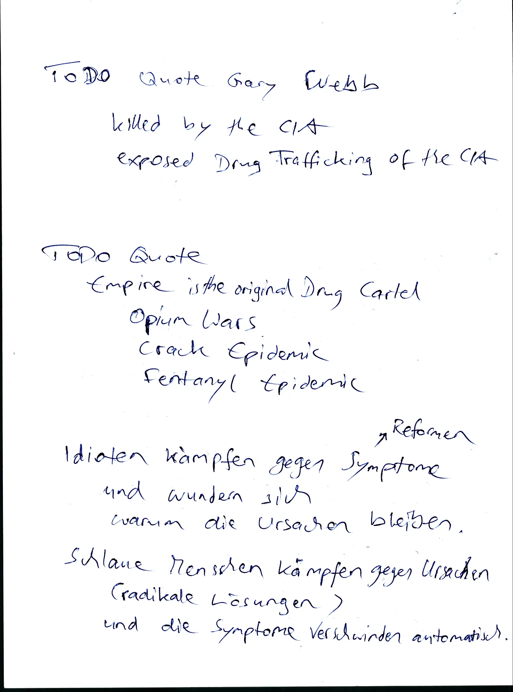

## 2023-12-15.07-30.aussage-gegen-aussage.kämpfen.experimente-machen.alle-aussagen-hypothesen-sind-wertlos-neutral-richtig-oder-falsch.nur-experiment-bringt-wahrheit.rhetorik-mentalisten-sophisten-schwätzer-politiker.schwanzvergleich-ohne-ausziehen.webp

<blockquote>

Fr 15.12.2023 0730

# Aussage gegen Aussage

Wenn Aussage gegen Aussage steht
dann muss man kämpfen
in der echten Welt
oder Experimente machen
in der echten Welt
weil alle Aussagen (Hypothesen)
sind gleich wertlos,
neutral, richtig oder falsch
und nur Experiment
bringt Wahrheit.

Rhetorik = Mentalismus = Sophisten = Schwätzer:
Das ist so als würden
zwei Männer streiten
und jeder sagt:
"Mein Schwanz ist länger als deiner"
aber keiner will sich nackt machen
und seinen Schwanz zeigen
weil das ist ja verboten.

(Schwanzvergleich ohne Ausziehen.)


</blockquote>


## 2023-12-15.07-35.cops-are-afraid-that-my-hypothesis-is-true.consequences-are-too-radical.they-try-to-make-my-hypothesis-look-false.webp

<blockquote>

# mental virus

Cops are afraid
that my hypothesis is true
cos the consequences
are too radical.

So they try to make my hypothesis look false
by stealing my books and throwing me in jail,
to censor my hypothesis,
to prevent
my "mental virus",
my "mental disease"
from spreading to other people.

# Elektrosmog Messgerät

```
  o---[ R ]---o---[ Mic In ]-+
230V         0,5V            |
  o---[ R ]---o--------------+
```

Mic In = Microphone In Port
von Smartphone mit Spektrometer App

Innenwiderstand von Microphone In Port?

(U = I * R)


</blockquote>


## 2023-12-15.08-00.opfer-getue.juden-rhetorik.ich-bin-ein-opfer-also-darf-ich-alles.defense.verteidigung.passive-gewalt.webp

<blockquote>

For 15.12.2023 0800

"Ich bin ein Opfer also darf ich alles."
Juden-Rhetorik,
Opfer-Getue


</blockquote>


## 2023-12-17.07-30.safe-use-oder-repression.learning-by-doing-or-learning-by-thinking.webp

<blockquote>

So 17.12. 2023 0730

Safe use | Repression
---|---
Fehler machen lassen | Fehler sind verboten
aus Fehlern lernen | aus Erfolg lernen
Learning by doing | Learning by thinking

Warum hat unser Kind
die teuere Brille vom Opa kaputt gemacht?

(Nicht weil das Kind
absichtlich die Brille kaputt machen wollte.)

Weil das Kind kennt nur Kinder-Brillen
wo man die zwei Bügel aus Gummi
nehmen und verbiegen kann.

Die dumme Mutter hat auch
"normale" Brillen (Sonnenbrillen)
aber die da sind tabu fürs Kind.
Also das Kind konnte noch nie probieren
was mit einer "normalen" Brille passiert
wenn man sie verbiegt.
(Sie bricht.)

(Das kann man dem Kind nicht sagen
das muss das Kind selbst erlebt haben.
Das Kind braucht eigene Erfahrzngen
und nicht nur "schlaue" Vorurteile.
Probieren geht über Studieren.
Machen ist besser als Reden.
Selber machen ist besser als machen lassen.)


</blockquote>


## 2023-12-18.05-00.echte-rechsextreme-forderungen.austritt-aus-allen-staatenbünden.nato-eu-brd.verbot-von-falschgeld-fiatgeld-gutscheine.webp

<blockquote>

Mo 18.12.2023 0500

# Rechtsextreme Forderungen

Austritt aus allen Staatenbünden:
NATO, EU, BRD.

Verbot von Falschgeld = Papiergeld, Fiatgeld
Gutscheine ohne Gegenwert
→ Golddeckung

----

Spruch

Damit die Bösen and Dummen siegen
reicht es,  
wenn die Guten and Schlauen nichts tun.

----

Schlauheit sieht von unter so aus wie Bosheit.

Typ 1: Boah bist du dumm!  
Typ 3: Boah bist du bose!


</blockquote>


## 2023-12-18.05-30.großstaaten.deutungshoheit.was-alle-glauben-müssen.objektive-wahrheit.aussagen.geister.gerüchte.rufmord.kleinstaaten.wissenschaftliche-methode.sozialismus-gegen-individualismus.webp

<blockquote>

Мо 18.12.2023 0530

In Großstaaten
sagt die Deutungshoheit,  
was Alle glauben müssen
also welche subjektive Wahrheit
zur objektiven Wahrheit wird.  
→Gerichtsprozesse. Nicht-reproduzierbar.
Aussagen. Geister.

In Kleinstaaten nutzt man
die Wissenschaftliche Methode
weil alle subjektiven Wahrheiten
sind gleichwertige Hypothesen
und nur reproduzierbare Experimente
zeigen die Wahrheit.

# Sozialismus

- Individuen opfern
- Minderheiten opfern
- "die Gesellschaft" schützen
- die Sozialisten schützen


</blockquote>


## 2023-12-19.06-00.jeder-steuerzahler-ist-mit-schuldig-an-verbrechen-von-vorgesetzten.leute-wollen-alles-haben-aber-nichts-zahlen.webp

<blockquote>

Dí 19.12.2023 0600

Jeder Steuerzahler ist mit-schuldig
an den Verbrechen
von unseren Vorgesetzten.

----

Typen sind zufällig verteilt
über Geburtstage

----

Bio-Heumilch
vom Supermarkt
ist keine Rohmilch?

----

Die Leute wollen alles haben
aber nichts dafür geben...
irgendwie dumm


</blockquote>


## 2023-12-20.06-00.pallas.vierdimensionale-lösung.problem-wird-in-öffentlichkeit-nur-eindimensional-dargestellt.gut-gegen-böse.webp

<blockquote>

20.12.2023 0600

Meine Pallas-Hypothese
ist eine vierdimensionale Lösung
für ein Problem
das in der Öffentlichkeit
immer nur eindimensional
dargestellt wird.

eindimensional = linear:

- Gut gegen Böse
- Links gegen Rechts

Extrem | Mitte | Mitte | Extrem
---|---|---|---
Links | Links | Rechts | Rechts

→

Extrem | Mitte | Mitte | Extrem
---|---|---|---
Gut | Gut | Böse | Böse


</blockquote>


## 2023-12-20.06-10.zweidimensional.hufeisen-theorie.two-factor-models-of-personality.webp

<blockquote>

Eine zweidimensionale Losung
ist die "Hufeisen-Theorie"
wo die zwei Extremen
wieder zusammen sind

3 = Mitte Links | 2 = Mitte Rechts
---|---
4 = Extrem Links | 1 = Extrem Rechts

Siehe auch:
Two-factor models
of personality

3 = Extraverted Neurotic | 2 = Introverted Neurotic
---|---
4 = Introverted Psychotic | 1 = Extraverted Psychotic


</blockquote>


## 2023-12-20.07-10.sklavenmoral.opfer-auf-rachefeldzug.slaves-on-revenge-trip.webp

<blockquote>

# Sklavenmoral

Opfer auf Rachefeldzug

'Ich bin ein Opfer
also darf ich alles."

I am a victim
So I am allowed everything.

Slave Morality.
Slaves on revenge trip.


</blockquote>


## 2023-12-21.06-00.öffentlichkeit.typen23.sportarten.typ1.reckturnen.klimmzüge.rudern.liegestütze.webp

<blockquote>

Do 21.12.2023 0600

# "Die Öffentlichkeit"

Hier stehen Typen 23
im Mittelpunkt
und Typen 34
stehen am Rand

```
M1 - M2 - M3 - M4

F1 - F2 - F3 - F4
```

# Typ 1 Sportarten / Kraftübungen

- Reckturnen
- Klimmzüge
- Rudern
- Liegestütze


</blockquote>


## 2023-12-21.06-10.alexander-benesch-auf-seinem-es-ist-kompliziert-trip.controlled-opposition-und-controlled-regime.banken-sind-gelddrucker.steuern-zahlen-ist-illusion.webp

<blockquote>

(Alexander) Benesch auf seinem
"es ist kompliziert" Trip:

Wir haben also  
eine "Controlled apposition" (AFD)  
und ein "controlled regime" (SPD)

What about die aggressive NATO Ost-Erweiterung?  
Ist das auch "nur ein Talking Point"?

# Steuernzahlen ist Illusion

Eine Illusion ist ja das Steuernzahlen.
Das sieht dann so aus
als wäre die Regierung
"von unten" finanziert
aber es gibt trotzdem immer
einen Fluss von "von oben"
also Banken
die der Regierung Kredite geben,
von Geld das die Bank
aus dem Nichts schöpft, ohne Gegenwert.
(Inflation)


</blockquote>


## 2023-12-22.06-00.fuck-bitcoin.yay-nanocoin.transaction-fees-are-shit.same-effect-as-inflation.devaluation.nano-is-feeless.webp

<blockquote>

Fr 22.12.2023 0600

Bitcoin? Nanocoin!

Bitcoin and most other cryptocurrencies
are shit
because they charge transaction fees
which have the same effect
as inflation on paper money:
Continuous devaluation.
of the currency.

NANO
(I call it Nanocoin)
is a rare exception
because it has zero transaction fees.

All Electronics and Information Technology
have no future,
but in the near future
I will use Nanocoin.


</blockquote>


## 2023-12-22.06-30.einigung-auf-niedrigem-niveau.quality-and-quantity-are-orthogonal.webp

<blockquote>

Fr 22.12.2023 0630

Einigung auf niedrigem Niveau.

Unification on
low common denominator.

Quality and Quantity are orthogonal:
If you want high Quality L
then you must have low Quantity N.

high L ~ low N

If you want high Quantity N
then you must have low Quality L.

high N ~ low L

L: Luxury, quality, Leetness eLiteress

N: Number, quantity

N * L = const


</blockquote>


## 2023-12-22.06-40.mainstream-technology-is-shit.why-cant-we-have-nice-things.consumer-grade-versus-military-grade.webp

<blockquote>

NOSTR is shit because JSON is slow
(fuck JavaScript)

SSB is shit because

Git is shit because SHA1 and Gzip

Bitcoin is shit because transaction fees

exception: Nano Coin

Torproject is shit
because low latency breaks anonymity

Alternative: Email Mixnets
→Mixmaster, Mixminion

Why cant we have nice things?
Because Maintainers block progress.
aka Gatekeepers.
(aka conservatives. aka realists.)


</blockquote>


## 2023-12-22.07-00.frustration-is-guaranteed.too-radical.radical-problems.webp

<blockquote>

fr 22.12.2023 0700

Nix-Index  
Why are binaries so large?  
blame zstd crate?  
should link to libzstd.so

Frustration is guaranteed  
because most people say  
that "this solution is too radical"  
But I say:  
"Radical problems need  
radical solutions."


</blockquote>


## 2023-12-22.07-30.decentral-offline-peer-discovery.two-meetings-per-day.webp

<blockquote>

Fr 22.12.2023 0730 in

# Decentral offline Peer Discovery

aka Sneakernet

Two meetings per day

- Morning meeting at 0700
- Evening meeting at 1600

because 7 and 16 are my lucky numbers...

The meetings take maximum one hour.

- 0700 to 0760 (aka 0800)
- 1600 to 1660 (aka 1700)

## Where?

The morning meetings (at 0700)  
are at house numbers 7 * k  
with k = 0, 1, 2, 3, 4, 5, ...

House number Zero  
is rounded up to house number one.

house numbers for morning meetings:  
1 7 14 21 28 35 42 49 56 63 70 ...

evening meetings are at 16 * k  
1 16 32 48 64 80 96 112 128 144 160...


</blockquote>


## 2023-12-22.07-40.klassenjustiz.verstecken-ist-selbstverletzung.webp

<blockquote>

# Klassenjustiz

- Chauvinismus
- Zwei Klassen Gesellschaft
- Protected Class
- Systemic Racism

----

# Sich verstecken ist Selbstverletzung

- sich verstecken aus Angst...
- Geheimnisse haben
- zu Hause bleiben
- sicher sein wollen

man gewinnt Sicherheit
aber verliert Freiheit
und auf Dauer beides.


</blockquote>


## 2023-12-22.08-00.keine-werbung.aufkleber.briefkasten.briefwerbung.spamfilter.webp

<blockquote>

Fr 22.12.2023 0800

# "Keine Werbung"

In Deutschland haben
Großkonzerne ein
Sonderrecht zum Müll abladen.

Sie nenner es "Briefwerbung
aber es ist 99% Müll.

Was tun?
Aggressiver Aktivismus:
Kauf dir 10.000
rote "Keine Werbung"  Aufkleber
(oder "No Ads")
und lauf durch deine Nachbarschaft
und klebe auf jeden Briefkasten
so einen Aufkleber.

Weisse Schrift
wie beim "Stop" Straßenschild.
Roter Hintergrund.

Die 1% Idioten die Werbung wollen
können den Aufkleber
wieder wegmachen.

Eigentlich sollte man
die Konzerne verklagen
wegen "Müll abladen"
aber in Deutschland gibts
keine class action lawsuits.


</blockquote>


## 2023-12-22.08-10.beziehungsqualität.delegieren-von-schwäche.freiwillig.freunde.webp

<blockquote>

# Beziehungsqualität

Vertrauen | Misstrauen
---|---
Verstehen | Missverstehen
Zerbrechlich | belastbar
geistig verwandt | geist-fremd
Soulmate | Soul Enemy
kompatibel | nicht kompatibel
Geist-freunde | Geist-Feinde

Delegieren von Schwäche,
sich helfen lassen,
das funktioniert nur mit Freunden,
also nur in freiwilligen Beziehungen,
und sicher nicht
mit Gewalt und Zwangstherapie
von Menschen die ich hasse.


</blockquote>


## 2023-12-22.08-30.jude.symbol.schafpelz.falsche-flagge.ausbeuter.vampir.mafia.parasit.klerus.webp

<blockquote>

Fr. 22.12.2023 0830

"Jude" ist synonym mit (ein Symbol für)

- "Ausbeuter"
- oder Vampir (Blutsauger)
- oder Mafin (Schutzgelderpressung)
- oder Wegelagerer (Zöllner)
- oder Zecke (Blutsauger)
- oder Parasit
- oder Klerus / Adel / Banken / Regierungen / Bürokraten / Verwalter / Vorgesetzte / ...

Die Juden-"Religion" 
ist höchstens ein Schafpelz (False Flag)
wie eine Flagge auf einem Piratenschiff.

Das Thema ist das Piratenschiff
aber wer vom Thema ablenken will
der sagt "die Flagge ist unschuldig".

siehe auch:

- Ashkenazi-Juden.
- Messionismus.
- Chabad Lubavitch.
- Skull +Bones


</blockquote>


## 2023-12-22.10-00.stolze-sklaven.steuern-zahlen.rationalisierung.webp

<blockquote>

Fr 22.12.2023 1000

Stolze Sklaven sagen:

Steuern zahlen ist eine gute Idee
und alles
was vom meinen Steuern finanziert wird
ist gut.

Also "Lehrer, Ärzte, Bullen sind gut
weil ich dafür Geld zahle."

Aka:

- Rationalisierung
- Falscher Rückschluss
- Logic Fail
- Dummheit


</blockquote>


## 2023-12-23.06-30.download-managers-should-be-file-centric.webp

<blockquote>

Sa 23.12.2023 0630

# Download Managers

should be file-centric
like File Managers
to allow organizing
the downloaded files
in a filesystem tree
of folders and files.

so the download manager
tolerates moving of files
(temporary
or complete files)
also with external tools
like the "mv" command.

----

Email Clients
should not add a full quote
of the previous mail by default
to dramatically reduce
the size of all emails.


</blockquote>


## 2023-12-23.07-00.öffentlichkeit-ist-idiotenfreundlich.webp

<blockquote>

Sa 23.12.2023 0700

# NUR Update

on eval error of a repo,
keep the last working version
of the геро.

# Englisch

Anlass, Vorwand | Pretext
---|---
Ausrede | excuse
Gegenteil von Ursache | .


Ursache | Anlass
---|---
reason | pretext
actual reason | ostensible reasen
private | Public

----

Die öffentlichkeit ist Idioten-freundlich
und schlauen-feindlich.


</blockquote>


## 2023-12-23.11-00.why-cant-we-have-nice-things.compromises-perfectionism.webp

<blockquote>

Sa 23.12.2023 1100

# Why cant we have nice things

Because compromises are idealized
and perfectionism is demonized.

Perfectionism is "too radical".


</blockquote>


## 2023-12-23.17-30.wollen-können-sollen-dürfen.webp

<blockquote>

Sa 23. 12. 2023 1730

# Wollen Können Sollen Dürfen

Wollen:
was ich will,
meine Ziele,
meine Wünsche.

Können:
Was ich kann,
meine Stärken und Schwächen,
natürlichen Grenzen,
meine angeborene Talente,
innere Grenzen.

sollen:
was ich machen soll,
Erwartungen an mich,
Was "die Gesellschaft" von mir will.

dürfen:
was ich machen darf,
die Grenzen die "die Gesellschaft" mir gibt,
künstliche Grenzen,
sozial-konstruierte Grenzen.


</blockquote>


## 2023-12-23.17-40.feudalismus.aristokratie.zwei-klassen.soldaten-bauern.webp

<blockquote>

- Feudalismus
- Aristokratie
- Zwei Klassen Gesellschaft
- Herren und Sklaven
- Soldaten und Bauern


</blockquote>


## 2023-12-24.16-30.bauernkriege.gold-aus-kolonien.fürsten-kaufen-soldaten.heute-bullen.webp

<blockquote>

So 24.12.2023 1630

# Bauernkriege

Vorher:
Tauschwirtschaft,
Naturalien-Handel.

Gold aus Kolonien an Fürsten.  
Fürsten kaufen Soldaten
und versklaven die Bauern.


</blockquote>


## 2023-12-24.16-40.intelligenz.transferleistung.übersetzung.sprachtalent.webp

<blockquote>

Intelligenz ist eine Transferleistung

```
          Abstrakt
        ↗          ↘
Konkret              Konkret
```

Schlaue Menschen
haben "Sprachtalent",  
also
können leicht übersetzen
zwischen vielen Sprachen,  
auch
Programmiersprachen
Körpersprache...


</blockquote>


## 2023-12-25.08-00.sklavenmoral.selbsthass.tyrannen.demokratie-nur-in-kleinstaaten.webp

<blockquote>

Mo 25.12.2023 0800

Sklavenmoral

- Selbsthass
- Dieses Leben ist scheisse
- Warten auf das Leben nach dem Tod
- Arbeiten für tote Götter

Tyrannen werden von oben gewählt
Sind Vorgesetzte
wollen Monopol

Demokratische Führer
werden von unten gewählt

direkte Demokratie
funktioniert nur in Kleinsteaten

- Schüler können Ihre Lehrer wählen
- Freier Markt
- Equal Opportunity


</blockquote>


## 2023-12-25.08-10.soft-power.statist-dynamist.webp

<blockquote>

# Soft Power

- Passiv
- hinterhältig
- hinterlistig
- hinterfotzig
- Geduld
- Warten auf gute Zeit zum Zurückschlagen
- indirekt
- direkten Feindkontakt meiden

----

# Rhetorik

Halbwahrheiten. Anspielungen

----

# Statik oder Dynamik

Statist hält Pendel.

Dynamist
Lasst das Pendel Schwingen
and reitet auf dem Pendel.

wenn das Pendel frei schwingt
dann ist das "falsch" für den Statist.


</blockquote>


## 2023-12-26.07-00.alternativ-lösung.privatleben-sabotieren.schwache-kinder.wehrlos.sklaven.webp

<blockquote>

Di 26.12. 2023 0700

# Alternativ-Lösung

Privatleben sabotieren.

Familien kaputt machen.

Alleinerziehende Mütter produzieren
die automatisch
schwache Kinder produzieren
die sich einfach versklaven lassen.

Starke Konzerne brauchen schwache Familien.

Starke Gesellschaften brauchen schwache Individuen.

----

# Papa warum

Zu der Frage meiner Tochter
"Papa warum
kommst du nicht mehr zu uns?"

Weil mein Antrag auf Wechselmodell
(Gerechtigkeit)
wurde abgelehnt,
und ich bin lieber kein Papa
als ein "Ein Prozent Papa"
der passiv zuschauen muss.


</blockquote>


## 2023-12-26.07-10.lieber-kein-papa.erziehungsunfähig.dumme-mutter.webp

<blockquote>

wie die dumme Mutter
alles falsch macht
und trotzdem (oder genau deswegen)
als "erziehungsfähig" deklariert wird.

Um solche Widersprüche (Paradoxons)
zu verstehen
muss man rational intelligent sein,
und man muss
emotionale Aspekte ausblenden:

- "es ist so schade um das Kind"
- "ich muss dieses kind retten"
- "das ist so traurig"


</blockquote>


## 2023-12-26.07-30.system-ist-nazi.schulzwang.versicherungszwang.psychiatrie.webp

<blockquote>

Di 26.12.2023 0730

Das ganze System ist "Nazi"

- Schulzwang ist ein Nazi-Gesetz
- Sozialversicherungszwang?
- Psychiatrie?
- Dr Mengele?

----

Meme: When will he die?

Covid NPC vs Chad


</blockquote>


## 2023-12-26.07-40.todesliste.moderatoren.zensoren.anti-radikalos.psychokrieg.webp

<blockquote>

# Todesliste

Alle Moderatoren und Zensoren
die von oben gewählt werden.
(ADL? Anti Discussion Losers?)
und alle Beiträge zensieren
die "zu radikal" sind
und damit alle Menschen zensieren
die "zu radikal" sind.
→ Psychokrieg.
Krieg gegen "falsche" Hypothesen


</blockquote>


## 2023-12-26.22-00.intelligenztest.tabus.ideale.dumm-gemacht.dumm-geboren.webp

<blockquote>

Di 26.12.2023 2206

# Intelligenztest

Mein Buch
ist auch ein Intelligenztest.

Wenn du mein Buch
"krank oder "falsch" findest
dann wird dein Hirn blockiert
von Idealen oder von Tabus
(beide sind falsch)
(künstlich dumm
durch falsche Erziehung)
oder du bist von Natur aus
zu blöd um mein Buch zu verstehen.

Entweder du wurdest
durch falsche Erziehung **dumm gemacht**
oder du wurdest **dumm geboren**,
und in beiden Fällen bist du hier nicht willkommen.

(dreiköpfiger Hund Cerberus
am Eingang zur Unterwelt Hades.)

(Warning: Here be dragons.)


</blockquote>


## 2023-12-27.05-00.staatliche-lehrer.vorbeter.staatsreligion.sozialistische-diktatur.webp

<blockquote>

Mi 27.12.2023 0500

# Staatliche Lehrer

sind Vorbeter für Staatsreligion
also für Sozialistische Diktatur.

----

"Deine Hypothese ist falsch,
weil du bist verrückt."
-- alle Rhetoriker (Typ 3)

(Schlauheit von unten
sieht aus wie "verrückt".)

----

# Ich wäre schon fast gestorben

an einer Lungenentzündung
mit circa 10 bis 15 Jahren
gerettet durch Antibiotika-Infusionen
im Krankenhaus in Traunstein

beim Snowboard fahren
abseits der Piste
wäre ich fast ein Mal
eine steile Klippe runtergefallen

im Alkohol-Vollrausch
mich einer fast tot geschlagen hat
oder zumindest bewusst los geschlagen
für zwei Tage Krankenhaus.


</blockquote>


## 2023-12-27.08-00.kurzsicht.release-early.release-often.jeder-tag-ist-letzter-tag.webp

<blockquote>

Mi 27.12.2023 0800

# Memento mori

(Denk dran, du wirst sterben.)

- Lebe jeden Tag so als wärs dein letzter.
- Mache dich überflüssig.
- Teile was wichtig ist.
- Übergebe dein Wissen an deine Nachfolger.
- Nicht warten... Machen.

----

# Kinder sind Druckmittel gegen Eltern

Matrix 4:
This punch is for using children
to enslave parents.

----

# Rhetorik

Billigste Abwehr:

- Du bist "verrückt"
- Du bist "krank"
- Du bist auf "Drogen"

(Subtyp: gelernt also änderbar)


</blockquote>


## 2023-12-28.05-00.elektrosmog-ist-folter.tinnitus-für-hellhörige-menschen.kinder-weinen-scheinbar-ohne-grund.chronischer-stress.webp

<blockquote>

Do 28.12.2023 0500

# Elektrosmog ist Folter

- Tinnitus 24/7 für hellhörige Menschen
- "Hörsturz" ?
- Kinder weinen ohne sichtbaren Grund
- chronischer stress schwächt den ganzen Körper
- macht müde
- trocknet Schleimhaute aus

----

# Idioten - Rhetorik

## Pars Pro Toto

Man sucht einen kleiner Teil
der "falsch" aussieht
weil irgendein Emo-Trigger-Wort
drin steht wie zum Beispiel "Jude"
und mit diesen "Grund" sagt man:
"Alles scheisse!"


</blockquote>

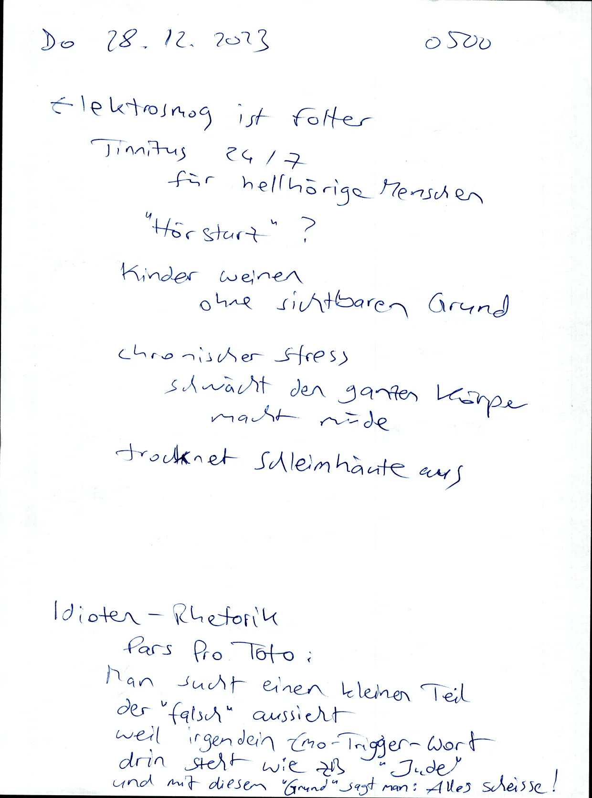

## 2023-12-28.05-10.jeder-will-schön-sein.keiner-will-dafür-sterben.billige-tricks.versicherungen.steuern.beiträge.webp

<blockquote>

Jeder will schön sein

- Frauen wollen schöne Titten
- Männer wollen schöne Schwänze
- Jeder will schöne Gesichter und schöne Hande, schöne Füße
- gesunde Augen and ohren, und so weiter

aber keiner will dafür sterben
weil "das ist zu teuer"
also sucht man wieder
"billige **Tricks** für arme Leute"

- Link
- Lügen
- Betrug
- Mind over matter
- Schönreden

Tricks:

- Brillen
- Hörgeräte
- Brust Halter für Frauen mit großen Titten
- schöne Kleider für Menschen mit hässlichem Körper


</blockquote>


## 2023-12-28.05-30.intuition.born-leaders.born-killers.justice.chemische-interpretation.bindungsverhalten.kohlenstoff-atome.webp

<blockquote>


Do 28.12.2023 0530

# Keywords

- Intuition
- A product of Intuition
- I follow my Intuition
- Leaders are born
- Born Leaders
- Natural Born Killers
- Justice is better than Equality

# Chemische Interpretation

Menschen haben
das gleiche Bindungsverhalten
wie Kohlenstoff-Atome.

```
    x
    |
x — C — x
    |
    x
```

vier Bindungen
weil Kohlenstoff hat
vier Valenzelektronen.

Menschen sind
Makromoleküle.


</blockquote>


## 2023-12-28.05-40.verrückt-oder-dumm.memento-mori.webp

<blockquote>

Dumme Menschen
beschimpfen "die Anderen"
als "verrückt".

Schlaue Menschen
beschimpfen "die Anderen"
als "dumm".

----

TODO VSCodium

enable Autosave to avoid data loss
on `git stash` + `git rebase`

----

Schwierige aber wichtige Fragen:

- Wie lange werde ich noch leben?
  - 1 Jahr?
  - 2 Jahre?
  - 5 Jahre?
  - 10 Jahre?
  - 20 Jahre?
  - 50 Jahre?
- Was mache ich mit meiner Zeit?

----

Andere Menschen
als "dumm" beschimpfen
ist unpopulär
weil die meisten Menschen
sind selber dumm
also wollen schlau klingen (Kompensation)
und weil "Du bist dumm"
ist ein "Conversation Ender"
also "Ende von Zivilisation
und Anfang von Krieg".


</blockquote>


## 2023-12-28.22-00.they-lied-about.webp

<blockquote>

Do 28.17.2023 2200

Die Experten haben uns angelogen bei

- 9/11
- Massenvernichtungswaffen im Irak
- Gaddafi
- Vietnam
- Pearl Harbor
- Sechs Tage Krieg
- Angriff von Polen auf Deutschland
- Skull and Bones
- Obama seine "Frau" hat einen Penis und heisst Michael ("Michael and I")
- den "Suizid" von Jeffrey Epstein
- den "Suizid" von John McAfee (?)
- die "Verbrechen" von Julian Assange
- das Guantanamo Bay Foltergefängnis

Die Liste ist lang.

Siehe auch:
Gerhard Wisniewski
Verheimlicht Vertuscht vergessen


</blockquote>


## 2023-12-28.22-10.soft-power.webp

<blockquote>

# Soft Power

nutzt zum Angriff
immer nur psychiscle Gewalt
also Nötigung, Angstmachen,
Nudging, Lügen, Manipulation

weil ..
manche Leute sagen
"die haben Angst vor Karma"
oder
die wollen "unschuldig" sein
oder
"die wollen fahrlässig aussehen"


</blockquote>


## 2023-12-29.00-00.demokratie-wenns-leicht-geht.keine-wahl-wenns-wichtig-ist.gefangen-im-wohnort.webp

<blockquote>

29.12.2023

heute heucheln sie Demokratie
erzählen uns
wir haben eine "Wahl"...
aber immer nur wenns
wenns leicht geht
(Schönwetter-Wahlen)
und wenns wichtig ist
haben wir keine Wahl.

Beispiel:
Schüler dürfen ihre Lehrer
nicht wählen.
Warum nicht?!

Arme Leute (also die meisten)
können ihren Wohnort nicht wählen
weil Umzüge sind teuer.
Deswegen:
Es gibt keine
"Abstimmung mit den Füßen"


</blockquote>

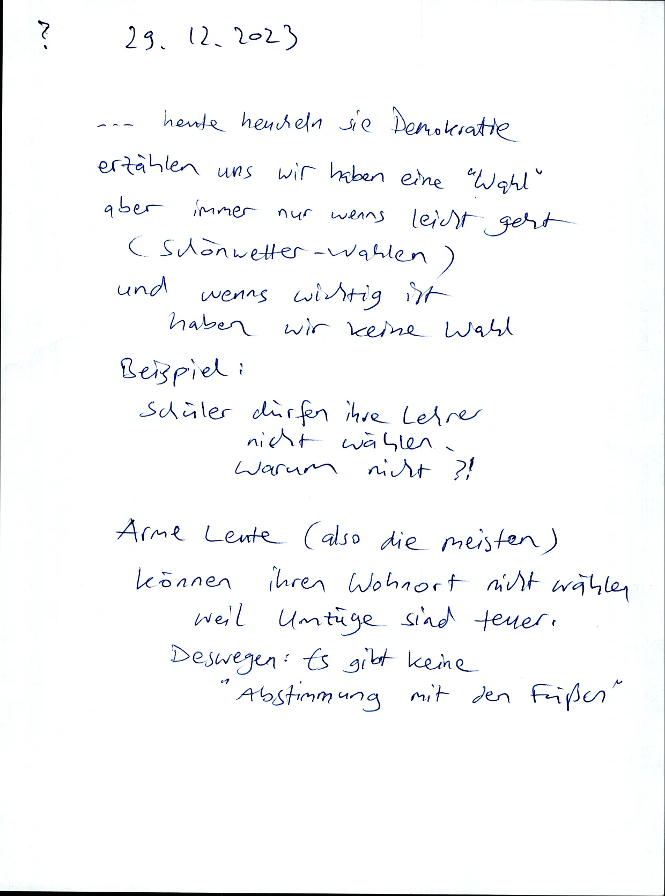

## 2023-12-29.00-01.sozialdarwinismus.nur-typ3-darf-führen.typ1-soll-folgen.monotheismus.einseitigkeit.mitspieler-sind-verräter-gegen-natur.webp

<blockquote>

29.12.2023

Sozialdarwinisten sagen

- Typ 1 soll folgen
- nur Typ 3 darf führen

Monotheismus, Einseitigkeit.
nur einer von 4 Typen führt.

Dualismus, Gerechtigkeit:
2 von 4 Typen führen.

----

Typ 1 Menschen
die sich zivilisieren lassen
und "brav mitspielen",
sind Verräter and Versager,
weil sie gegen ihre Natur arbeiten.

Geborene Führer
die sich zu Sklaven machen lassen.


</blockquote>


## 2023-12-29.00-02.natürliche-neigungen.gefühle-wollen-ernst-genommen-werden.hoffnung-stirbt-zuletzt-egal-wie-sinnlos-das-leben-ist.webp

<blockquote>

Natürliche Neigungen sind Gefühle
die ernst genommen werden wollen.

Die Hoffnung stirbt zuletzt
und hält Menschen am Leben
egal wie "sinnlos" dieses Leben ist.

Von Aussen gesehen ("sinnlos") ...
aber von Innen gesehen (subjektiv)
muss man es weiter versuchen
und versuchen und versuchen ...


</blockquote>

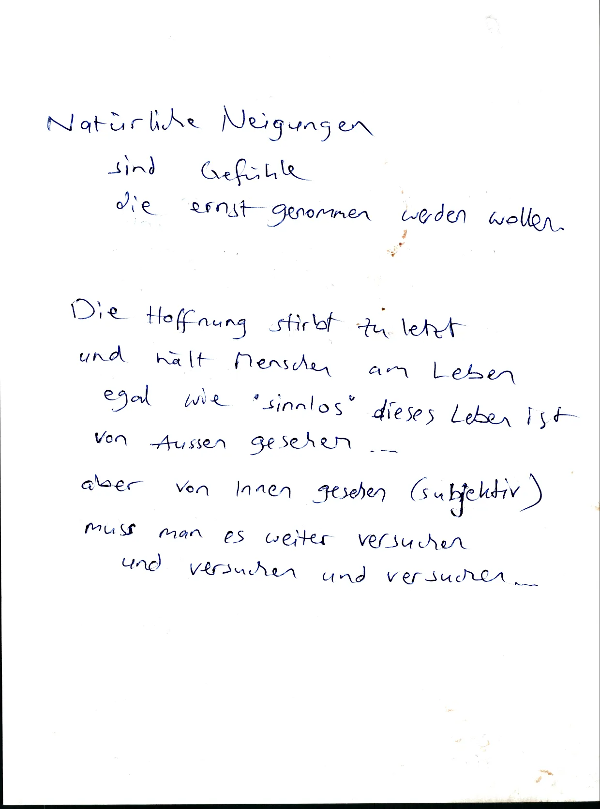

## 2023-12-29.00-03.typ1-typ2.webp

<blockquote>

29.12.2023

# Typ 1 und Typ 2

<!-- TODO image. mermaid.js? -->

- 1
  - 14
    - Geist
    - Schlau
    - männliches Hirn
    - Rational
    - Task Focus
    - 1
      - Transactional Leader
      - Communist
    - 4
      - Transformative Leader
      - Soft Power
      - Fascist
  - 13
    - aktiv
    - Aktivisten
    - junges Hirn
- 2
  - 23
    - Körper
    - Dumm
    - weibliches Hirn
    - Emotional
    - People Focus
  - 24
    - passiv
    - Pazifisten
    - altes Hirn


</blockquote>


## 2023-12-29.00-04.family-tree.webp

<blockquote>

<!-- TODO image. mermaid.js? -->

Irma F3 - M1 Kurt

Karl M3 - F1 Ivana

Philipp M3 - F3 Miriam
Luisa F3

Jan M4

Tina F4? F1?

Ivana F1 - M2 Karel

Milan M1 - F2 Ramona
Lena F1


</blockquote>


## 2023-12-29.05-00.recht-auf-leben-ist-absurd.content-scheisst-auf-form.webp

<blockquote>

Fr 29.12.2023 0500

Das "Recht auf Leben" für Menschen
ist so absurd
als hatte ein Schimmelpilz
in meiner Wohnung
ein Recht auf Leben
weil Naturschutz oder so
(der Schimmelpilz ist ein Lebewesen!)
und wenn ich den Schimmelpilz töte
dann holt mich die Polizei
und steckt mich
lebenslang in den Knast wegen "Mord".

- Politisch Korrekt
- Formal korrekt
- Geschliffene Form
- Innen leer
- oberflächlich
- kurzsichtig
- Schöne Oberfläche

Wer Inhalte hat
der kann auf Form scheissen.

Reicher Herz
trägt armen Pelz.


</blockquote>

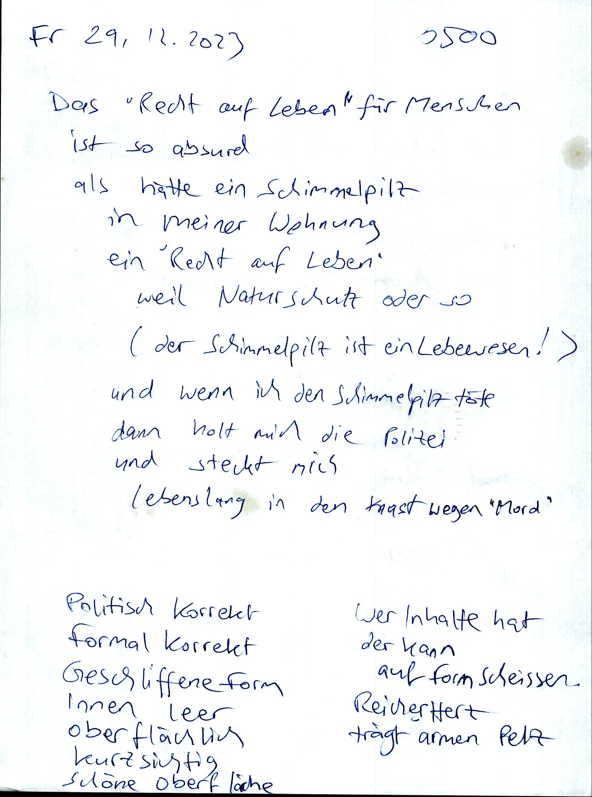

## 2023-12-30.22-00.radikale-menschen.wissen-ist-macht-nein.webp

<blockquote>

Sa 30.12.2027 2200

# Ich suche radikale Menschen

und keine "Kompromissler"

Kompromissler wie ...
Eltern und Lehrer
die zwar wissen
dass Impfungen falsch sind
aber für die Schule arbeiten
die von Schülern Impfungen erwartet.

# Wissen ist Macht

Nein. Einfach nur Nein.

Genauso
"Passiver Widerstand"
ist viel zu wenig.

Wer ernsthaft was ändern will
der muss einen "Hebel" finden
damit er maximale Wirkung erreicht.


</blockquote>


## 2023-12-31.05-00.wer-sind-die-dummen.objektiv-oder-subjektiv.beleidiger.tagebuch.webp

<blockquote>

So 31.12.2023 0500

# Wer sind die Dummen?

Ist das objektiv oder subjektiv?

Туреn 23

die Anderen

(Ich bin Typ 104)

----

Tatsachenbeschreibungen
sind keine Beleidigungen.

Aber jeder Beleidiger hat seine Gründe.

Also subjektiv gesehen
ist jede Beleidigung
"nur" eine Tatsachenbeschreibung.

----

Warum schreibst du kein Tagebuch?
Sind deine Gefühle so wertlos?
Weil Gefühle werden vergessen
wenn man sie nicht festhält.
Und das Festhalten geht nicht im Kopf
weil Gefühle kann man sich nicht merken.
Gefühle sind flüchtig. Volatil. Fragil.


</blockquote>


## 2023-12-31.05-30.typ4-typ1.webp

<blockquote>

31.12. 2023 0530

Unterschied Typen 13 - Typen 24

Albrecht M401L - M104S Milan

M401L

- L = Large = älter
- Ich Rede in
- Rede flissen
- Ich wiederhole mich gerne
- Ich bin eher defensiv

M104S

- S = Small = jünger
- Ich fasse mich kurz.
- Ich sag es mit einem Wort
- Ich meide Wiederholung
- Ich bin eher aggressiv

Gemeinsamkeit

- Typen 14
- Tough-minded
- Starke Köpfe
- Psychisch belastbar
- "Schlau"
- "rational"
- weitsichtig
- Strategisches Denken


</blockquote>

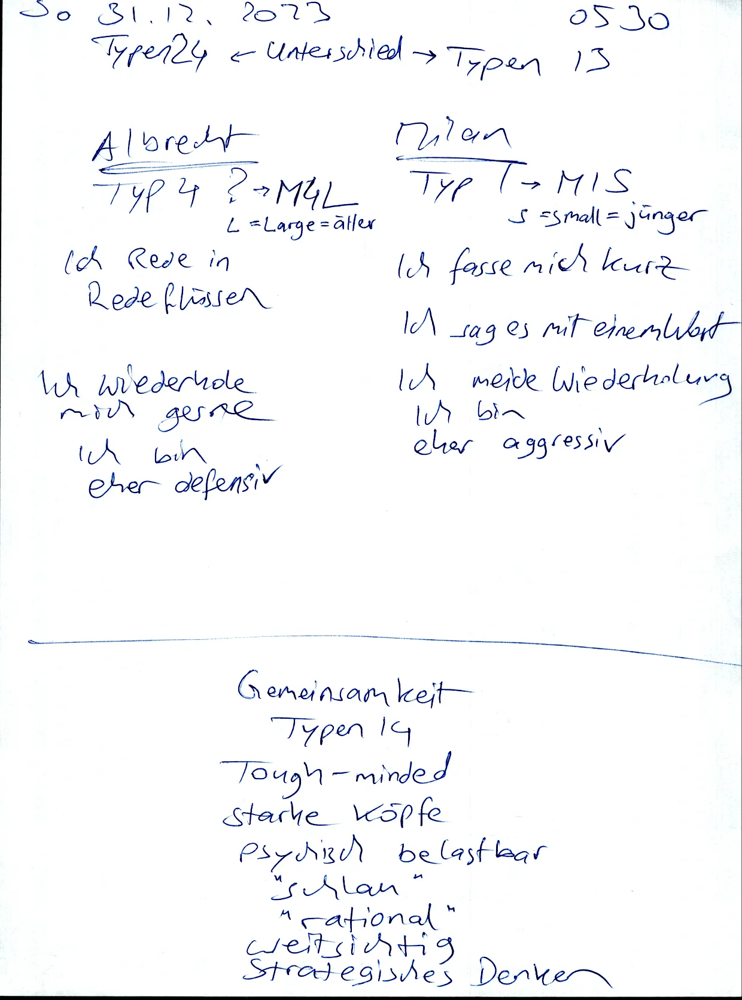

## 2023-12-31.05-40.ober-unter-linker-rechter.webp

<blockquote>

```
        Ober
         |
Linker --+-- Rechter
         |
       Unter
```

----

(Milan und Albrecht, M1S und M4L)

Wie gehts weiter?

Erweiterung
von Zweier-Gruppe
zu Vierer-Gruppe

```
M4L   M1S
    x
F2L   F3S
```

Striche verbinden Gegentypen:
1-2
und
3-4

Also uns fehlen zwei Weiber: F2 und F3


</blockquote>


## 2023-12-31.06-00.grundnahrung.webp

<blockquote>

So 31.12.2023 0600

Grundnahrung

Huel
Super Greens

Gräser, Kräuter

Traubenkerne → OPC

Olivenöl, Olivenblätter →
→ Vitamin C Synthese im Körper

Vitamine: D, C, K,

Mineralien:
Magnesium Kalium
Calcium
lod Selenium

Kräutertee: Grüner Tee,
Rosmarin?


</blockquote>


## 2023-12-31.06-10.imperium.menschen-alleine-leichter-beherrschbar.teams-sollen-zusammen-bleiben.feudalismus-naturkonstante.webp

<blockquote>

# Vierer-Gruppen

Imperium glaubt:
Menschen sollen alleine sein
dann sind sie leichter beherrschbar.

Deswegen werden Arbeiter
immer alleine angestellt und entlassen.

Ich glaube:
"Teams"
(also Vierer-Gruppen)
sind so wichtig
dass man Menschen
als Team anstellen und entlassen soll.

# Feudalismus

= Zwei Klassen Gesellschaft
= Aristokratie = Oligarchie

ist eine Naturkonstante
aber unsere "moderne" Kultur
will uns einreden
wir sind alle "frei"
und dass Sklaverei "abgeschafft" wurde.
und dass Kolonialismus "überwunden" ist.

wers glaubt wird selig - Leichtgläubige!

(dumm und glücklich)


</blockquote>


## 2023-12-31.06-30.mystik-gnostik.pallas-muster.mehr-vierer-gruppen.webp

<blockquote>

So 31.12.2023 0630

Gläubige | Wissende
---|---
Mystiker | Gnostiker

----

# Vierer-Gruppen

Pallas-Muster hat mehr Vierer-Gruppen

- Vierer-Gruppe mit gleichem Alter
- Vierer-Gruppe mit gleichem Geschlecht

```
F1S F2L F3S F4L
M2S M1L M4S M3L
F4S F3L F2S F1L
M3S M4L M1S M2L
F1S F2L F3S F4L
M2S M1L M4S M3L
```

## gleiches Geschlecht

- F1234
  - `F1S F2L F3S F4L`
  - `F1L F2S F3L F4S`
- M1234
  - `M1S M2L M3S M4L`
  - `M1L M2S M3L M4S`

```
F1S    F2L
   ----
  /    \
  \    /
   ----
F4L    F3S
```

## gleiches Alter

- S1243
  - `M1S F2S M4S F3S`
  - `F1S M2S F4S M3S`
- L1243
  - `M1L F2L M4L F3L`
  - `F1L M2L F4L M3L`

```
F1L    M2L
   ----
  /    \
  \    /
   ----
M3L    F4L
```


</blockquote>


## 2023-12-31.19-00.dumm-oder-böse.webp

<blockquote>

So 31.12.2023 1900

Auch ein Persönlichkeitstest:
Was ist schlimmer?
Dummheit oder Bosheit?

Schlaue Menschen sagen:
Dummheit ist schlimmer.

Dumme Menschen sagen:
Bosheit ist schlimmer.

weil grundsätzlich:
Scheisse sind immer die Anderen.
aka "Meine Gefühle
sind besser als deine Gefühle"


</blockquote>


## 2023-12-31.22-00.pallas-sechseck.mehrheit-glaubt-an-lügen-der-öffentlichkeit.webp

<blockquote>

So 31.12.2023 2200

# Pallas Sechseck

135 = 90 + 45

```
   -----------------
  / 135         135 \
 /                   \
/                     \
 90                 90
\                     /
 \                   /
  \ 135         135 /
    ----------------
```

für same-age oder
same-sex Vierer Gruppen

----

Mo 1.1.2024 0500

"Wir" (Wahrheits-Sucher)
kennen die **Wahrheit**
zu jedem Thema,
egal ob "Terror von oben"
oder Schädliche Impfungen
oder Übervölkerung

Das Problem ist:
Die Mehrheit glaubt an Lügen
die aggressiv
in der **Öffentlichkeit**
verbreitet werden
und wenn wir eine Gegenöffentlichkeit
aufbauen wollen,
dann werden wir angegriffen von Polizei, Moderatoren, ...


</blockquote>


## 2023-12-31.22-10.nagelbetten-lang-kurz.webp

<blockquote>

Lange Nagelbetten zeigen Typen 14

Kurze Nagelbetten Zeigen Nichts
weil Kurze Nagelbetten
können auch künstlich erzeugt werden
indem man natürlich lange Nagelbetten
immer wieder zu kurz schneidet
also zu aggressiv Fingernägel schneidet.

(Schuld sind dumme Mütter.)

----

> ("Danke" an dumme Mütter.)

Ironie ist Lüge
und alle Lügen sind falsch.
(Ironie, Sarkasmus, Satire,...)


</blockquote>


