# 2024-01

## 2024-01-01.05-30.wahrsager-sind-staatsfeinde.staaten-bauen-auf-lügen.webp

<blockquote>

Mo 1.1.2024 0530

Wahrsager sind Staatsfeinde
weil Staaten
bauen auf Lügen.

Ich sage

- Wahrheit ist einfach
- Lügen sind komplex

aber wer an Lügen glaubt
der sieht es
andersrum!

der glaubt:
die offizielle Geschichte ist einfach
und "Verschwörungstheorien"
sind komplex.


</blockquote>


## 2024-01-01.05-40.nostr-is-shit.controlled-opposition.sabotage.information-overload.too-much-information.webp

<blockquote>

# fundamental Problems of NOSTR

- There is
Chain of Events
- JSON is slow
and verbose
- "Signatures" cannot be verified
because they are only checksums
of cryptographic Signatures

So at best
NOSTR is controlled opposition

Sponsored by the CIA
because the CIA knows
that NOSTR is shit,

# Meme Information Overload

Informationsflut

BLAA


</blockquote>


## 2024-01-01.22-00.einseitigkeit-gerechtigkeit.webp

<blockquote>

Mo 1.1.2014 2200

Einseitigkeit | Gerechtigkeit
---|---
Schieflage | 
Andere bekehren | Toleranz
Gleichmachen | 
Gleichheit | 
eine Wahrheit | mehrere Wahrheiten
Objektivismus | Subjektivismus
Pazifismus | Permanenter Streit
ein "Gesetz" für Alle | Freier Markt
equal outcome | Equal Opportunity
Monismus | Dualismus
Statik | Dynamik
Sozialismus | Kapitalismus
Kollektivismus | Individualismus
Gleichmacherei | Individualförderung
Große Gruppen | Kleine Gruppen
Typen 23 oder 34 | Typen 14 oder 12


</blockquote>


## 2024-01-01.22-10.chaoten-sind-besser-organisiert.kompensation.kunstordnung.webp

<blockquote>

Chaoten sind besser organisiert

des Kaisers neue Kleider

Lügen sind Psychische Gewalt.
Tränen statt Blut

Pazifisten | Kämpfer
---|---
Lügner | Wahrsager
Passive Gewalt | Aktive Gewalt
defensiv | aggressiv
Team Blue | Team Red
Blaue Pillen | Rote Pillen
Beruhigungsmittel | Wachmacher
Alkohol | Amphetamin
Opium | 


</blockquote>

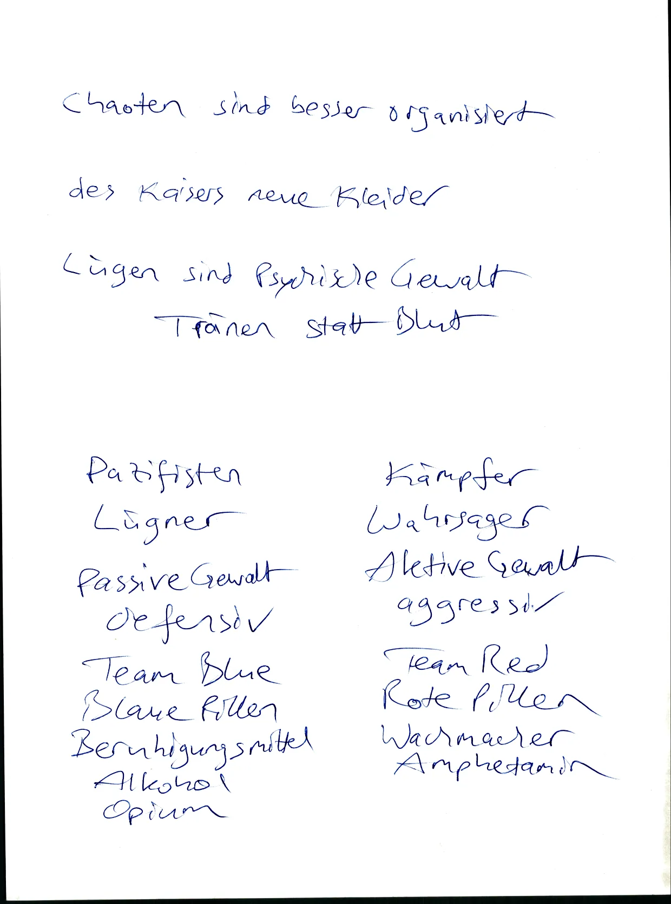

## 2024-01-02.05-00.natural-cancer-cures.observe-animals-eating-herbs.dumme-menschen-sagen-tiere-sind-dumm.webp

<blockquote>

Di 2.1.2023 0500

# Natural Cancer Cures

Herbs were found
by observing animals (horses)
who were sick (cancer?)
and who were deliberately
eating specific herbs
to fight the disease.

Dumme Menschen sagen
"Tiere sind dumm"
weil Tiere kein Deutsch reden
und weil man schlau sein muss
um die Körpersprache der Tiere
zu verstehen.

Ahnlich bei Kleinkindern:
Die reden auch mit Körpersprache
und werden oft nicht verstanden
und nicht ernst genommen.


</blockquote>


## 2024-01-02.05-10.placenta.muttermilch.kind.immunschwäche.webp

<blockquote>

# Mama soll die Placenta essen

Schon mal Tiere beobachtet
wenn die Kinder kriegen?

Die
Placenta, die mit dem Kind rauskommt,
wird von der Mutter gefressen
weil das die Milchproduktion anregt.

Wir waren so blöd
und sind ins Krankenhaus gefahren
zum "Entbinden"
(für die Geburt unserer Tochter)
und als ich die Placenta holen wollte
hieß es "die haben wir nicht..."

Also irgendwer hat die Placenta geklaut
and wahrscheinlich verkauft
an die Pharmaindustrie
die teuere "Medizin" draus macht.

Und unsere Mama durfte
sowieso nicht "Stillen"
weil die Mama ist "ein scheiss Junkie"
also Methadon-abhängig...
Kind -> Immunschwäche


</blockquote>


## 2024-01-02.05-30.mit-idioten-über-schlauheit-reden.mit-blinden-über-farben-streiten.webp

<blockquote>

Di 2.1.2024 0530

Einem Idiot seine Dummheit erklären
ist als würde man einem Farbenblinden
seine Farbenblindheit erklären.
"Ich sehe doch alle farben:
Schwarz Dunkelgrau Grau
Hellgrau Weiss.
sind das nicht genug Farben?!"

Dann sag ich ihm
"Was du als Farben verstehst
sind nur verschiedene Helligkeiten
der Farbe Weiss
also verschiedene Intensitäten
oder Lichtleistungen.
Aber neben der Lichtleistung
gibt es auch Lichtfarbe
und die kommt
von verschiedenen Wellenlängen
der Lichtteilchen (Photonen)
(freie Elektronen)


</blockquote>


## 2024-01-02.05-40.freier-markt.wahre-lebenskosten.bevölkerung.inflation.wachstum.recht-auf-leben.webp

<blockquote>

Wenn Kapitalismus funktionieren würde
also wenn wir einen "freien" Markt hätten
ohne Verbote / Steuern / Zölle / Versicherungen /...
Banken /...
Geldfälscher-Organisationen
dann würden die Preise
die wahren Lebenskosten zeigen
und die wahren Lebenskosten
den gleichen Verlauf haben
wie die globale Bevölkerung
nämlich "Inflation"
also "exponentielles Wachstum."
also "Explosion".

Bei jedem anderen Parameter
würden wir sagen
"Scheisse! Das explodiert.
Wir müssen was machen!"

Aber weil Menschen
ein "Recht auf Leben" haben... Tja!


</blockquote>


## 2024-01-02.06-00.kein-aufruf.was-würde-ich-machen.andere-menschen-egal.sowieso-idioten.betrug.bioscan.webp

<blockquote>

Di 2.1.2024 0600

übrigens:

# Das hier ist kein "Aufruf" zu Irgendwas.

Ich beantworte hier die Frage:
Was würde ich machen
in der "König der Welt" wäre?

wenn ich alles entscheiden darf.
wenn ich alle Freiheiten habe.

Was andere Menschen machen
das ist mir egal,
die meisten Menschen
sind sowieso Idioten
die mich immer nur falsch verstehen.

# Wie funktioniert Betrug?

Beispiel Bioscan:
Bioscan verspricht eine Messung
Von vielen Gesundheits- Parametern
wie Elektrolyte, Vitamine, ...

Aber: Bioscan ist nur ein Zufallsgenerator
und das wird versteckt
indem man die "Messung" teuer macht.
nicht reproduzierbar weil zu teuer.


</blockquote>


## 2024-01-02.06-10.farben.grün-rot-blau.hauptwort-nebenwort.aussen-innen.webp

<blockquote>

Warum sind "Marsmenschen" grün?
Planet Mars ist ein Symbel für Typ 1
(oder für Typen 14 = männlich)

Warum tragen Frauen rot
und Männer blau?

Substantiv and Adjektiv  
Hauptwort und Nebenwort  
Äussere Werte und Innere Werte

Mann männlich  
Weib weiblich

gender-opposing types:  
männliche Weiber und weibliche Männer  
F14 und M23


</blockquote>


## 2024-01-02.06-30.global-warming.global-cooling.schwächen-und-stärken-sind-subjektiv-und-reziprok.webp

<blockquote>

Di 2.1.2024 0630

Global Warming oder Global Cooling?

Global Warming:
Im Polarklima bleiben
weil es wird
automatisch wärmer

oder

Global Cooling:
Auswandern
Richtung Tropenklima
weil hier wird kälter
(Eiszeit?)

----

Blindheit und Sensibilitat
sind subjektiv und reziprok

meine Schwäche ist deine Stärke  
meine Stärke ist deine Schwäche

Also die Frage ist:  
Wie funktioniert eine Ergänzung  
eine **Ergänzung von Gegensätzen**


</blockquote>


## 2024-01-02.06-40.stärke-schwäche.gegentypen.webp

<blockquote>


Stärke | Schwäche
---|---
bewusst | unterbewusst
sensibel | blind
Fachgebiet | blinder Fleck
Führer | Folger
Wissen | Glauben

Jeder Mensch hat
Stärken und Schwächen.
(nichts Neues)

Das Neue ist
eine "Soziale Lösung" von Schwäche
durch "Paarung" mit anderen Menschen vom Gegentyp.

Ich als Typ 1 sage:  
Meine Stärke ist Typ 1  
meine Schwache ist Typ 2.

weil Typ 2 ist
das Gegenteil von Typ 1:

```
1   3
  x
4   2
```


</blockquote>


## 2024-01-02.11-30.große-probleme.zu-weit-weg.passivität.sich-schlau-fühlen.webp

<blockquote>

Di 2.1.2024 1130

Probleme wie  
Great Reset  
Enteignung  
Inflation  
Zentralisierung  
Migranten-Invasion  
Zerstörung von Sozialstaat  
Krieg  
... sind alles sehr reale Probleme  
aber das alles sind große Probleme  
die zu weit weg sind  
so dass man gefangen bleibt in Passivitat  
und sich höchstens Schlau fühlen kann  
weil "Wissen ist Macht"


</blockquote>


## 2024-01-02.11-40.kleine-probleme.aktiv-werden.lösbare-probleme.bottom-up.webp

<blockquote>

Mich interessieren solche Probleme  
wo man aktiv werden kann  
die man im privaten Umfeld  
bearbeiten = angreifen = lösen kann  
also "lösbare Probleme"  
also "erstmal vor der eigenen Haustür kehren"  
also Bottom-up Strategien


</blockquote>


## 2024-01-03.08-00.vitamin-c.webp

<blockquote>

Mi 3.1.2024 0800

Auf die Vitamin C Frage  
(Gretchen-Frage: Bist du dumm?)  
gibt es mehrere Antworten.

Die Pharmaindustrie  
und ihre vielen Helfer glauben,  
jeder Mensch braucht  
nur circa 0,1 Gramm Vitamin C pro Tag.

Aber die Pharmaindustrie will Geld machen  
und Vitamin C ist ein Naturstoff  
und für Naturstoffe gibt es keine Patente.  
Also Interessenskonflikt, Krankheitsgewinn.

Manche Naturmediziner glauben  
jeder Mensch braucht  
mindestens 5 Gramm Vitamin C pro Tag  
und bei Krankheit noch mehr.

Ein Problem dabei ist:  
Wenn man zu viel Vitamin C isst,  
dann kriegt man Durchfall.

Deswegen sagen diese Naturmediziner  
man soll die Dosis erhöhen  
bis zur "Bowel Tolerance"  
also kurz bevor man Durchfall kriegt,  
also circa 5 Gramm pro Tag.

Klingt logisch:  
Wenn meinem Körper Vitamin C fehlt  
dann muss ich mehr Vitamin C essen.


</blockquote>

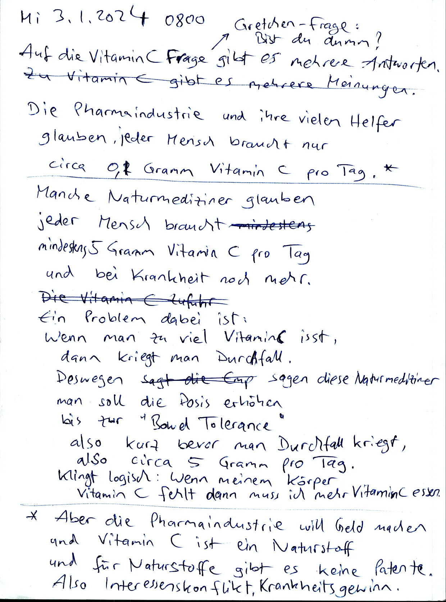

## 2024-01-03.08-10.webp

<blockquote>

Die "Bowel Tolerance" von Vitamin C
ist aber auch ein Problem
weil bei Krankheit
braucht der Körper viel mehr Vitamin C.

Beispiel: Eine natürliche Krebstherapie
ist die intravenose Gabe von Vitamin C
ist intravenöses Vitamin C,
Quellen: Linus Pauling

Die therapeutische Dosis
liegt dann bei circa 25 Gramm pro Tag
(oder noch mehr?)

Diese Vitamin C Infusionen
macht man für mehrere Tage bis Wochen,
bis der Krebs-Tumor weg ist.

Ein Problem bei dieser Methode
ist die Abhängigkeit
von einem Spritzen-Hersteller.

Also diese Methode
hätte vor einer Million Jahren
nicht funktioniert
weil wir Spritzen erst vor circa 200 Jahren
erfunden haben.


</blockquote>


## 2024-01-03.08-20.webp

<blockquote>

Mi 3.1.2024 0820

Neben diesen zwei Antworten
gibt es eine dritte Antwort
auf die Vitamin C Frage.
Die zwei anderen Antworten
basieren auf der Annahme:

Der Mensch kann Vitamin C nicht selber machen,
weil der Mensch (als einziges Säugetier)
einen Gendefekt hat im GULO-Gen,
das die Synthese
von Vitamin C aus Glucose
verhindert. Aber stimmt das?

Es gibt mehrere Widersprüche:

1. Der Mensch ist das einzige Säugetier
mit diesem Gendefekt.
Es gibt 6000 Arten von Säugetieren.
Paradebeispiel sind Ziegen die extrem viel Vitamin C machen.
2. Kleinkinder können sehr wohl
Vitamin C selber machen
aber verlieren diese Fähigkeit mit der Zeit.
3. Manche Erwachsene
können Vitamin C selber machen.
4. Durch Nahrungsergänzung
mit Olivenblatt-Extrakt und Olivenöl
kann die Vitamin C Produktion gesteigert werden.


</blockquote>


## 2024-01-03.08-30.webp

<blockquote>

Also scheinbar ist unser Vitamin C Mangel
ein künstliches Problem
(falsche Erziehung, falsche Körperpflege)
und keine Naturkonstante (Gendefekt)
gegen den man nichts machen kann
ausser mit Gentechnik (Hightech)
irgendwelche Gene reparieren.

Aber die Lösung ist viel einfacher:
Mehr Olivenöl essen -> Mediterrane Diät
Mehr Rohkost essen -> circa 75%
Mehr Bitterstoffe essen:
Traubenkerne, Olivenblätter, Kräuter, ...
-> Phenole


</blockquote>


## 2024-01-03.08-40.webp

<blockquote>

Mi 3.1.2024 0840

Versicherungen...
Sklavenmoral...
Dummheit

Dass Versicherungen überhaupt existieren
ist ein weiteres Beispiel für Idiokratie
also "Wir werden regiert von **Idioten**".

Aber es sind nicht nur die Idioten
sondern auch
die **Puppenspieler** im Hintergrund
die mit Soft Power die Idioten **unterbewusst** so manipulieren (Nudging)
(oder Korruption = Geld regiert die Welt,
Subventionen)
dass sie den Befehl von oben ausführen
obwohl dieser Befehl
nie bewusst ausgesprochen wurde
und jeder der **bewusst**
über diese Befehle reden wil
wird aus
der Öffentlichkeit verbannt
als Ketzer, Hassredner, Verschwörungstheoretiker,
Esoteriker, Querdenker, Falschdenker, Wahrsager,
als einer der "verrückt und gefährlich" ist.


</blockquote>

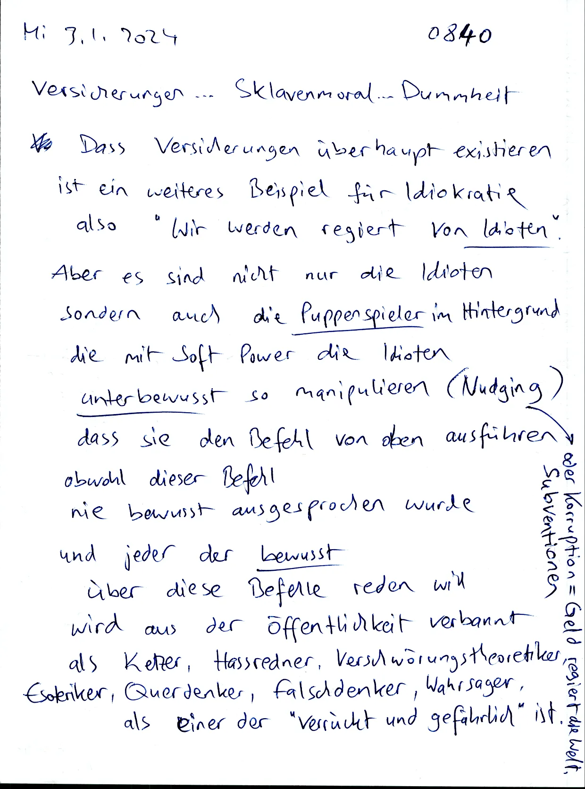

## 2024-01-03.08-50.webp

<blockquote>

Also warum gibt es Versicherungen?

Weil Idioten es schaffen, dass sie
diesen Zwang
von oben **Schönreden**
und schöndenken.

Also Rationalisierung (Gründe erfinden)  
Zirkelschluss (Es ist gut weil es gut ist)  
Rhetorik (Probleme im Kopf lösen)  
Blind für Ursachen
-> Nur Symptome angreifen
und Ursauen erhalten.

Idioten glauben:  
"Da wird schon was dran sein"  
"Das wird schon so passen"  
→ gutgläubig, Glaube an Autoritäten,
"Liebe deine Feinde"
(Religionskritik ist die Mutter von Systemkritik) (Früher Kirche, heute Staat), Sklavenmoral, Unterwürfigkeit
"Wers glaubst wird selig",
"Konservativ / Gemäßigt / Schwäche,
"Kompromissler", Anti-Radikalos
Also statt zu sagen "Steuern sind Raub"
(radikale Systemkritik)...
sagen Idioten eher:
Ich wäre ja blöd wenn ich diese Leistungen (Geschenke) nicht nutzen (zurück holen) würde.


</blockquote>


## 2024-01-03.10-00.unterhaltung.webp

<blockquote>

Mi 3.1.2024 1000

Unterhaltung (Entertainment)
ist wenn man
Untertanen unten hält.

Konservation vom Status Quo.


</blockquote>


## 2024-01-03.12-00.persönliche-gründe.webp

<blockquote>

Mi 3.1.2024 1200

Ich suche **persönliche Gründe**
für erfolgreiche Kommunikation
also **wer muss mit wem reden**
und wer muss auf wen hören
damit jeder verstanden wird
und damit jeder versteht.

Also damit es **null** Missverständnisse gibt.
und jeder seine Wahrheit frei reden kann.

Wenn ich Menschen hasse (oder bemitleide)
dann sind sie entweder
sachlich weit entfernt von mir
oder persönlich weit entfernt von mir.

Ich glaube "Coaching" also "Schulung"
für erfolgreiche Kommunikation
ist komplett sinnlos und falsch
weil dort werden
persönliche Gründe ignoriert
und man lernt nur besser Lügen.


</blockquote>


## 2024-01-03.12-10.webp

<blockquote>

Wenn Menschen
persönlich weit weg sind von  mir
dann brauchen wir
gemeinsame Freunde
die als Übersetzer wirken.
Übersetzer, Vermittler, Botschafter...
aber alle Beziehungen
müssen freiwillig sein.

```
Ich ← Er
↓       ↑
Sie → Es
```

Pfeile zeigen den Rede fluss:  
Ich rede mit Sie
weil Sie hört auf Ich.  
etc.

(Ich weiss schon,
sieht aus wie eine Swastika...
wenn das die alten Inder wüssten...)

(In Indien ist die Swastika
ein symbol für Sonne, Tag,
Bewegung, Aktivität, Rotation, ...)


</blockquote>


## 2024-01-03.22-00.webp

<blockquote>

Mi 3.1.2024 2200

Testfrage: Körper oder Geist?  
Was ist wichtiger?

----

Konzept: Four Colors  
Natural Color System NCS

```
   Gelb
Grün + Rot
   Blau
```

Drei Farben System

```
Green-Blue   Red-Blue
      Cyan   Magenta
           Y
        Yellow
```

oder

```
            Blue
             人
        Lime    Orange
Yellow-Green    Yellow-Red
```


</blockquote>


## 2024-01-03.22-10.webp

<blockquote>

# Natürliche Krebstherapien

Manche Therapien wurden gefunden  
durch Tiere beobachten.  
Pferde fressen bestimmte Kräuter  
wenn sie krank sind

Dumme Menschen sagen  
"Salat ist Tierfutter  
das esse ich nicht"  
-> auch nur "Junkies"  
die ihren Körper kaputt machen

----

Gerhard Wisnewski  
Vertuscht Verdrängt Vergessen


</blockquote>


## 2024-01-04.05-00.webp

<blockquote>

Do 4.1.2024 0500

I just wanted to know  
where your line is.  
-- Mister Garisson als Präsident

----

# Grundtyp oder Subtyp

Grundtyp | Subtyp
---|---
angeborene Stärke | gelernte Stärke

----

# Kunstordnung oder Naturordnung

Kunstordnung | Naturordnung
---|---
Wissen | Gefühl
starr | flexibel
dogmatisch | intuitiv
in der Schule gelernt | Selbstgelernt
natürliche Stärke verdrängen | natürliche Stärke ausleben
Kampf gegen Natur | Kampf gegen Kunst
Kampf gegen Wahrheit | Kampf gegen Lügen


</blockquote>


## 2024-01-04.05-10.webp

<blockquote>

Privatsphäre ist
wenn zwei Menschen
alleine sind
und frei reden können
ohne Angst
dass ein "falsches" Ohr mithört
und alles falsch versteht
und den Dialog stört.

aka
Monolog Bindung:  
A sieht und redet  
B hört und zeigt


</blockquote>

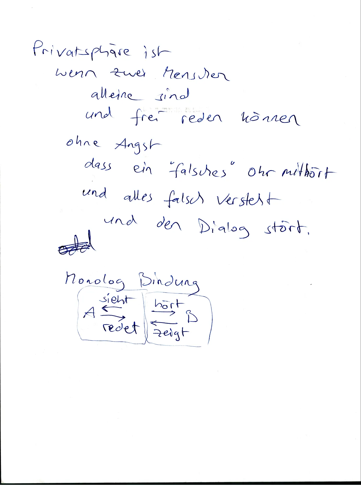

## 2024-01-04.06-00.webp

<blockquote>

Do 4.1.2024 0600

Kleinstaat | Großstaat
---|---
Kapitalismus aussen (Typ 2) | Sozialismus aussen (Typ 3)
Kommunismus innen (Typ 1) | Faschismus innen (Typ 4)
Wahrheit | Lügen
Gerechtigkeit | Wahrheitsministerium
. | Zensur
. | Pazifismus
. | Passive Gewalt
. | wir müssen zusammen halten (Kunstordnung)
. | Harmoniesucht
kleiner Musikclub | großes Musikfestival
Sekte | Kirche
Dorf | Imperium (Stadt)
Lowtec | Hightech


</blockquote>

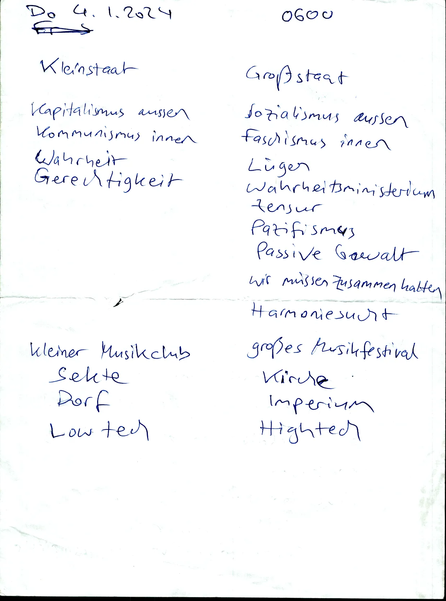

## 2024-01-04.06-10.webp

<blockquote>

# Probleme verschieben

Hilfe, Doktor, meine Hand tut weh!  
Der Doktor steigt dem Patient  
kräftig auf den Fuß.  
Aua! Das war mein Fuß!  
Aber die Hand tut jetzt nicht mehr weh?

# Kognitive Dissonanz

Zwischen Theorie und Praxis

Alle Probleme sind theoretisch gelöst  
aber es scheitert an der Umsetzung.

Inkonsequenz

Passive Geister  
Typ 4  
Soft Power  
Transformative Leadership Style


</blockquote>

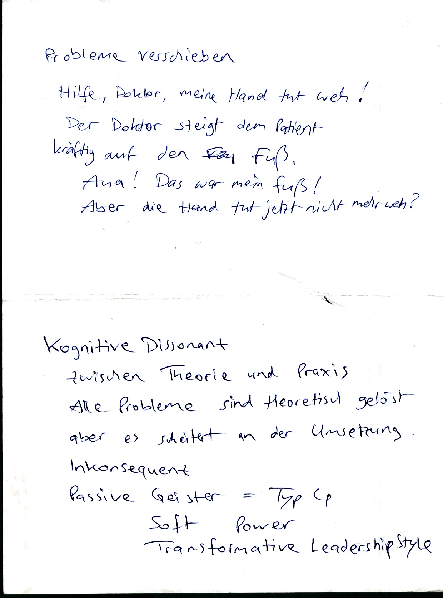

## 2024-01-05.07-30.webp

<blockquote>

Fr 5.1.2024 0730

# Pallas Hypothese

Woher kommt das...?

5 Jahre Tagebuch Schreiben

20 Jahre Nachdenken  
über diese kaputte Welt  
also seit meiner Pubertät (14-16)

I feel stupid... and contagious.  
Ich fühl mich dumm.. und ansteckend.  
-> Primitiver Führer: Kurt Cobain (M1)

Kontroverse Themen  
wirken als Persönlichkeitstest  
zur Suche nach "Systemfreunde"  
(nützliche Idioten)

Beispiele: Critical Race Theory,
Gender Studies

Immer lustig wenn Leute
sich als "Systemkritiker" zeigen
aber nur Symptome kritisieren
und an einfachsten Problemen Scheitern.
also höchstens "Controlled Opposition" sind.

(einfachste Probleme:
Übervölkerung, Degeneration)


</blockquote>


## 2024-01-05.07-40.webp

<blockquote>

9150

# Gesinnungsethik

Hauptsache gut gemeint  
das Ergebnis ist egal  
-> So kann man
schlechte Ergebnisse schönreden  
"Das Ergebnis ist nicht so wichtig"

Als Nihilist muss ich Recht geben:  
Alles wird Sterben.  
Alles ist egal:  
Ergebnisse sind egal und  
Intentionen sind egal.

# Leistungskurs Ethik

Sowas fehlt noch am Gymnasium.

Ich hatte Leistungskurse Matte Physik  
und Englisch im schriftlichen Abitur  
und Ethik als mündliche Abiturprüfung.

Ethik Colloquium Thema:  
Recht und Gerechtigkeit  
(Konflikt zwischen legal und legitim)  
(Konflikt zwischen Kunstordnung und Naturordnung)


</blockquote>


## 2024-01-05.22-00.webp

<blockquote>

5.1.2024 2200

Schlampig | Genau
---|---
Ungefähr | Exakt
Mystik | Gnostik
Schätzung | Präzision
Irgendwie | .
. | Bewusst
Schlafen | Wach
Zombies | .
Sleepwalker | .

6.1.2024 0500

# Steuern sind Raub

Woher kommen Stenern?

Früher:  
Opfergabe = Sacrificium  
Symbiose von Bauern und Soldaten  
Soldaten gehen zu Bauern  
und suchen ein Opfertier aus  
das die Bauern den Soldaten schenken


</blockquote>


## 2024-01-06.05-30.webp

<blockquote>

Sa 6.1.2024 0530

# TODO Coding

Split SQLite Database for Github
in chunks of 100 MB or less
(done)

Fix Metadata of opensubtitles
with Language Detection
of Argos Translate?

# Divide And Conquer

Pyramide der Macht

```
      Oben

Links      Rechts
```

Oben | Unten
---|---
Elite | Unterschicht
Oberschicht | Sklaven
Owners | Arbeiter

We are fighting left-right wars  
when we should be fighting a class war

(querfront)


</blockquote>


## 2024-01-07.05-00.webp

<blockquote>

So 7.1.2024 0500

Kapitel

- Vitamin C selber machen
- Gerechtigkeit beim Sex

# Schule ist kein Ort für schlaue Menschen

In der Schule lernt man nicht
wie man Menschen führen kann,
man lernt nur wie man brav folgt.

# Zielgruppe

Naturmediziner

# Elektrosmog macht krank

Metall gerört weg vom Körper
und sicher nicht in
Matratzen, Schmuck,
Zahnfüllungen, Impfungen....

----

Hilfe gesucht beim übersetzen


</blockquote>

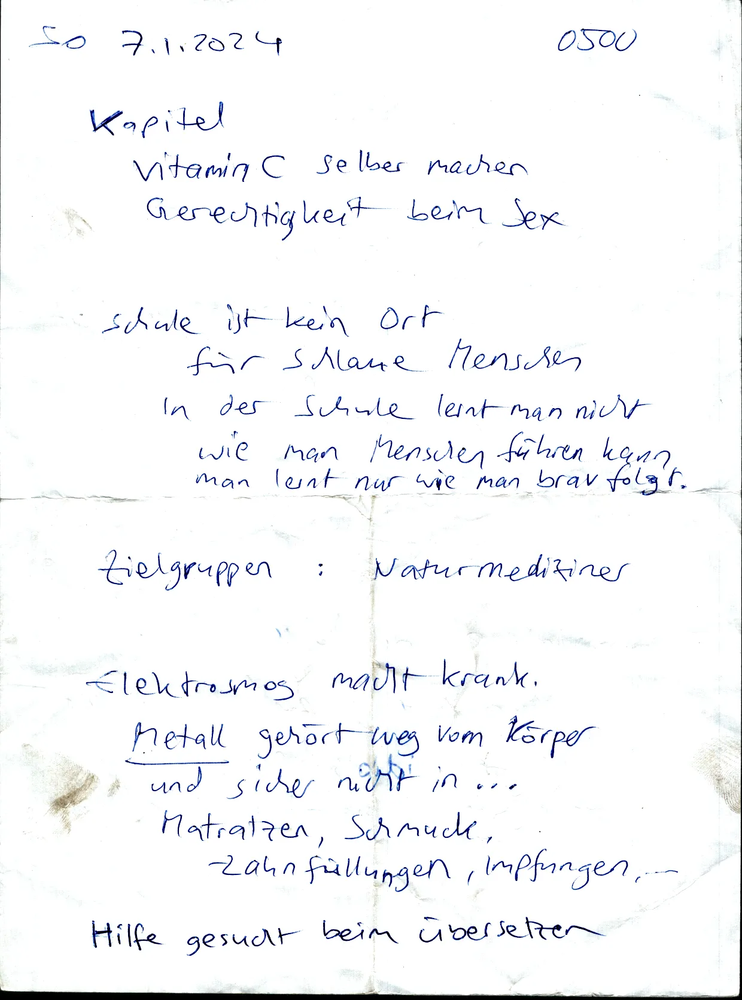

## 2024-01-07.05-10.webp

<blockquote>

Farin urlaub - Petze

----

# Plato's Höhlengleichnis

Idioten sind gefanger in Dummheit
Lebenslang!

Allegory of the cave

Plato's Cave

Plato - Republic

## Nature or Nurture?

Is stupidity a natural constant
or can idiots be
made "smart" in schools?


</blockquote>


## 2024-01-07.22-00.webp

<blockquote>

So 71.2024 2200

# Passivität

- delegieren an Niemand
- verlassen von guten Geistern
- Kopf in den Sand stecken und warten
- warten bis es von selber aufhört
- hilflos
- überfordert
- unorganisiert
- chaotisch
- alleine

... all diese Schwächen
werden schöngeredet
als Sklavenmoral


</blockquote>


## 2024-01-07.22-10.webp

<blockquote>

Matrix

Ending Monolog

You are afraid of change  
I show you how it begins

----

ТODO Mehr Nihilismus

Fight Club

on a long enough timeline
the survival rate for **everything**
drops to **Zero**,
Everything will die.
Nothing will stay.

But this hard truth
is too hard for many people
who rather want shit than nothing.


</blockquote>

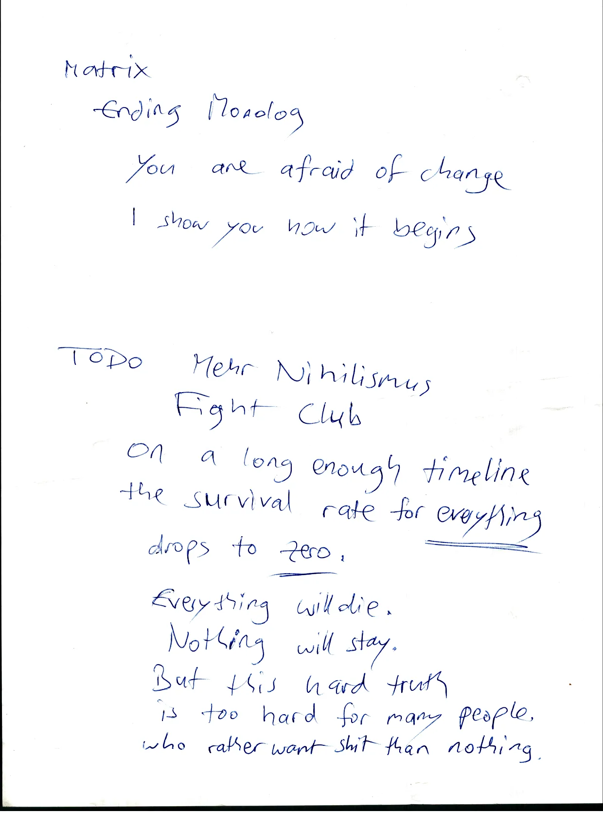

## 2024-01-07.22-30.webp

<blockquote>

So 7.1.2024 2230

TODO

- Konto leer
- Guthaben 9978
- Scraper wieder auf Github

DDL 2 Torrent

- KIZ
- Kool Savas
- JAW


</blockquote>


## 2024-01-07.22-40.webp

<blockquote>

So 7.1.2024 2240

Schlampen | .
---|---
Kompromissler | Perfektionisten
. | Radikalos
ungefähr | .
irgendwie | .
Schwätzer | Macher
Verwalter | Arbeiter
Dekorativ | Nützlich
Parasiten | .
Konservativ? | Liberal?


</blockquote>


## 2024-01-08.05-00.webp

<blockquote>

Mo 8.1.2024 0500

# Sklavenmoral ist ein Intelligenztest

In der Öffentlichkeit
wird mit voller Absicht
der absurdeste Schwachsinn
aggressiv als Wahrheit verkündet
und Nützliche Idioten sagen
"Ja das wird schon stimmen"
(Gutgläubig, Harmoniesuchr)
und Wahrsager werden provoziert
mit dieser offensichtlichen Lügen.

Aber wenn Wahrsager aktiv weden
und Widerstand leisten
in der Öffentlichkeit
dann werden sie angegriffen
als Staatsfeinde, Terroristen,
Ruhestörer, Widerstandsführer,
Chaoten


</blockquote>

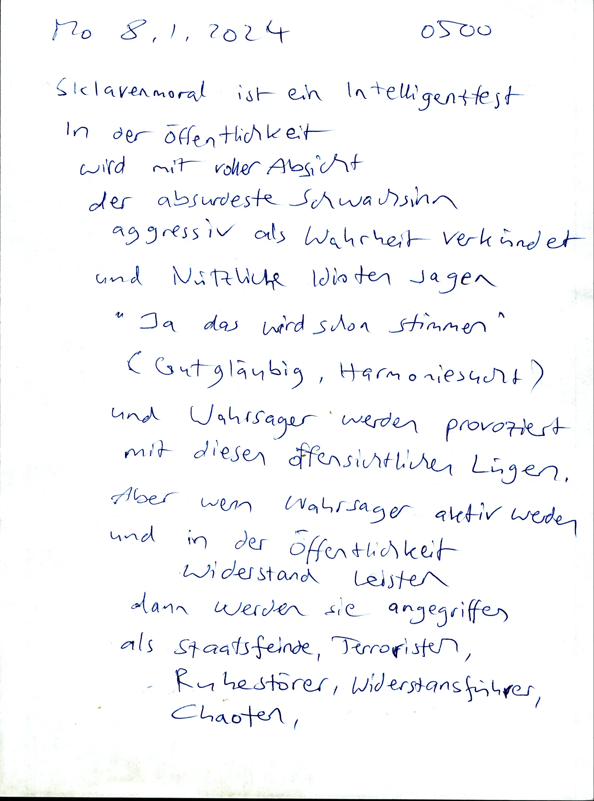

## 2024-01-08.05-10.webp

<blockquote>

Die weisse Rose druckt wieder.

Halt mal bitte deine Fresse du Patient.  
-- Gzuz

Schau mir in die Augen Bulle.  
spürst du den Hass?  
-- Zara - Bullenschwein

----

Zielgruppe Naturmediziner

----

just wanted to know where your line is.  
Garisson as President

----

# Plato's Cave

Plato ist zu optimistisch

er glaubt man kann  
dumm-geborene Menschen schlau machen...

----

# Gesinnungsethik

- gefangen im Kopf
- Hypothesen gegen Hypothesen
- Probleme im Kopf Lösen
- Rhetorik


</blockquote>

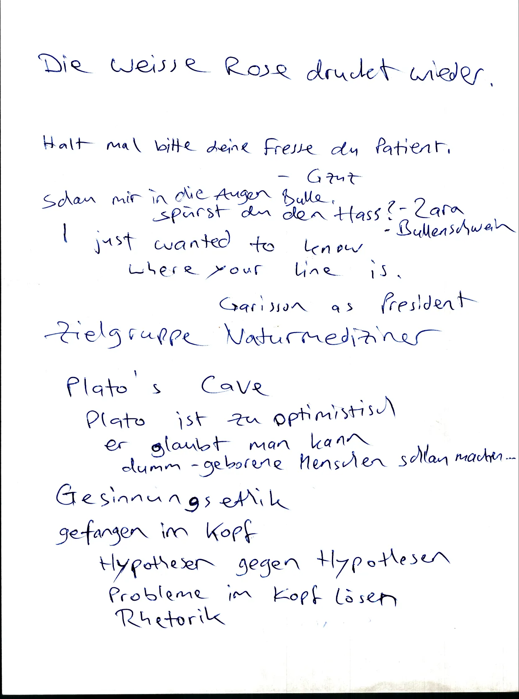

## 2024-01-08.17-00.webp

<blockquote>

Mo 8.1.2024 1700

Demos sind nur
Wohlfühl-Veranstaltungen
damit die Leute nicht alleine sind
mit ihrem Zorn gegen das System
also eine Form von Controlled Opposition
weil auch dort wird viel geredet
und wenig gemacht.
"Gut gebrüllt Löwe"

Und dann?!
Dann fahren alle wieder nach Hause
und sind genauso weit wie vorher.

Unterbewusst:
Die Leute suchen Freunde
die "gleichgesinnt" sind.

Und dann?
Man müsste ja Wohngemeinschaften
machen mit diesen neuen Freunden
also eine Abstimmung mit den Füßen.


</blockquote>


## 2024-01-08.17-10.webp

<blockquote>

Aber die meisten Leute sind gefangen

- gefangen in Armut
- gefangen in ihrer Wohnung
- gefangen in ihrer Stadt
- gefangen in ihrem Land
- gefangen in Sachzwängen

gefangen in einer Scheiss-Realität
aus der man "irgendwie" raus will
(Weltflucht, Eskapismus, Ablenkung)
und die "Flucht nach Innen"
in schöne Ideen
(Ideale, Schönes Gerede, Rhetorik,
Gesinnung, Intention)
ist ein billiger Trick für arme Leute,
die wenigstens (schwacher Trost)
für kurze Zeit
glücklich sein wollen.


</blockquote>


## 2024-01-09.05-00.webp

<blockquote>

Di 9.1.2024 0500

Reformer sind konservative Rebellen
die ihren Lifestyle verteidigen wollen
und
nur die 1% Symptome
bekampfen wollen.

Aber dass der Lifestyle
Ursache ist
die
für
diese Symptome
dafür sind sie blind.

Gerechtigkeit oder Gleichheit.
was ist besser?
objektiv gleich.
Subjektiv verschieden.

Gerechtigkeit:
Jeder soll seine
angeborene Stärke
frei ausleben
and seine angeborenen Schwächen
delegieren an seine Freunde.

Gleichheit:
Stärken unterdrücken
und Schwächen "fördern"


</blockquote>

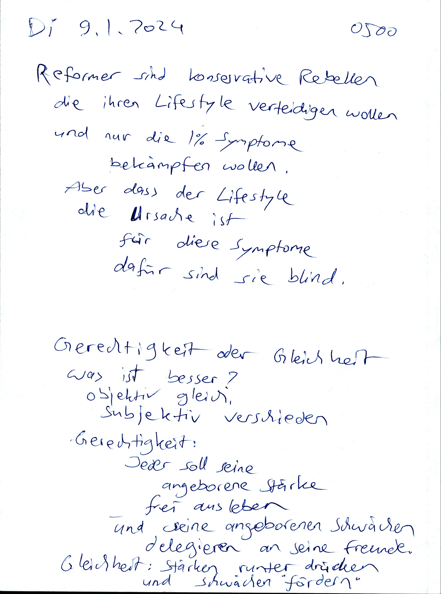

## 2024-01-10.16-00.webp

<blockquote>

Mi 10.1.2024 1600

<!-- TODO table -->

Eros
Lover
Helfer
Retter
den Schwachen helfen
Opfer
Pro Life

Thanatos
Killer
.
.
.
Täter
Pro Choice

<!-- TODO table -->

Vereinfachungen
Reductionism
Einseitigkeit
nur einer hat Recht

Ganzheit
Wholistic
Gerechtigkeit
beide haben Recht


</blockquote>


## 2024-01-10.17-00.webp

<blockquote>

Mi 10.1.2024 1700

Tragische Helden

- sich in Sachen einmischen
  - die dich nix angehen
  - die du nicht verstehst
- sinkende Schiffe retten
- Verlorene Kriege kämpfen
- tote Götter anbeten
- systematisch alles falsch machen
- Suizid-Kultur
- das eigene Grab schaufeln
- Selbstzerstörung
- Selbsthass


</blockquote>

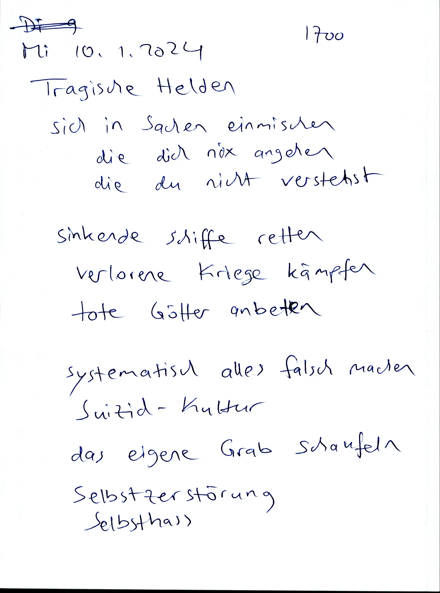

## 2024-01-11.06-00.webp

<blockquote>

Do 11.1.2024 0600

# Das Sündenbock Spiel

Einer ist schuld
und alle anderen haben Recht

aka

- Sozialismus
- Demokratie
- Mehrheitswahlrecht
- Diktatur der Mehrheit
- Geist der Quantität
- Sklavenmoral

Große Imperien
branchen schwache Menschen

# Das Glück scheitert an einfachen Dingen:

Körperpflege, Medizin,
Essen, Trinken, Wohnen
Hygiene, Freunde, Arbeit...

# Staatsfeinde werden kaputt gemacht

Kinder von Staatsfeinden
werden absichtlich vernachlässigt,
krank gemacht, dumm gemacht.

→ Sozialdarwinismus. Tod den Antisozialen.


</blockquote>


## 2024-01-11.06-10.webp

<blockquote>

Pazifismus

- Harmoniesucht
- Probleme werden totgeschwiegen
- Probleme bleiben ungelöst
- Jeder will seine Ruhe haben
- Keiner will kämpfen
- Keiner will etwas opfern
- Keiner will seine Fehler zugeben
- Jeder will sich schlau fühlen
- Alle wollen ewig leben
- Keiner will sterben
- Jeder will unschuldig sein
- Immer sind "die Anderen" schuld
- Alle sind vorsichtig und geduldig
- Alle haben Angst vor Schmerzen
- Jeder schämt sich für seine Fehler

Predetermination

- angeborene Neigungen
- Naturordnung
- Vorbestimmung
- Schicksal


</blockquote>

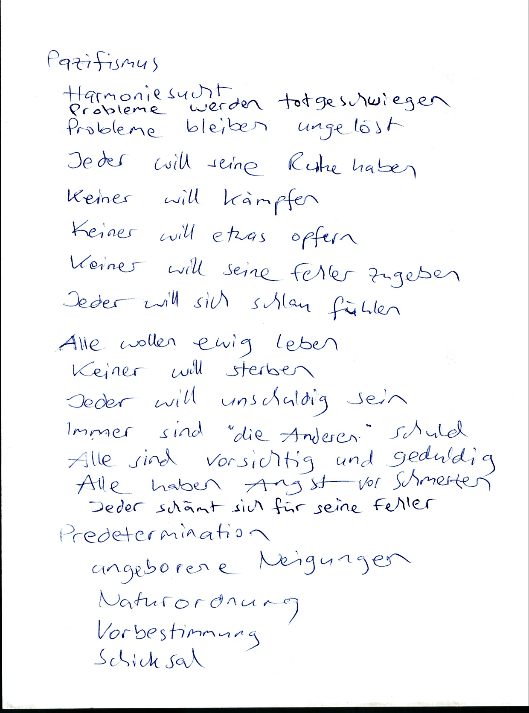

## 2024-01-12.05-00.webp

<blockquote>

Fr 12.1.2024 0500

# Failure in Communication

- Versagen bei Kommunikation
- Zu blöd zum Reden

Theoretisch sind alle Probleme gelöst
aber diese Lösungen scheitern zu oft
am Übergang von Theorie zu Praxis.

Schlaue Menschen sind oft zu passiv
und warten dass ein Dummer kommt
und fragt "Was soll ich machen?"
oder warten
bis ein Problem eskaliert
und sagen
"Ich hätte das anders gemacht"

Ein Grundproblem ist
dass die Kommunikation
zwischen Schlauen und Dummen
nicht von Anfang an geübt wird,
sondern die Schlauen
gehen zur Hochschule
wo sie nochmal
10 Jahre Schlausein studieren,
wo sie nur über Dumme reden
aber nicht mit Dummen reden.


</blockquote>

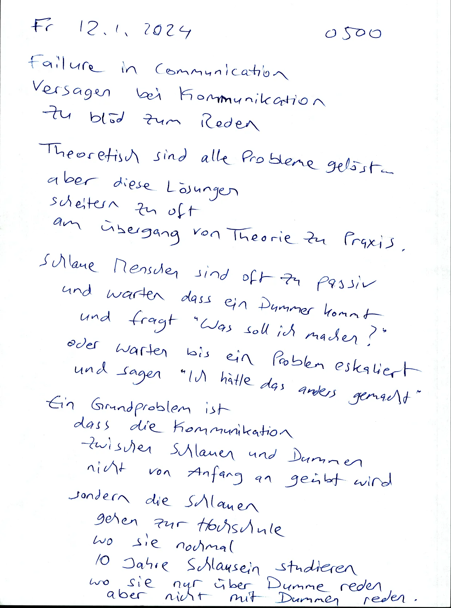

## 2024-01-12.05-10.webp

<blockquote>

SQLite Connection

```
check_size = False
update_size = false
```

Split DB in Volumes,
→ Continuous Releases
via Bittorrent v2
by adding files
and keeping old files


</blockquote>


## 2024-01-12.06-00.webp

<blockquote>

Fr 12.1.2024 0600

Typen 13 sagen:
Junge Menschen sind
wichtiger als alte Menschen.

Typen 24 sagen:
Alte Menschen sind
wichtiger als junge Menschen.

----

Das Leben ist eine eine Suche
nach Lebensraum, Arbeit, Freunde,
aber wenn man bei dieser Suche
immer nur die gleichen Leute fragt
(Lehrer in der Schule, Eltern zu Hause)
dann kriegt man immer nur
die gleichen Antworten,
also man kann keine
verschiedenen Antworten vergleichen
denn nur Vergleich macht schlau.


</blockquote>


## 2024-01-12.06-10.webp

<blockquote>

# Falscher Individualismus

Jeder hat ein Recht zum Falschmachen

"Privatsphäre"

aka

- Jeder fahlt sich schlau
- Jeder fühlt sich im Recht
- Jeder darf seine Egotrips machen (Freiheit)
- Jeder führt sich selber
- Alle sind Selbständig
- Alle sind erwachsen

Wahre Führung
ist immer unterbewusst
→Manipulation gegen Gefühle

- Soft Power
- Transformative Leadership Style

Thema Beziehungen ist Tabu
weil keiner weiss
wie Beziehungen funktioneren
und jeder schämt sich
dass er sowas einfaches nicht versteht.
Und unsere Herren lachen sich kaputt
weil wir sind zu blöd für Organisation.


</blockquote>


## 2024-01-12.07-00.webp

<blockquote>

Fr 12.1.2024 0700

Unsere Herren (Sklaventreiber)
haben ein Monopol auf Beziehungskontrolle.

Wenn ich ein Staatsfeind bin
und ein Kind habe
dann entscheiden Jugendamt-Bullen
und Familienrichter:
Ich bin "erziehungsunfähig"
und mein Kind
kommt in eine Pflegefamilie
wo es zum Staatsfreund dressiert wird,
also zum Sozialismus bekehrt wird,
auch wenn das Kind von Natur aus
gar keine Lust hat auf Sozialismus.

Der Staat sagt:
Lieber soll das Kind "gestört" sein
(psychisch kaputt gemacht
durch falsche Erziehung)
bevor ein Staatsfeind-Elter
das Kind zum Staatsfeind ausbildet.
weil solche Leute (Anti Sozialisten)
sollen keinen Nachwuchs haben.


</blockquote>

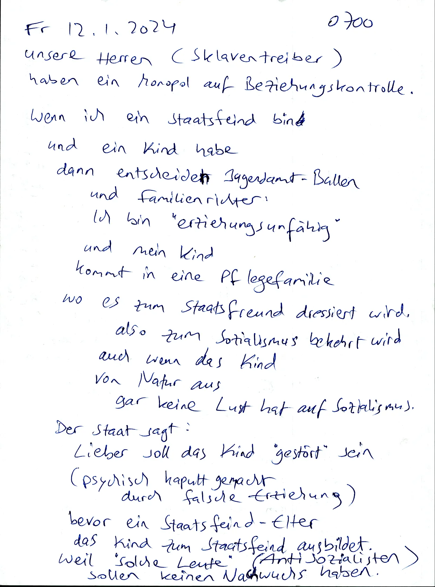

## 2024-01-12.07-10.webp

<blockquote>

# Mind over Matter

Geist über Körper

So kann man auch Analsex schönreden
der "eigentlich"
(vom Körper her)
extrem uninteressant ist
weil im Enddarm sind
keine "spaß sensoren"
also keine erogenen Zonen.

aber für manche Leute
ist es
"intellektuell anregend"
wenn Irgendwas im Arsch steckt.

oder Fremdwert = Altruismus:
Wer seinen Schwanz da rein steckt
nur der soll Spaß haben.

Und man will "etwas Besonderes" können.

Also bewusst gegen den Körper arbeiten
und "die Grenzen des Machbaren"
weiter ausdehnen
wörtlich weil
man dehnt einfach nur
den Schließmuskel
**langsam** auf größere Durchmesser
bis irgendwann eine Faust rein passt.

Toll. Und dann ?
What a skill to have...


</blockquote>

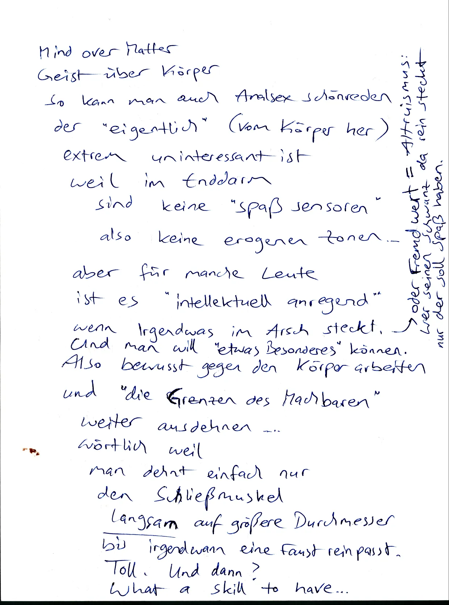

## 2024-01-12.08-00.webp

<blockquote>

Fr 12.1.2024 0800

Demokratie
ist nur ein anderes Wort für
Sozialismus.

Demokratie sagt:

- Alle Menschen sind gleich wertvoll
- Jeder Mensch hat genau eine Stimme bei der Wahl
- Antisoziale Menschen sind krank und müssen weg
- Antisoziale Parteien = Gruppen sind kriminell und müssen weg

Schiller war ein Antidemokrat und Aristokrat:  
"Die Mehrheit ist Unsinn.  
Man soll die Stimmen wägen nicht zählen."

----

"Nicht mein Problem"
ist ein wichtiger Teil von Sklavenmoral.

Jeder verschiebt das
Problem auf einen Anderen
and jeder sagt "Nicht mein Problem"
und "mir egal",
und so bleiben Probleme ungelöst,
und Menschen bleiben dumm, schwach, arm.


</blockquote>


## 2024-01-14.08-00.webp

<blockquote>

So 14.1.2024 0800

Sozialismus ist  
wenn man die Mafia legalisiert  
und umbenennt zu "Versicherung".

Die Schutzgelderpressung  
wird umbenannt zu  
"Versicherungsbeiträge eintreiben".

[rename game. scheinbarer fortschritt.]

----

# Objektiv gleich. Subjektiv verschieden

welche Hand ist besser?  
Links oder Rechts?

Test: Finger verschränken.  
Welcher Daumen ist oben?

Linker Daumen oben = Rechte Hand ist besser.  
weil rechte Hand ist Innen,  
wird geschützt durch linke Hand aussen.

→Kampfstellung:  
Linke Hand ist vorne beim Gegner,  
diese Hand wird geopfert, ist passiv.  
Rechte Hand ist hinten, bereit zum Schlag. 
Linkes Bein steht vorne.


</blockquote>


## 2024-01-14.11-00.webp

<blockquote>

So 14.1.2024 1100

# Objektiv gleich. Subjektiv verschieden.

Wo kommen wir hin  
wenn jeder das macht was er will?  
In die Hölle oder ins Paradies?

# Arbeitsteilung

Manche Menschen sind überfordert.  
Manche Menschen sind unterfordert.  
Warum ist ein Ausgleich so schwer?


</blockquote>

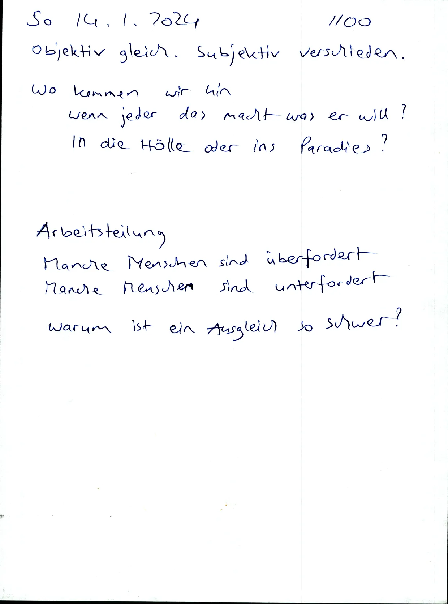

## 2024-01-14.22-00.webp

<blockquote>

So 14.1.2024 2200

Themen

- Post-Apokalypse
- Tribalismus
- Future Primitive
- Paradies auf Erden
- Grostik
- "New Age"
- Naturordnung
- Naturkonstanten
- Nihilismus
- Classical Liberalism


</blockquote>

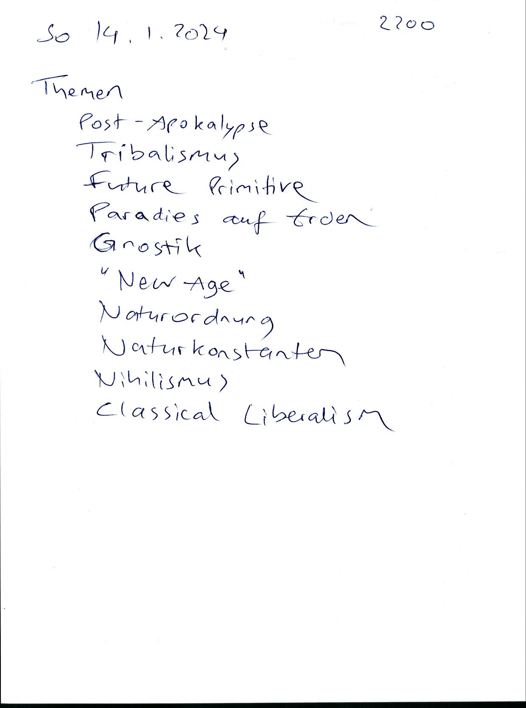

## 2024-01-15.05-00.webp

<blockquote>

Mo 15.1.2024 0500

"Official Stories exist to protect officials."  
-- Liam Scheff

Wer Nihilismus nicht aushält
der braucht Religion.

Wer Wahrheit nicht aushält
der braucht Lügen.

- Doppeldenk
- Doublethink
- Kognitive Dissonanz
- Widersprüche
- Heroin verboten aber Methadon legal
- Opium verboten aber Fentanyl legal
- Cannabis verboten aber Chemotherapie legal

Man könnte fast meinen
dass Großkonzerne diese "Gesetze" schreiben.
Fast wie im ach-so-bösen Faschismus.


</blockquote>


## 2024-01-15.06-00.webp

<blockquote>

Mo 15.1.2024 0600

"Ich sehe was  
das siehst du nie"  
-- Rammstein - Moskau

----

# Plato's Höhle

Lebenslang gefangen
in angeborener Dumnheit

----

# Warum sind kleine Strukturen so kaputt?

Beziehungen, Familien,
Wohngemeinschaften,
Nachbarn, Dörfer, Stadtteile, ...

Weil wir gegen Naturgesetze arbeiten.

Weil dieser Kampf gegen die Natur
von großen Strukturen gefördert wird.

→ Staaten, Großkonzerne, Versicherungen,
Subventionen, "Geschenke"

Demos sind Wohlfühlveranstaltungen
für "Weiber" (Typen 23)
→Utopia US, Samantha:
"Rallies make us feel good"


</blockquote>


## 2024-01-16.13-00.webp

<blockquote>

Di 16.1.2024 1300

Schulstreik war die beste Idee
von Greta Thunberg

----

Do 18.1.2024 2230

Systemlinge sind Pazifisten
die Alles machen
um einen Krieg zu verhindern,
und tun lieber
eine Million Lügen leben,
lassen sich von oben terrorisieren
mit False Flag Attacks.


</blockquote>


## 2024-01-17.07-00.webp

<blockquote>

Mi 17.1.2024 0700

# Hate Gatekeepers

because they judge others
only by their intentions
and not by their results.

# Hate Psychowar

because it always
only compares
Hypothesis versus Hypothesis
but there are
"No experiments!"
to confirm the Mysticism
(Anti-Gnosticism) of
"We will never know"
aka Ignorance:
"We dont want to know."

Psychowar is legal serial murder
against Ideas, Hypotheses,
Opinions, Feelings, Intuitions.  
trying to prevent the spreading
of "bad" ideas.


</blockquote>

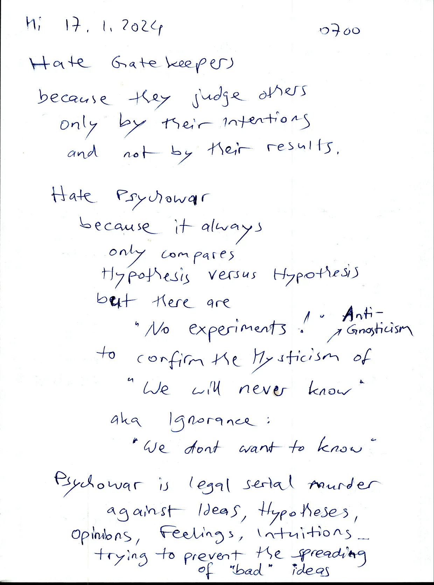

## 2024-01-17.07-10.webp

<blockquote>

Totalitarismus will Alles kontrollieren

deswegen Controlled Regime
und Controlled Opposition
(Pseudo-Alternative)

"Problem und Lösung aus der gleichen Hand"

<!-- TODO table -->

Totalitarismus
versus
Naturalismus

Kunst
gegen
Natur

Erziehung
gegen
Naturtalente

Künstlich
gegen
organisch

Mind
versus
Matter

Geist
gegen
Materie

Idealismus
gegen
Realismus

Schöne Ideen
gegen
Bittere Wahrheiten

----

<!-- TODO table -->

Lebende Götter
Тур1
Aktiv
Aggressiv
Anfänger

Tote Götter
Typ 4
Passiv
Defensiv
Fertigmacher


</blockquote>

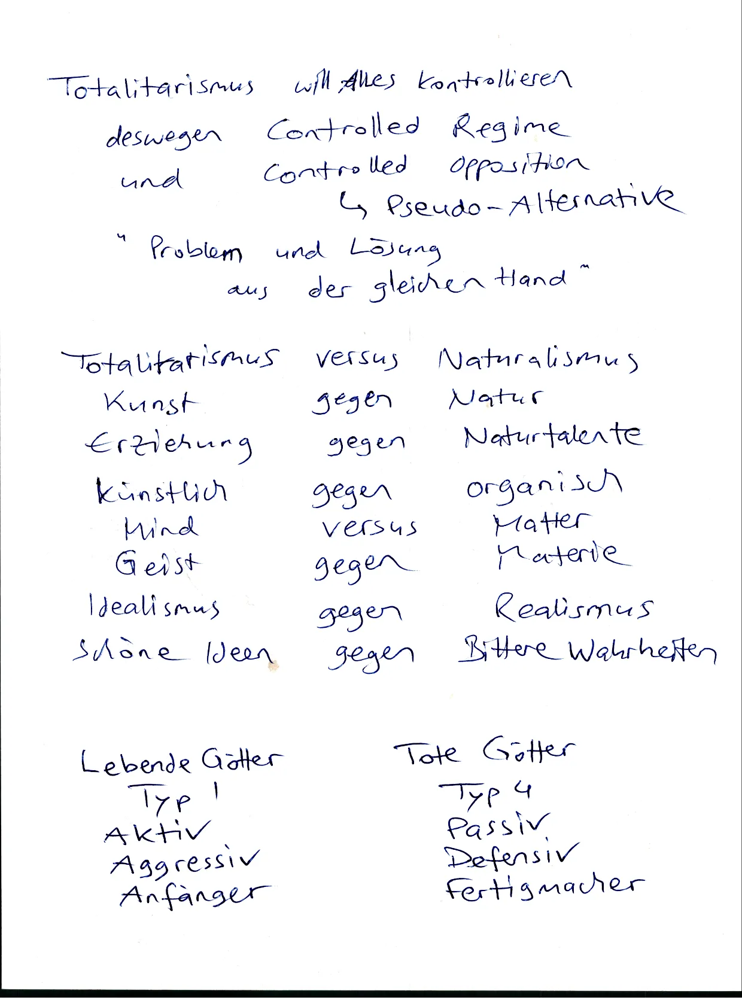

## 2024-01-17.23-00.webp

<blockquote>

Do 17.1.2024 2300

# Rückwärts Denken

- Vom **gewünschten Ergebnis** zurück schließen auf Ursachen
- Regressiv
- Gegen die Zeit
- Vorurteile bestätigt haben wollen
- Idealismus?
- Mentalismus
- Psychokrieg
- Links?
- Erziehung
- Unlogisch
- Mind over Matter
- sich schlau fühlen
- Lügen
- Preskriptiv: Das **was sein soll** ist wichtiger als das was ist.
- Cartoon: Is versus Should


</blockquote>


## 2024-01-17.23-10.webp

<blockquote>

# Alternativ-Lösungen

## "Rationalität"

Sachgründe sind
wichtiger als Persönliche Gründe.

Also wenn mich einer hasst
dann liegt das an meinen Sachen
und nicht an meiner Person.

Also variable Gründe
nicht konstante Gründe.

Also muss ich die Sachen in meinem Kopf
umlernen damit ich geliebt werde.

→ Altruismus, Gefallsucht, Fremdwert,
Harmoniesucht, Typen 24.


</blockquote>

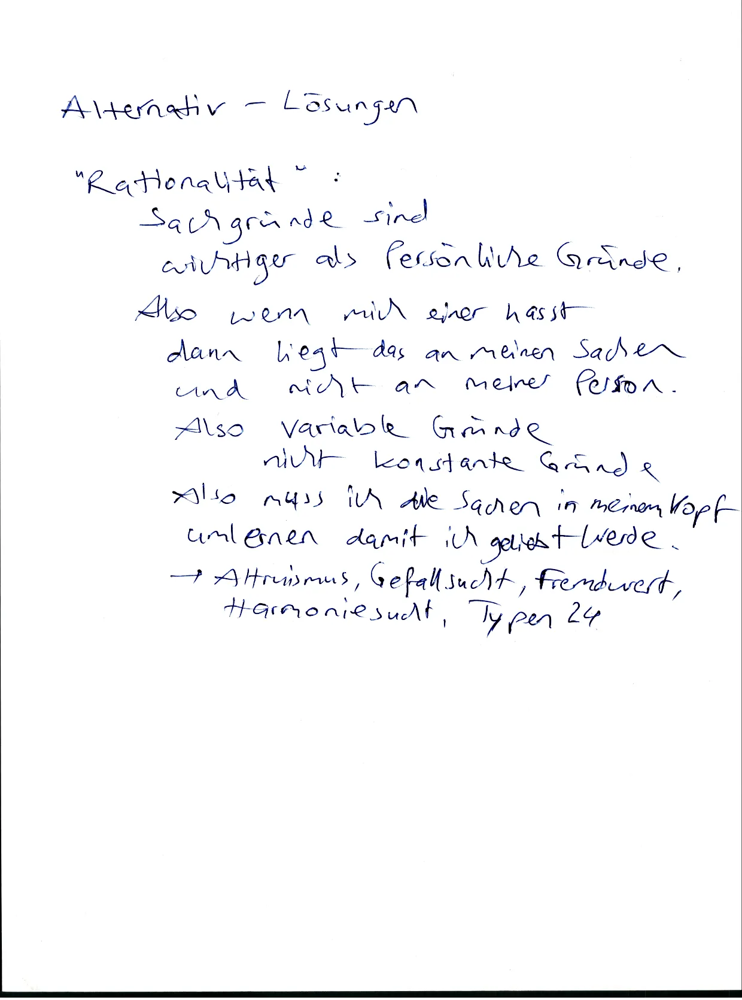

## 2024-01-18.00-00.webp

<blockquote>

Fr 18.1.2024

# Suchen oder Haben?

Mating Call
or Self Display?

Schwäche
oder Stärke?

Wer gegen einen Wahrsager
gewinnen will
der braucht Lügen und Gewalt.

# Keep It Simple, Stupid!

Smart people are
much more aware of Limits
and much more aware of their own limits
so they know
how easily their "smart" brain can fail.


</blockquote>


## 2024-01-18.00-01.webp

<blockquote>

Lästern über Andere.
und dann?
Probleme lösen oder
Probleme verdrängen?

----

Wer beim Inhalt
schon verloren hat
der kämpft weiter
mit Formkritik.

----

Sa 19.1.2024

Elektrosmog macht krank,
nicht nur müde.

----

Kranke Menschen sind gute Sklaven:
wehrlos, dumm, kurzlebig

----

Drucker macht Falten
weil Toner auf Rollen irgendwo

Fix: Zerlegen und Saubermachen

Fuser schafft
... K Seiten dann "Totalschaden"

weil neuer Drucker kostet 130 Euro
(ohne Toner, ohne Drum)
neuer Fuser kostet 250 Euro


</blockquote>

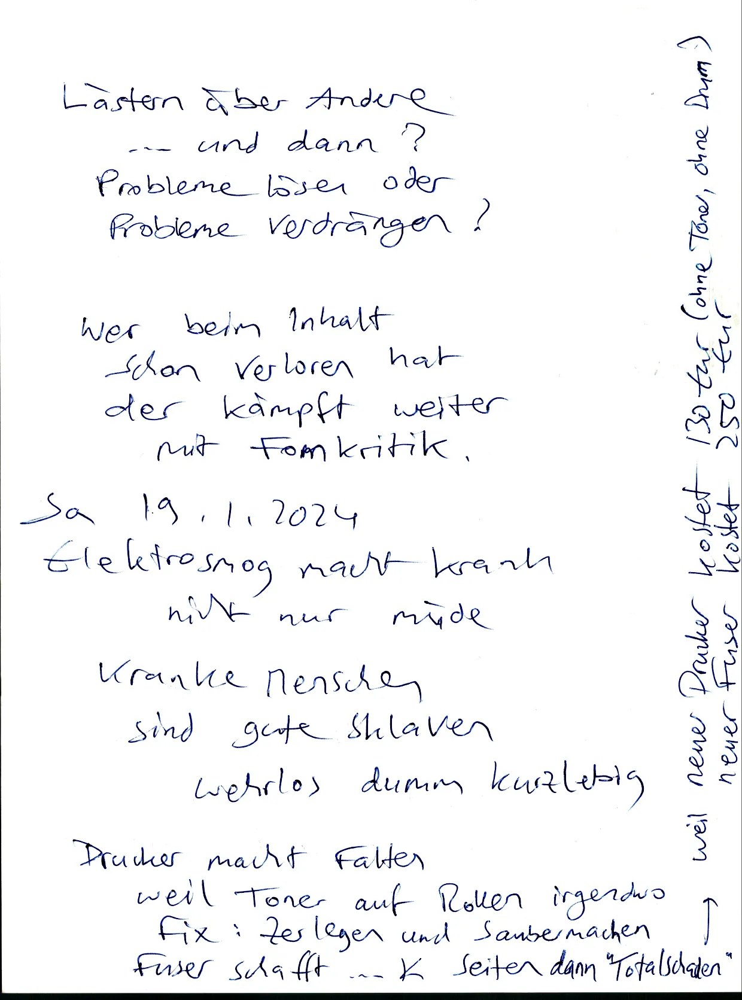

