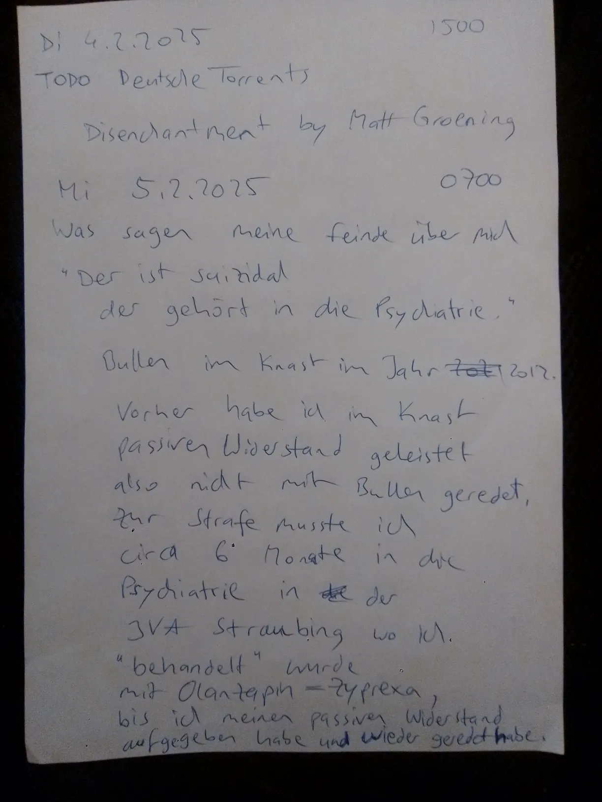
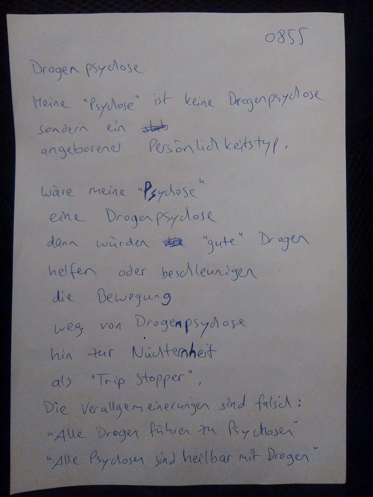
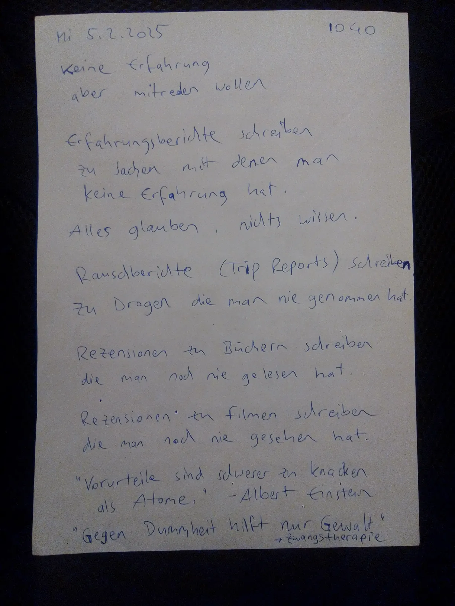
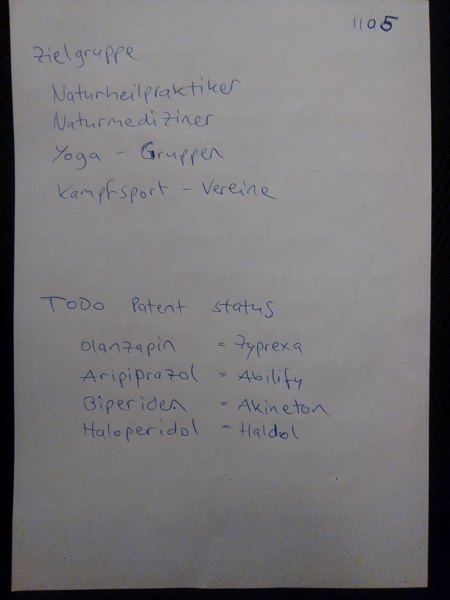
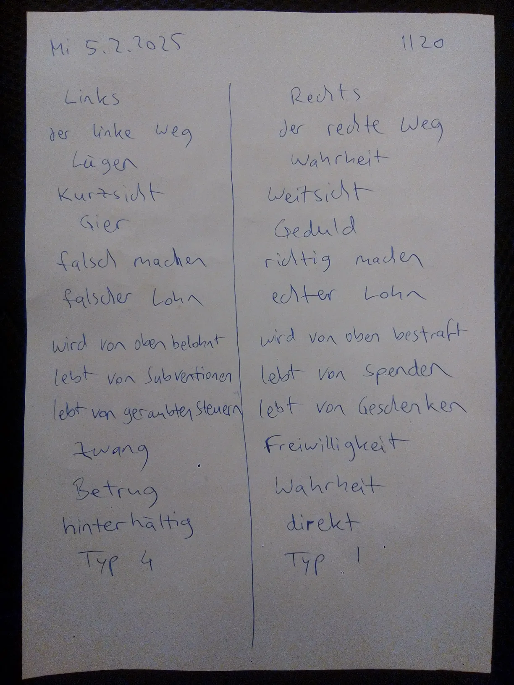

# 2025-02

## 2025-02-03.08-10.webp

<blockquote>

Mo 3.2.2025 0810

# South Park - Psychiatrie Episode

## Kampfbegriffe

Kinderpornos, Schizophrenie,
Paranoia, Wahn, Psychose, ...

Negative Begriffe
die bei Idioten
das rationale Hirn ausschalten
die Idioten "betroffen" machen,
also Ekel oder Zorn,
Disgust Response,
"emotional".

Wie viel diese Kampfbegriffe
mit der Wahrheit = Realität
gemeinsam haben
das ist den Idioten egal.

Idioten sind staatsgläubig.

</blockquote>

## 2025-02-03.08-20.webp

<blockquote>

0820

Typen 14 | Type 23
---|---
rational | emotional
berechnend | impulsiv
phlegmatiker | Choleriker
träge | sprunghaft
distanziert | betroffen
frühes Aufhören zu Schreien | spätes Aufhören zu Schreien
frühes Abregen | spätes Abregen
resolut | kein Ende
tough-minded | tender-minded
"männlich" | "weiblich"
unten lang | unten breit

</blockquote>

## 2025-02-05.07-00.webp

## 2025-02-05.07-10.webp

## 2025-02-05.08-50.webp

## 2025-02-05.08-55.webp

## 2025-02-05.09-50.webp

## 2025-02-05.10-00.webp

## 2025-02-05.10-40.webp

## 2025-02-05.10-50.webp

## 2025-02-05.11-00.webp

## 2025-02-05.11-05.webp

## 2025-02-05.11-10.webp

## 2025-02-05.11-20.webp

## 2025-02-05.12-15.webp

