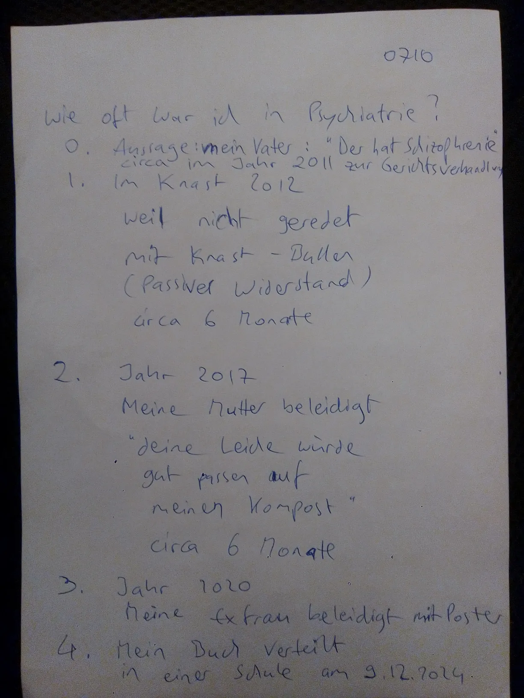
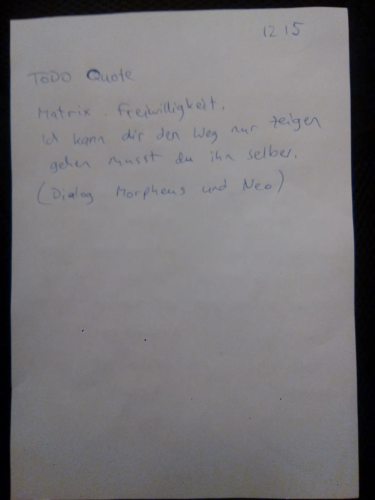

# 2025-02

## 2025-02-03.08-10.webp

<blockquote>

Mo 3.2.2025 0810

# South Park - Psychiatrie Episode

## Kampfbegriffe

Kinderpornos, Schizophrenie,
Paranoia, Wahn, Psychose, ...

Negative Begriffe
die bei Idioten
das rationale Hirn ausschalten
die Idioten "betroffen" machen,
also Ekel oder Zorn,
Disgust Response,
"emotional".

Wie viel diese Kampfbegriffe
mit der Wahrheit = Realität
gemeinsam haben
das ist den Idioten egal.

Idioten sind staatsgläubig.

</blockquote>

## 2025-02-03.08-20.webp

<blockquote>

0820

Typen 14 | Type 23
---|---
rational | emotional
berechnend | impulsiv
phlegmatiker | Choleriker
träge | sprunghaft
distanziert | betroffen
frühes Aufhören zu Schreien | spätes Aufhören zu Schreien
frühes Abregen | spätes Abregen
resolut | kein Ende
tough-minded | tender-minded
"männlich" | "weiblich"
unten lang | unten breit

</blockquote>

## 2025-02-05.07-00.webp

<blockquote>

DI 4.2.2015 1500

TODO Deutsche Torrents

Disenchantment by Matt Groening

----

Mi 5.2.2025 0700

# Was sagen meine Feinde über mich

Der ist suizidal,
der gehört in die Psychiatrie!"
-- Bullen im Knast im Jahr 2012.

Vorher habe ich
habe ich im Knast
Passiven Widerstand geleistet
also nicht mit Bullen geredet,
zur Strafe musste ich
circa 6 Monate in die
Psychiatrie in die der
JVA Straubing wo ich
behandelt wurde
mit Olanzapin = Zyprexa
bis ich meinen passiven Widerstand
aufgegeben habe und wieder geredet habe.

</blockquote>

## 2025-02-05.07-10.webp

<blockquote>

0710

Wie oft war ich in Psychiatrie?

1. Aussage mein Vater:
"Der hat Schizophr"nie"
circa im Jahr 2011 zur Gerichtsverhanglung
2. Im Knast 2012
weil nicht geredet mit Knast-Bullen
(Passiver Widerstand)
circa 6 Monate
3. Jahr 2017
Meine Mutter beleidigt
"deine Leiche würde gut passer auf meinen Kompost"
circa 6 Monate
4. Jahr 2020
Meine Exfrau beleidigt mit Poster
5. Mein Buch verteilt
in einer einer Schule am 9.12.2024.

</blockquote>

## 2025-02-05.08-50.webp

<blockquote>

Mi 5.2.2025 0850

# Ungläubige

Der Kampf der "Ärzte"
gegen meine "Psychose"
bestätigt meine Befürchtung
dass "manche Leute" (Typen 34?)
wirklich nicht glauben
dass Persönlichkeitstypen
teilweise (50 bis 80 Prozent)
angeboren sind
und teilweise (20 bis 50 Prozent)
gelernt sind.

Sondern diese Leute glauben
"von Natur aus"
alle Menschen sind gleich geboren,
alle Unterschiede sind
gelernt also änderbar.

</blockquote>

## 2025-02-05.08-55.webp

<blockquote>

0855

# Drogenpsychose

Meine "Psychose"
ist keine Drogenpsychose
sondern ein
angeborener Persönlichkeitstyp.

Wäre meine "Psychose"
eine Drogenpsychose
dann würden "gute" Drogen helfen
oder beschleunigen
die Bewegung
weg von Drogenpsychose
hin zur Nüchtenheit
als "Trip Stopper".

Die Verallgemeinerungen sind falsch:

- "Alle Drogen führen zu Psychosen"
- "Alle Psychosen sind heilbar mit Drogen"

</blockquote>

## 2025-02-05.09-50.webp

<blockquote>

Mi 5.2.2025 0950

# Legalize DMT und Meskalin

Gib den Indianern ihr Tryptamin zurück
nicht nur
"gib den Indianern ihr Land zurück"
(Marteria / Marsimoto)
sondern auch
Legalisiere alle Tryptamine (DMT)
und alle Phenethylamine (Meskalin).

# Noch nicht

Ihr habt Glück dass ich
keine Soldaten habe
die meine Befehle ausführen...
Noch nicht.

Irgendwann habe ich Soldaten
die meine Befehle ausführen
die mene kommunistische Revolution
in Taten umsetzen.

</blockquote>

## 2025-02-05.10-00.webp

<blockquote>

1000

# Mein Leben ist zu Ende

Ich habe meine Arbeit getan:
mein Buch geschrieben,
mein "Testament" geschrieben.

Danach kommt Nichts mehr ...
ausser Gemüsebau und Tierzucht
aber das machen schon Andere
länger als Ich und besser als Ich.

Ich will jetzt nur noch
maximal viele Bücher drucken
und an alle mögliden Leute schicken,
bis endlich irgendwer
mit Experimenten prüft
ob meine Hypothese
wahr oder falsch ist.

</blockquote>

## 2025-02-05.10-40.webp

<blockquote>

Mi 5.2.2025 1040

# Keine Erfahrung

aber mitreden wollen.

Erfahrungsberichte schreiben.
zu Sachen mit denen man
keine Erfahrung hat.

Alles glauben
nichts wissen.

Rauschberichte (Trip Reports) schreiben
zu Drogen die man nie genommen hat.

Rezensionen zu Büchern schreiben
die man noch nie gelesen hat.

Rezensionen zu Filmen schreiben
die man noch nie gesehen hat.

"Vorurteile sind schwerer zu knacken
als Atome." -- Albert Einstein

"Gegen Dummheit hilft nur Gewalt "
→ Zwangstherapie

</blockquote>

## 2025-02-05.10-50.webp

<blockquote>

1050

# Diebe im Gesetz

Keine familie.
weil familie ist ein Druckmittel.
Kinder sind Druckmittel gegen Eltern.

Kein Wohnsitz.
Kein Haus.
Auf der Straße leben.
In Bewegung bleiben.
Wer rastet der rostet.
Scheiss auf Bewegungsmangel.
Scheiss auf Sesshaftigkeit.

# Keine Erfahrung

Als würden dumme Kinder  
über schlaue Eltern herrschen.

- Verdrehung um 180 Grad.
- Machtdemo.
- Genau falschrum.
- Provokation.
- Inversions.
- Paradox.
- "Satanismus".

</blockquote>

## 2025-02-05.11-00.webp

<blockquote>

Mi 5.2.2025 1100

Übervölkerung und Hungertod

Faschisten = Zentralisten = Monopolisten
kaufen alle Nahrungsproduktionen
damit sie überraschend
von heute auf morgen
die Versorgung ausschalten können.

So dass die meister Menschen
(90 Prozent)
an Hungertod sterben
(Kälte und Hunger).

Siehe auch

- Holodomor
- Ice Age farmer
- Brandanschläge gegen Tierfarmen

</blockquote>

## 2025-02-05.11-05.webp

<blockquote>

1105

# Zielgruppe

- Naturheilpraktiker
- Naturmediziner
- Yoga Gruppen
- Kampfsport Vereine

# Todo Patent status

- Olanzapin = Zyprexa
- Aripiprazol = Abilify
- Biperiden = Akineton
- Haloperidol= Haldol

</blockquote>

## 2025-02-05.11-10.webp

<blockquote>

Mi 5.2.2025 1110

# Steter Tropfen höhlt den Stein

Einer der heute Nein sagt  
der kann morgen Ja sagen.

Also dran bleiben,  
weiter versuchen.

Penetrant sein.

Aufdringlich sein.

weil die Bösen sind auch  
penetrant, aufdringlich,
geduldig, stur.

</blockquote>

## 2025-02-05.11-20.webp

<blockquote>

Mi 5.2.2025 1120

<!-- TODO table -->

Links
der linke Weg
Lügen
Kurzsicht
Gier

Rechts
Der rechte Weg
Wahrheit
Weitsicht
Geduld

falsch machen
richtig machen

falscher Lohn
echter Lohn

wird von oben belohnt
wird von oben bestraft

lebt von Subventionen
lebt von Spenden

lebt von geraubten Steuern
lebt von Geschenken

Zwang
Betrug
hinterhaltig

Freiwilligkeit
Wahrheit
direkt

Typ 4
Tур 1

</blockquote>

## 2025-02-05.12-15.webp

<blockquote>

1215

TODO Quote

Matrix

Freiwilligkeit

Ich kann dir den Weg nur zeigen,  
gehen musst du ihn selber.  
(Dialog Morpheus und Neo)

</blockquote>

